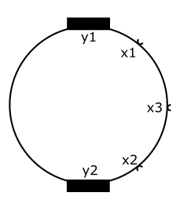

# A - Álgebra Booleana e Implementação de Funções Lógicas com Transistores

| Data da entrega| 
|----------------|
| Quinta - 01/09 |

Nesse projeto iremos utilizar a álgebra booleana para obter as funções lógicas de um sistema que deverão ser implementadas utilizando transistores.

Esse projeto deverá ser realizado em duplas ou trios utilizando o GitHub Classroom.

Queremos controlar o robô asprirador de pó da figura a seguir:

{width=400}

onde y1 e y2 são sinais de saída que ligam ou desligam o motor das rodas esquerda ou direita e x1, x2 e x3 são sensores para detectar a presença de algum obstáculo.

O controle deve ser feito da seguinte forma:

1. O motor esquerdo (y1) deverá ser ligado e o motor direito (y2) desligado, permitindo que o robô rotacione em sentido horário, sempre que um objeto for detectado em x1 e/ou x3, mas não em x2.
1. O motor esquerdo (y1) deverá ser desligado e o motor direito (y2) ligado, permitindo que o robô rotacione em sentido anti-horário, sempre que um objeto for detectado em x2 e/ou x3, mas não em x1.
1. Ambos os motores devem ser ligados se nenhum dos sensores detectar um objeto ou se x1 e x2 detectarem o objeto.
1. Todos os motores devem ser desligados se os três sensores detectarem um objeto.

-> Caso alguma condição lógica esteja presente em mais de uma instrução, considerar a primeira condição que ocorre!

## Rubricas

| Conceito | Descritivo                                                  |
|----------|-------------------------------------------------------------|
| **A+**   | Funções lógicas implementadas com transistores no protoboard                     |
|          | Anexar video no repositório da atividade                    |
| **B+**   | Funções lógicas implementadas com transistores no simulador falstad ou tinkercad |
|          | Anexar video e/ou o arquivo texto da simulação no repositório da atividade       |
| **C+**   | Funções lógicas obtidas e simplificadas                     |
|          | Anexar foto da resolução                                    |
| **D**    | Funções lógicas obtidas mas não simplificadas               |
| **I**    | Funções lógicas não obtidas                                 |
