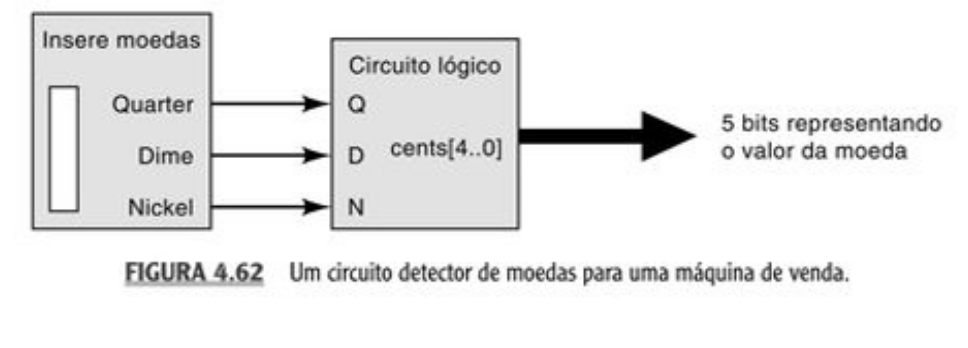

# Álgebra Booleana - 2

[{width=25} Versão para impressão.](https://github.com/Insper/Z01.1/raw/main/Exercicios/Exercicio-Algebra-Booleana-2.pdf) 

!!! tip ""
    [:pencil: Resolução](https://github.com/Insper/Z01.1/blob/master/Exercicios/Exercicio-Algebra-Booleana-2-resolucao.pdf)

### Simplifique o circuito a seguir:

(desenhe o circuito simplificado)

------------------------

### Econtre a equação dos mapas de K. a seguir:

> (TOCCCI - pg. 178)

> `X` representa: Tanto faz, pode assumir `1` ou `0`. Você deve decidir o que for melhor para a simplificação.

------------------------

\newpage

### Detector de moedas

Um detector de moedas em uma máquina de venda aceita *quarters, dimes e nickels* e ativa o sinal correspondente (Q,D,N) apenas com a moeda correta. É fisicamente impossível múltiplas moedas estarem presentes ao mesmo tempo. Um circuito digital utiliza os sinais Q,D e N como entradas e produz um número binário representando o valor da moeda, como mostrado no circuito a seguir.

- Desenvolva um circuito (diagrama lógico) que resolva o problema (dica: use um MUX)

| Moeda   | Valor  |
| -----   | ------ |
| Quarter | `25`   |
| Dime    | `10`   |
| Nickel  | `5`    |

------------------------

\newpage

### Impressora

A fig. a seguir mostra quatro chaves que fazem parte do circuito de controle em uma máquina copiadora. As chaves estão posicionadas ao longo da trajetória do papel dentro da máquina. Cada chave está no estado normal aberta e, quando o papel passa sobre a chave, ela é fechada. É impossível o fechamento simultâneo das chaves SW1 e SW4. 

1. Projete um circuito lógico que gere em saída em nível ALTO sempre que duas ou mais chaves estiverem fechadas ao mesmo tempo. Utilize o mapa de Karnaught.

> (TOCCI - pg. 179)

-----------------------

\newpage

### SevenSeg

Encontre as equações que regem os segmentos `0` e `6` de um display de 7 segmento.

> 

!!! warning
    A lógica de acender um display é invertida (por ser do tipo anodo comum), para acender um segmento é necessário colocar `0` na linha e para apagar `1`.
