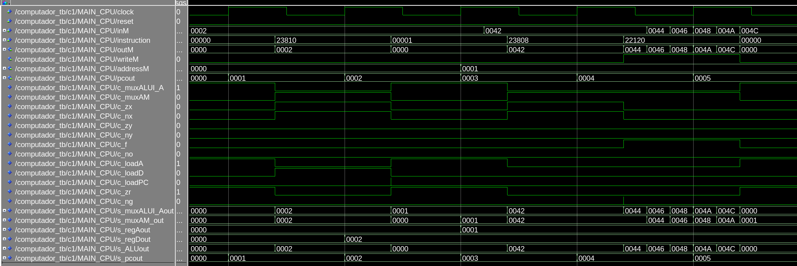
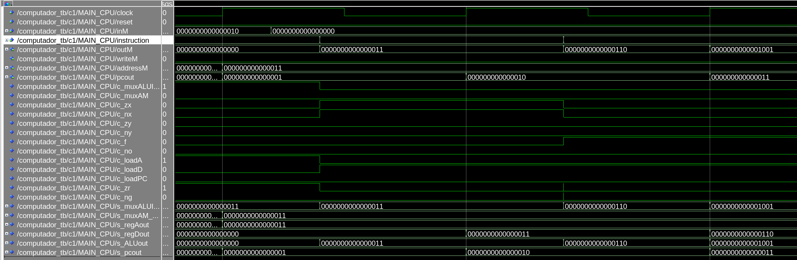

# Exercicio CPU - 2

## falha 1

!!! note
    Para resolver o exercício a seguir vocês devem verificar a instrução que está sendo executada na CPU e o que ela deveria estar fazendo no hardawre.

Vocês estavam desenvolvendo o projeto F quando o teste de integração `./testeAssemblyMyCpu.py` falhou no nasm descrito a seguir. Um colega do grupo enviou o waveform a seguir para você encontrar o problema (você deve falar o que está falhando). 

[](figs/Exercicios/CPU-fail-add-loadA.png)

!!! tip
    1. clique na imagem para ampliar
    1. esse waveform é dos sinais da `CPU.vhd`

Essa simulação executa o programa a seguir:

```nasm
leaw $0, %A
movw (%A), %D
leaw $1, %A
movw (%A), %A
addw %A, %D, (%A)
```

Que possui a RAM iniciada com os seguintes valores:
    
| Address | Dado             |
| ------  | ---              |
| 0       | 0000000000000010 |
| 1       | 0000000001000010 |
| 3       | 0000000000000000 |

!!! info "Resolução"
     <video width="640" height="480" controls>
      <source src="http://54.162.111.146/shared/ele/erro-loadA.mp4" type="video/mp4">
      Your browser does not support the video tag.
    </video> 
    
    - Se o vídeo não abrir acesse pelo link e faça o download:  http://54.162.111.146/shared/ele/erro-loadA.mp4


## Engenharia reversa

Você foi chamado para fazer engenharia reversa em um programa executando no HW do Z01, na captura de dados a equipe responsável não conseguiu capturar o sinal da Instrução, e não sabem quais comandos estão sendo executados no computador.

Encontre os ==três== comandos em nasm que estão sendo executados no hardware nesse momento:

[](figs/Exercicios/CPU-eng-rev.png)

!!! tip
    1. clique na imagem para ampliar
    1. esse waveform é dos sinais da `CPU.vhd`

!!! info "Resolução"
     <video width="640" height="480" controls>
      <source src="http://54.162.111.146/shared/ele/eng-rev.mp4" type="video/mp4">
      Your browser does not support the video tag.
    </video> 
    
    - Se o vídeo não abrir acesse pelo link e faça o download: http://54.162.111.146/shared/ele/eng-rev.mp4


