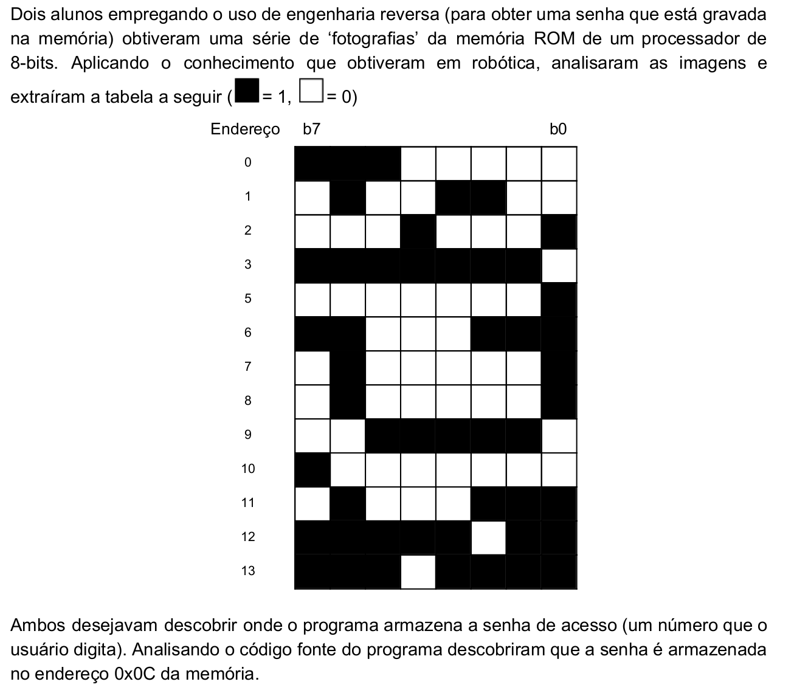
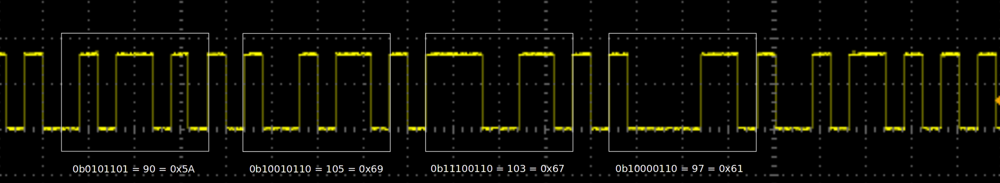

# Dados Digitais - 2

[{width=25} Versão para impressão.](https://github.com/Insper/Z01.1/blob/main/Exercicios/Exercicio-Dados-2.pdf)

## Memória 1



## Memória 2

Você está debugando uma comunicação serial entre dois equipamentos e foi capaz de capturar a seguinte sequência de dados:



Qual foi a mensagem enviada? Você sabe que a mensagem enviada está codificada em ASCII.

## 7 Segmentos

O display de sete segmentos é um componente muito utilizado em sistemas eletrônicos, com ele conseguimos exibir valor dígitos numéricos:

{width=300}

> Fonte: https://www.sunfounder.com/media/wysiwyg/swatches/super-kit-v2-for-Arduino/10_7_seg_display/

Por exemplo, para exibir o valor `7` é necessário acionar os segmentos: `a`, `b`, `c`: 

{width=80}

> Utilize o site: http://www.uize.com/examples/seven-segment-display.html para brincar um pouco.

Os segmentos normalmente formam um vetor do tipo `g`, `f`, `e`, `d`, `c`, `b`, `a`. O Valor 7 seria codificado em: `0b0000111` -> `0x07` .

Você está fazendo um projeto que possui um display de 7 segmentos, mas infelizmente ele está queimado (pois é, essas coisas acontecem), você foi incumbido de descobrir quais valores estavam sendo enviados para ele. Para isso você plugou um analisador de sinais nas trilhas que iam para o display, e foi capaz de obter a seguinte forma de onda:


Você deve descobrir quais são os três valores (fachas) que estariam sendo exibidos no display!


## Octal

Você quer modificar as permissões de um arquivo no seu Linux para: 

- Usuário: Leitura/Escrita e execução
- Grupo: Escrita e Leitura
- Outros: Leitura

Preencha o comando a seguir, com os valores corretos (em octal) para isso:

```

$ chmod ________  FILE.py

```

!!! tip
    Consulte a teoria.

