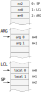
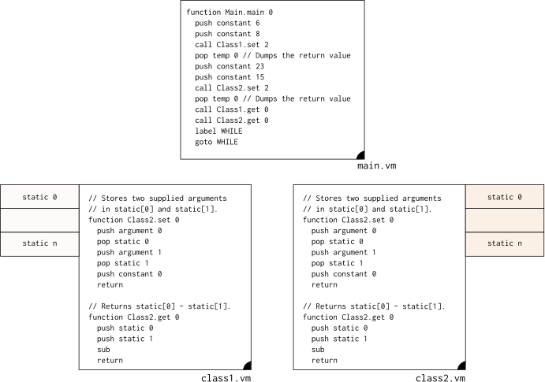
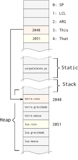

## Função

Os ponteiros `LCL` e `ARG` são utilizados somente na execução de uma função. O `ARG` indica em qual endereço da stack os parâmetros que serão passados para a função estão salvos e o `LCL` é usado para apontar para o endereço na pilha utilizado para armazenar variáveis locais da função.

O fluxo de chamada de função, de forma simplificada é:

1. Coloca na pilha os argumentos que ser passado para a função 
     - a quantidade varia conforme a demanda da função
     - primeiro argumento colocado na stack é o de index 0
1. Chama a função (**call**)
1. Aloca na pilha os endereços de memória para armazenar as variáveis locais
1. Atualiza os ponteiros: SP, LCL, ARG, THIS e THAT

O fluxo de chamada de função (call) é um pouco complexo, pois demanda que salvemos algumas informações da pilha antes de executarmos a função (precisamos conseguir após a execução da função retornar para um estado similar antes da execução). Para isso é salvo na pilha, NA ORDEM A SEGUIR:

- Endereço de retorno 
- LCL (antes da chamada de função)
- ARG (antes da chamada de função)
- This (antes da chamada de função)
- That (antes da chamada de função)

### LCL - Local 

Local indica o endereço na pilha na qual foi alocado para as variáveis locais de uma função, a quantidade de endereços alocados varia conforme a declaração da função, que pode possuir zero ou mais variáveis temporárias.

Peguemos como exemplo uma função em java :

```
void example(int a, int b){
 int aux0;
 int aux1;

 aux0 = a;
 aux1 = b;
}
```

Note que essa função possui duas variáveis locais: `aux0` e `aux1`, que são visíveis somente dentro do escopo da função, essas variáveis são alocadas quando a função é chamada e desalocada quando a função retorna. Essas variáveis (`aux0`, `aux1`) servem como variáveis locais da função, e são salvas na stack, como a ilustração a seguir :



O exemplo em java anterior seria traduzido para a linguagem VM (de forma imediata) na seguinte maneira:

```
 function example 2
     push argument 0  // coloca na pilha o valor a
     pop local 0       // aux0 = a
     push argument 1  // coloca na pilha o valor b
     pop local 1       // aux1 = b
```

Note que o que define `local 0` e `local 1` é a ordem na qual as variáveis foram declaradas, como a variável *aux0* foi declarada primeiro, ela é alocada no `local 0`. 

O `LCL` aponta apenas para o endereço do primeiro **local**, os demais são inferidos da seguinte maneira:

- push local n

> **endereço local n = LCL + n**

### ARG - Argumento

O ponteiro ARG indica a onde na pilha estão salvos os argumentos que a função pode acessar, e segue a mesma lógica do LCL, onde o ARG aponta para o primeiro argumento e o endereço dos demais são inferidos com base no endereço do primeiro.

Os `ARG` são salvos na própria pilha, antes da chamada da função:

```
   pilha       comando VM    endereços
--------------------------------------------
     12    |  call mult 2  |     12  <- ARG
     13    |               |     13  
SP ->      |    |----\     |    
           |    |----/     |      
```  


## Exemplo Stack chamada de função


```
   258 : SP                   265 : SP                      257 : SP
   333 : LCL                  263 : LCL                     333 : LCL
   444 : ARG   call mult 2    256 : ARG           return    444 : ARG
   555 : THIS    |----\       555 : THIS          |----\    555 : THIS
   666 : THAT    |----/       666 : THAT          |----/    666 : THAT
  ~~~~~~~~~~~~                ~~~~~~~~~~~                  ~~~~~~~~~~~~
   8   : 256                  8   : 256 <- LCL              32  : 256
   4   : 257                  4   : 257                     4   : 257  <- SP
   0   : 258  <- SP           256 : 258 : RETURN            0   : 258
                              333 : 259 : LCL
                              444 : 260 : ARG
                              555 : 261 : THIS
                              666 : 262 : THAT
                              0   : 263 <- LCL
                              0   : 264 
                              0   : 265 <- SP
```
 
 
 

# Static variables

É a região da memória utilizada para armazenar variáveis compartilhadas entre o mesmo arquivo .vm, conforme figura a seguir :


A static não é visível entre diferentes arquivos .vm, deixando as variáveis limitadas a um escopo. O static será utilizado para armazenar as variáveis estáticas de uma determinada classe. Exemplo de acesso ao static :

O exemplo a seguir demonstra duas classes (class1.vm e class2.vm) sendo utilizadas com os seus respectivos stacks. Nesse exemplo, a função main inicializa o static da classe 1 em : static[0] = 6, static[1] = 8 e o static ca classe 2 em : static[0] = 23, static[0] = 15.



Isso será bastante utilizado para fazer a implementação da estrutura a seguir :

``` java
public class class1 {

 static int valor0;  // alocado no static 0
 static int valor1;  // alocado no static 1
    
 public void set(int var1, va2){
      valor0 = var1;
      valor1 = var2;
 }

 public void get(void){
     return(valor0-valor1);
 }
```

> As variáveis estáticas são compartilhadas entre os objetos inicializados a partir da mesma classe, alocando assim apenas um slot de memória para todos os objetos criados a partir dessa classe ^1.

^1: https://beginnersbook.com/2013/05/static-variable/

# HEAP

O HEAP é a região de memória a ser utilizada para armazenamento objetos e vetores, um objeto será construído a partir de uma classe  e compartilhará as mesma variáveis estáticas mas não as mesmas variáveis locais ao objeto. Vamos tomar como ponto de partida o exemplo a seguir que inicializa dois objetos (terra e lua) do tipo corpoCeleste :

``` java
void main(){
    corpoCeleste terra  = new corpoCeletes();
    terra.setMassa(1200);
    corpoCeleste lua = new corpoCeleste();
    lua.setMassa(32);
    
    lua.pi = 314;
}

public class corpoCeleste(){
    static int pi;
    
    int raio ;
    int gravidade;
    int massa;
    
    void getMassa(){
        return(this.massa);
    }
    
    void setMassa(int m){
        this.massa = m;
    }
}
```

Esse exemplo aloca no Heap três endereços em locais diferentes para cada objeto criado do tipo corpoCeleste, porém a variável *pi*, que é estática é comum a todos os objetos criados a partir da mesma classe. A figura a seguir ilustra como essas variáveis seriam alocadas em memória.



## This

This é o ponteiro que referência o próprio objeto: objeto na qual o método ou construtor está sendo chamado. No caso da chamada do método getMassa() da classe corpoCeleste, o ponteiro **This** será ajustado para apontar para o objeto na qual o método foi chamado. O fluxo da máquina virtual será o seguinte :

1. Ajusta o **this** para apontar para o início do HEAP pertencente ao objeto
1. chama a função getMassa do arquivo corpoCeleste.vm

## That

O ponteiro **That**  é utilizado para referenciar **outro**  objeto, utilizado no exemplo a seguir :

Método objetoCeleste : 

``` java
    void compareMassa(corpoCeleste outro){
        if(this.massa == outro.massa){
            return(True);
        } 
        else{
            return(False);
        }
    }    
```

Código principal :

``` java
    void main(){
       ...
       
       rtn = terra.compareMassa(lua);
    }
```

Nesse exemplo, incluímos um novo método (compareMass) na classe corpoCeleste, esse novo método compara a massa de um outro objeto com a do próprio objeto, retornando verdadeiro ou falso dependendo do resultado.

Como esse código seria traduzido para VM ? O objeto em questão será acessado utilizando o ponteiro **this** e o objeto a ser comparado será acessado via o **that**. O compilador da linguagem de alto nível para VM será responsável por alocar os objetos nos endereços certos.

``` vm
function main 0
    ...
    push constant 2048  // endereço objeto terra
    push constant 2051  // endereço objeto lua
    call cortpoCeleste.compare mass 2

function corpoCeleste.compareMass 0
    push argument 0
    pop pointer 0   // atualiza endereço this
    push argument 1
    pop pointer 1   // atualiza endereço that
    push this 2     // this 0 = gravidade; this 1 = raio; this 2 = massa
    push that 2     // that 0 = gravidade; this 1 = raio; this 2 = massa
    eq
    return
```

Note que quando o método for chamado (no caso da vm o método será traduzido para uma função), os ponteiros **this** e **that** devem ser passados via a chama da função, e no começo da função atualizado os endereços RAM[3] - This e RAM[4] - That. 
