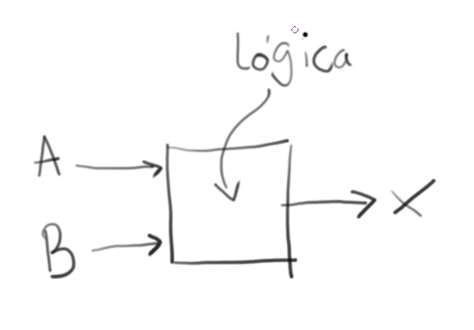
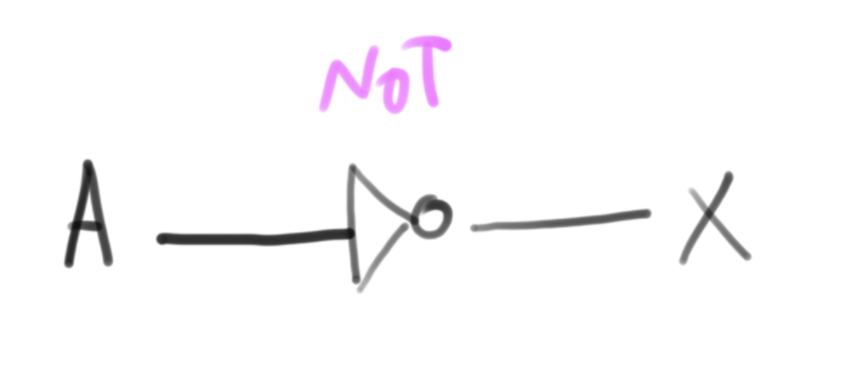
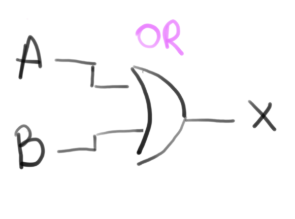
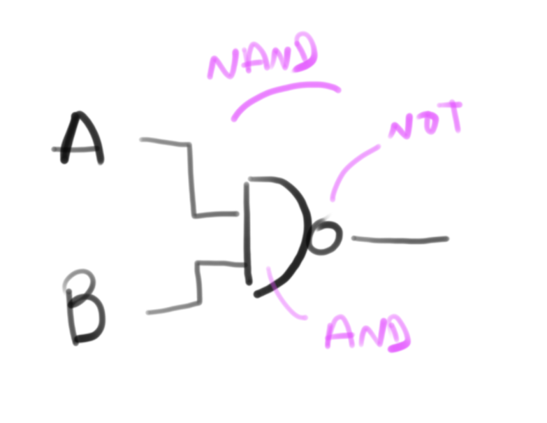
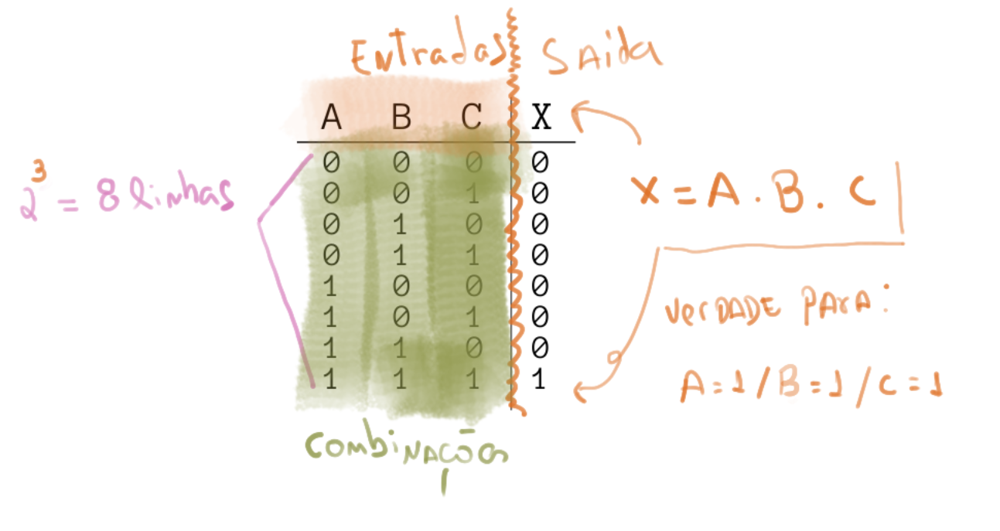
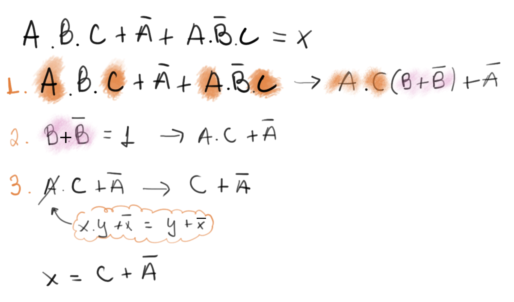
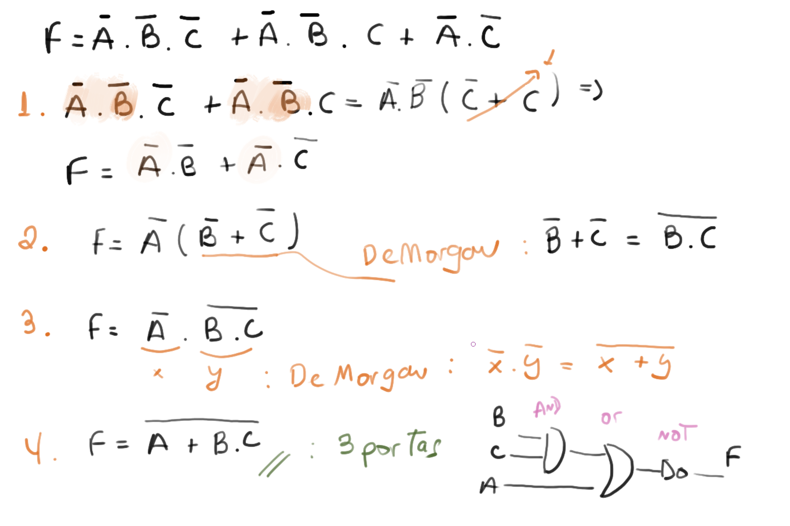
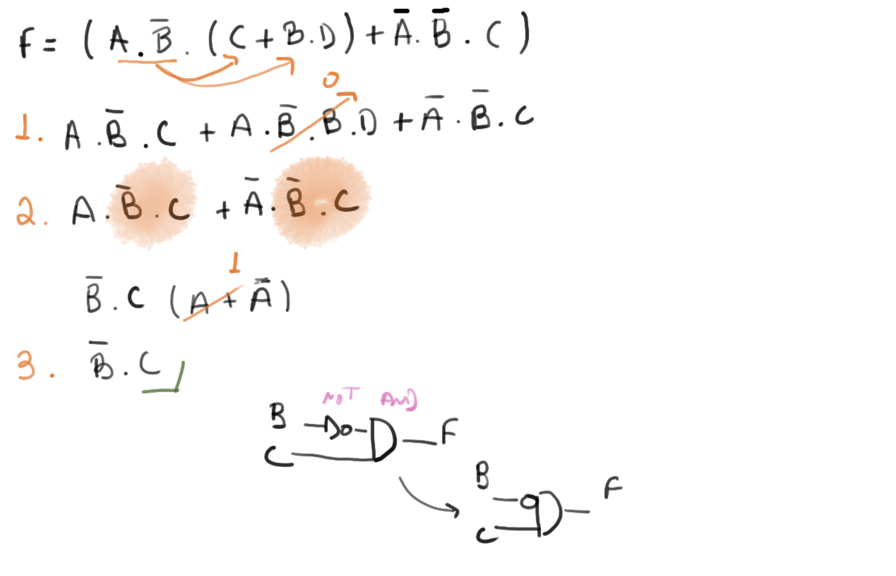
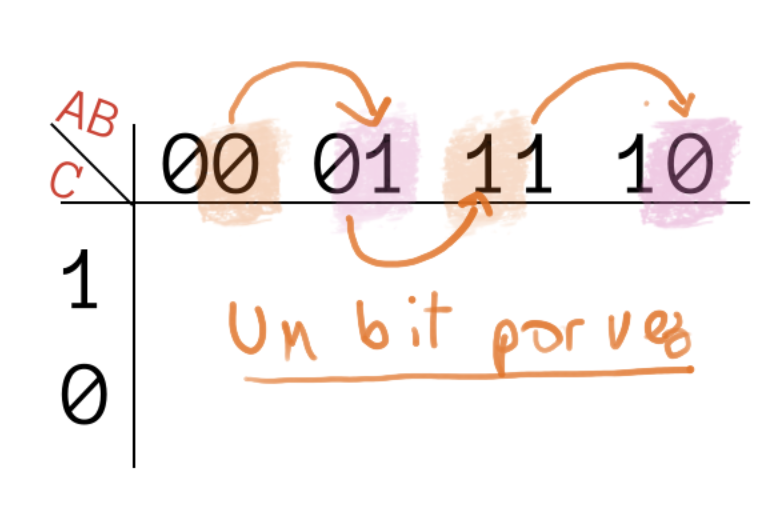
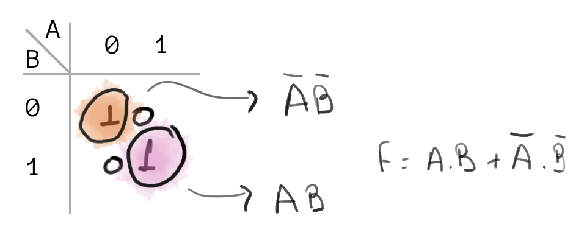

# Álgebra Booleana

- Conteúdo: Equações; Operações (portas lógicas); Tabela Verdade; Sintetização de funções; Soma dos Produtos; Produto das Somas; Simplificação Algébrica; Mapa de Karnaught.

| Estudando      |                                                                                                                                                                                                            |
| ---------      | --                                                                                                                                                                                                         |
| Bibliografia   |                                                                                                                                                                                                            |
|                | [Cap1. Cap2. NISAN, 2005]                                                                                                                                                                                  |
|                | [Cap6. TOCCI, 2011]                                                                                                                                                                                        |
|                | [Cap1. FLOYD, 2007]                                                                                                                                                                                        |
|                | [LAING, 2004]                                                                                                                                                                                              |
| Vídeos (extra) |                                                                                                                                                                                                            |
|           :+1: | <iframe width="200" height="200" src="https://www.youtube.com/embed/YYIucfsQKl4" frameborder="0" allow="accelerometer; autoplay; encrypted-media; gyroscope; picture-in-picture" allowfullscreen></iframe> |
|                | [Logic 101 (#11): Truth Tables](https://www.youtube.com/watch?v=_Lb2c18xdeo)                                                                                                                               |
|                | [Logic 101 (#12): Truth Table Practice](https://youtu.be/UaGM8T4o9xI?list=PLKI1h_nAkaQq5MDWlKXu0jeZmLDt-51on)                                                                                              |
|                | [Computer Science: Karnaugh Maps – Introduction](https://www.youtube.com/watch?v=3vkMgTmieZI)                                                                                                              |
|           :+1: | [Computer Science: Karnaugh Maps - 4 vars](https://www.youtube.com/watch?v=YJSqf_Z024w)                                                                                                                    |
                  
                  

A álgebra booleana foi desenvolvida por [George Boole](https://pt.wikipedia.org/wiki/George_Boole), um matemático britânico que desenvolveu os conceitos em 1847, base da computação moderna. Muito tempo depois, nos anos 30, Claude Shannon, um importante engenheiro na história da computação moderna, aplicou as ideias de Boole em circuitos elétricos. Ele trabalhava no Analisador Diferencial de Vannevar Bush, e logo percebeu a relação dos relés com álgebra booleana. Ele fazia um relé acionar o outro usando usando uma lógica binária do relé fechado ou aberto. Sua dissertação e artigos, levaram outras pessoas a perceber os benefícios da álgebra booleana em eletrônica e consequentemente computação.

Em Álgebra Booleana as variáveis só podem assumir dois valores. Desligado e ligado, ou falso e verdadeiro, 0 volt e 5 volts, branco e preto. Porém normalmente na computação usamos `0` e `1` pela conveniência. Todos os computadores tem como sua menor unidade de dado, esse elemento. Em computação chamamos isso de bit. que vem de dígito binário (ou do inglês binary digit).

!!! note

    Bit é a unidade mais simples de representação de dados digitais, um bit é uma unidade que pode assumir apenas dois valores: `0` ou `1`. Com um bit podemos representar o estado de uma luz na sala de aula, se uma cadeira está vazio ou não, .... não conseguimos representar **com apenas um bit** uma informação que não seja binária. Mas se combinarmos mais de um bit, criando um vetor de bits, somos capazes de representar quantos estados desejarmos.

    <iframe width="710" height="520" src="https://www.youtube.com/embed/ewokFOSxabs" frameborder="0" allow="accelerometer; autoplay; encrypted-media; -picture" allowfullscreen></iframe>

!!! progress 
    Cheguei Aqui!

## Equações


Uma equação de lógica booleana pode possuir uma ou mais 'entradas' e apenas uma saída, na equação exemplo a seguir, `X` é uma saída (e pode assumir apenas valor `1` ou `0`) e `A` e `B` são entradas também do tipo binária.

```
    X(A,B) = A . B
```

{width=400}

!!! note 
    A operação `.` é chamada de `E` (`and`) que também pode ser representada pelo simbolo: `^`
    
    ```
    X = A and B
    
    X = A . B
    
    X = A ^ B
    ```

A operação de `and` pode ser entendida como uma multiplicação: A saída (`X`) só é verdadeira se as entradas `A` e `B` forem verdadeiras: `1 . 1 = 1`. Como A e B são números binários, é possível encontrar uma tabela que relaciona o **TODOS** os valor da saída `X` com todas as entradas possiveis: `A` e `B`

| Entrada A | Entrada B | Saída X |
|-----------|-----------|---------|
| `0`       | `0`       | `0`     |
| `0`       | `1`       | `0`     |
| `1`       | `0`       | `0`     |
| `1`       | `1`       | `1`     |

!!! note "Tabela Verdade"
    Essa tabela que acabamos de construir chama ==tabela verdade==, e será muito utilizada 
    ao longo do curso.
    
Também podemos representar essa equação `X = A . B` como sendo um circuito digital:

{width=400}

!!! note 
    Resolver funções booleanas é entender quando a saída será `Verdadeira` ou `Falsa` dado a combinação possível de entradas.

    <iframe width="710" height="520" src="https://www.youtube.com/embed/rZwCJWOhNG0" frameborder="0" allow="accelerometer; autoplay; encrypted-media; gyroscope; picture-in-picture" allowfullscreen></iframe>

!!! progress 
    Cheguei Aqui!

## Operações

O `and` utilizado no exemplo anterior é um operador da lógica booleana, operadores possuem uma ou mais entradas e geram uma saída. Os operadores mais comuns são: `not`, `and`, `or`, `nand`, `nor`, `xor`.

<iframe width="710" height="520" src="https://www.youtube.com/embed/UvI-AMAtrvE" frameborder="0" allow="accelerometer; autoplay; encrypted-media; gyroscope; picture-in-picture" allowfullscreen></iframe>

### not

O operador `not` atua sobre uma variável, tornando a saída o inverso da entrada, ou seja, se a entrada do operador for `1` sua saída será `0` e vice versa.

> Uso: a luz interna do carro será acesa ('1') quando a porta estiver fechada ('0').

Notação: `not`, `-`, `~`, `¬`:

```
X = not A  /  X = A  /  X = Ã / X = ¬ A
```

Tabela Verdade:

| Entrada A | X  = not A |
| --------- | ---------- |
| `0`       | `1`        |
| `1`       | `0`        |

Simbologia:

{width=300}

### and
      
O operador `and` atua sobre duas variável, tornando a saída `verdadeira` somente se as duas entradas forem `verdadeiras`, se uma das entradas forem `falsa` a saída será `falsa`.

> Uso: o cofre será aberto somente quando as duas chaves de seguranças forem inseridas.

Notação:  `and`, `.`, `^`:

```
X = A and B  /  X = A . B   /  X = A ^ B
```

Tabela Verdade:

| A   | B   | X = A and B |
|-----|-----|-------------|
| `0` | `0` | `0`         |
| `0` | `1` | `0`         |
| `1` | `0` | `0`         |
| `1` | `1` | `1`         |

Simbologia:

{width=300}

### or

O operador `or` atua sobre duas variável, tornando a saída `verdadeira` sempre que uma das entradas forem `verdadeira`.

> Uso: O alarme de incêndio será acionado caso alguns dois dois botões sejam pressionados.  

Notação:  `or`, `+`, `v`:

```
X = A or B  /  X = A + B   /  X = A v B
```

Tabela Verdade:

| A   | B   | X = A or B |
|-----|-----|------------|
| `0` | `0` | `0`        |
| `0` | `1` | `1`        |
| `1` | `0` | `1`        |
| `1` | `1` | `1`        |

Simbologia:

{width=300}

### nand

Podemos começar a 'unir' operadores para formar novos comportamentos, o `nand` é a inversão (`not`) da porta lógica `and`. Na porta `nand` a saída só é `verdadeira` quando as entradas são `falsas`.

> Uso: Soar o alarme se os sensores de batimento cardíaco e o de pressão falharem.  

Notação:  `nand`, `¬( ∧ )`

```
                    _____
X = A nand B  /  X = A . B  / X = ¬(A ∧ B)
```

Tabela Verdade:

| A   | B   | X = A nand B |
|-----|-----|--------------|
| `0` | `0` | `1`          |
| `0` | `1` | `1`          |
| `1` | `0` | `1`          |
| `1` | `1` | `0`          |

Simbologia:

{width=300}

### nor / xor / xnor

Para as demais portas lógicas, consulte a referência: https://en.wikipedia.org/wiki/Logic_gate#Symbols
    
==Estudar as portas pois iremos precisar que vocês saibam.==

!!! example "Check-Point"
    <div class="riddle_target" data-rid-id="227742" data-fg="#1486CD" data-bg="rgb(255, 255, 255)" style="margin:0 auto;max-width:100%;width:640px;" data-auto-scroll="false" data-auto-scroll-offset="0">
      <script src="https://www.riddle.com/files/js/embed.js"></script>
      <link href="https://www.riddle.com/files/css/embed.css" rel="stylesheet">
      <iframe style="width:100%;height:300px;border:1px solid #cfcfcf;" src="https://www.riddle.com/a/227742?" title="Pop Quiz - Lógica booleana 1 "><section><h2><h2><strong>Lógica booleana 1 </strong></h2></h2><p><p>Questões básicas</p></p></section><section><h2><h2>O que é correto afirmar sobre bits?</h2></h2></section><section><h3><p>1 AND 0</p></h3><p><p>Se aplicarmos as entradas 1 e 0 a porta, a saída será:</p></p></section><section><h3><p>1 OR 0</p></h3><p><p>Se aplicarmos as entradas 1 e 0 a porta, a saída será:</p></p></section><section><h2></h2></section><section><h3></h3></section></iframe>
      </div>
      
      
!!! progress 
    Cheguei Aqui!

## Tabela Verdade

Nessa tabela criamos colunas para cada variável de entrada e de saída e colocamos as situações possíveis (resultado). Para construirmos uma tabela verdade basta seguir as regras a seguir (na sequência):

1. Criar uma coluna para cada entrada do sistema (n)
1. Criar uma coluna para cada saída do sistema 
1. A tabela verdade vai ter 2^n números de linhas  (onde n é a quantidade de entradas)
    - um sistema com 2 entradas possui 2² = 4 linhas
    - um sistema com 3 entradas possui 2³ = 8 linhas ...
1. Preencher as entradas (com '1's e '0's ) de forma a cobrir todas as possibilidades.
1. Para cada linha, analisar se a combinação de '1's e '0' torna a saída '1' e '0'



!!! example "Check-Point"
    <div class="riddle_target" data-rid-id="227867" data-fg="#1486CD" data-bg="rgb(255, 255, 255)" style="margin:0 auto;max-width:100%;width:640px;" data-auto-scroll="false" data-auto-scroll-offset="0">
    <script src="https://www.riddle.com/files/js/embed.js"></script>
    <link href="https://www.riddle.com/files/css/embed.css" rel="stylesheet">
    <iframe style="width:100%;height:300px;border:1px solid #cfcfcf;" src="https://www.riddle.com/a/227867?" title="Pop Quiz - Lógica booleana - Tabela Verdade"><section><h2><p>Lógica booleana - Tabela Verdade</p></h2><p><p>Responda sobre tabela verdade</p></p></section><section><h2><h2>É correto afirmar sobre a tabela verdade:</h2></h2><p><p>(pode existir mais de um item correto)</p></p></section><section><h3><p>Considerando um circuito de <strong>4 entradas</strong> (A,B, C, D) quantas são as linhas da tabela verdade?</p></h3></section><section><h3><h2><strong>Qual tabela verdade a seguir foi montada correta?</strong></h2></h3></section><section><h3><p>Considerando a equação:<strong> X = not(B) + A</strong>, e a tabela verdade da imagem, qual resposta está correta (na sequência da tabela)? </p><p><br></p><p>Resposta na sequência: X0; X1; X2; X3</p></h3></section><section><h2></h2></section><section><h3></h3></section></iframe>
    </div>
    
!!! progress 
    Cheguei Aqui!
    
## Funções geradas a partir de Tabelas Verdade

<iframe width="710" height="520" src="https://www.youtube.com/embed/Xgy6p12ZcTI" frameborder="0" allow="accelerometer; autoplay; encrypted-media; gyroscope; picture-in-picture" allowfullscreen></iframe>

É possível a partir de uma tabela verdade obter uma equação lógica que a represente (caminho inverso), podemos fazer isso por duas técnicas diferentes (chamadas de forma canônicas): 

- Soma dos Produtos (SoP) 
- Produto das Somas (PoS)


### Soma Dos Produtos

Na soma dos produtos iremos encontrar uma equação booleana que possui a seguinte forma:

```
 X = ( . . . ) + ( . . . ) + ... + ( . . . )
       ----- 
         |
         | = '1'
```

Nesse método, precisamos encontrar as linhas da tabela verdade que resultam em uma saída **'1'** (Verdadeira) e invertendo (ou não) as entradas fazendo com que o termo `( . . . .)` resulte em **'1'** para a linha em questão.


### Produto das somas 

```
 X = ( + + + ) . ( + + + ) . ... . ( + + + )
       -----
         |
         | = '0'
```

Nesse método, precisamos encontrar as linhas da tabela verdade que resultam em uma saída **'0'** e invertendo (ou não) as entradas fazendo com que o termo `( . . . .)` resulte em **'0'** para a linha em questão.

!!! example
    

!!! example "Check-Point"
    <div class="riddle_target" data-rid-id="228672" data-fg="#1486cd" data-bg="#ffffff" style="margin:0 auto;max-width:100%;width:640px;" data-auto-scroll="true" data-auto-scroll-offset="5">
    <script src="https://www.riddle.com/files/js/embed.js"></script>
    <link href="https://www.riddle.com/files/css/embed.css" rel="stylesheet">
    <iframe style="width:100%;height:300px;border:1px solid #cfcfcf;" src="https://www.riddle.com/a/228672?" title="Tap And Find - Lógica Booleana - Equações Canônicas "><section><h2><h2><strong>Lógica Booleana - Equações Canônicas </strong></h2></h2><p><p>Encontre a equação correta dada a tabela verdade ou vice versa</p></p></section><section><h2><h2><strong>Qual forma é a mais adequada?</strong></h2></h2></section><section><h3><h2><strong>Qual forma é a mais adequada?</strong></h2></h3></section><section><h3><p>Qual equação representa a tabela verdade?</p></h3></section><section><h3><p>Qual equação representa a tabela verdade?</p></h3></section><section><h2></h2></section><section><h3></h3></section></iframe>
    </div><p class="link-riddle" style="width: 640px; margin: 0px auto; padding-top: 10px;"><a href="https://www.riddle.com"  rel="nofollow" target="blank">Quiz Maker</a> - powered by Riddle</p>

!!! progress 
    Cheguei Aqui!

## Simplificação

Existem duas formas bastante populares de simplificar uma equação booleana: algébrica ou via mapa de Karnaugh. Veremos as duas com mais detalhes.

### Simplificação algébrica

Na simplificação algébrica iremos utilizar as seguintes propriedades de lógica booleana para nos ajudar a simplificar uma equação:

| Propriedade               | Operação                                |
|---------------------------|-----------------------------------------|
| Lei da Identidade         | A = A                                   |
|                           | $\bar{A} = \bar{A}$                     |
| Lei da Comutatividade     | A . B = B . A                           |
|                           | A + B = B + A                           |
| Lei da Associatividade    | A . (B . C) = A  B  C                   |
|                           | A + (B + C) = A + B + C                 |
| Lei da Idempotência       | A . A = A                               |
|                           | A + A = A                               |
| Lei do Complemento Duplo  | $\overline{\overline{A}} = A$           |
| Lei da Complementariedade | $A \, \overline{A} = 0$                 |
|                           | $A + \overline{A} = 1$                  |
| Lei da Intersecção        | A . 1 = A                               |
|                           | A . 0 = 0                               |
| Lei da União              | A + 1 = 1                               |
|                           | A + 0 = A                               |
| Lei da Distributividade   | A . (B + C) = (A . B) + (A . C)         |
|                           | A + (B . C) = (A + B) (A + C)           |
| Teorema de DeMorgan       | $\overline{A \, B} = \bar{A} + \bar{B}$ |
|                           | $\overline{A + B} = \bar{A} \, \bar{B}$ |

!!! note "Explicação da tabela"
    Para essas simplificações nós usaremos as propriedades das operações básicas de álgebra booleana, representada na tabela anterior. As leis da identidade, comutatividade, associatividade e distributividade são bem similares ao que já fazemos normalmente em expressões matemáticas. A idempotência mostra que um AND ou OR com duas variáveis é exatamente a mesma variável. A lei do complemento duplo mostra que se negarmos duas vezes uma variável, teremos a mesma variável. A lei da complementariedade já mostra que fazermos um AND com a negação da mesma variável acabaremos com zero, ou seja, 0 vezes 1 ou 1 vezes 0 sempre dará zero. Já com o OR é o oposto e sempre teremos 1 como resposta. Na lei da interseção temos que uma variável vezes 1 é sempre ela mesma, e se for vezes 0, acabara zerando o resultado. Já a lei da união diz que uma variável mais um é sempre um, e uma variável mais zero é a própria variável. O teorema de DeMorgam é bem interessante, pois mostra uma propriedade bem peculiar da álgebra booleana, no caso o conjunto de A vezes B negado, é o mesmo que A negado, mais B negado, e da mesma forma A negado mais B negado é igual ao A vezes B, e esse resultado negado.

Para simplificarmos uma equação, aplicamos as propriedades da tabela anterior a fim de encontrarmos uma equação que:

1. Tenha uma forma mais explicita de sua propriedade
    - exe: $A . B  + A . C$ -> $A (B + C)$
1. Minimize o uso de 'portas lógicas'
    - exe: $(A . B) . C  + A . B . D$ -> $(A . B)(C + D)$
1. Elimine minimize as entradas necessárias
    - exe: $( (A + \overline{A}).B)$ ->  $B$

!!! progress 
    Cheguei Aqui!

#### Exemplos

!!! example "Exemplo 1"
    

!!! example "Exemplo 2"
    

!!! example "Exemplo 3"
    

!!! tip 
    O vídeo a seguir possui as resoluções de forma detalhada:
    
    <iframe width="710" height="520" src="https://www.youtube.com/embed/0as464WmfCo" frameborder="0" allow="accelerometer; autoplay; encrypted-media; gyroscope; picture-in-picture" allowfullscreen></iframe>

### Mapa de Karnaugh (MK)

A simplificação por mapa de Karnaugh é uma técnica visual de encontrarmos uma equação reduzida, porém para isso precisamos primeiro:

1. Gerar a tabela verdade
1. Gerar o mapa de Karnaugh
1. Criar os grupos 
1. Gerar as equações

<iframe width="710" height="520" src="https://www.youtube.com/embed/ghHYBAwHrho" frameborder="0" allow="accelerometer; autoplay; encrypted-media; gyroscope; picture-in-picture" allowfullscreen></iframe>

#### 2. Criando o Mapa

O mapa pode ser criado para N entradas, mas só iremos tratar nesse curso sistemas de **2**, **3** ou **4** variáveis (entradas). A seguir exemplos do mapa para 2, 3 e 4 entradas:


Para criar o mapa basta seguir a receitinha anterior, note que a sequência das entras: `AB` e `CD` é da forma:

```
     __ _      _
     AB AB AB AB
     -----------
AB \ 00 01 11 10
```

e não:

```
AB \ 00 01 10 11
```

Como seria mais lógico (já que em binário: `00 = 0; 01 = 1; 10 = 2; 11 = 3`). Porém o mapa de Karnaugh assume que as variáveis estão ordenadas na forma de [código gray](https://pt.wikipedia.org/wiki/C%C3%B3digo_de_Gray), onde um bit é alterado por vez!

{width=450}

!!! warning
    Colocar qualquer sequência na criação do mapa é um dos erros mais comuns dos anos anteriores!

!!! tip
    Podemos começar a sequência com qualquer combinação, se seguirmos a ordem de só mudar um bit por vez, exemplo:
    
    ```
    AB \ 11 10 00 01
    ```
    
    ```
    AB \ 01 11 10 00
    ```
    
!!! example "Check-Point"
    <div class="riddle_target" data-rid-id="228677" data-fg="#1486cd" data-bg="#ffffff" style="margin:0 auto;max-width:100%;width:640px;" data-auto-scroll="true" data-auto-scroll-offset="5">
    <script src="https://www.riddle.com/files/js/embed.js"></script>
    <link href="https://www.riddle.com/files/css/embed.css" rel="stylesheet">
    <iframe style="width:100%;height:300px;border:1px solid #cfcfcf;" src="https://www.riddle.com/a/228677?" title="Tap And Find - Lógica Booleana - Karnaugh 1"><section><h2><p>Lógica Booleana - Karnaugh 1</p></h2><p><p>Encontre a montagem do mapa de Karnaugh correta.</p></p></section><section><h2><p>Qual mapa de K. foi montado certo?</p></h2></section><section><h3><p>Qual mapa de K. foi montado certo?</p></h3></section><section><h2></h2></section><section><h3></h3></section></iframe>
    </div><p class="link-riddle" style="width: 640px; margin: 0px auto; padding-top: 10px;"><a href="https://www.riddle.com"  rel="nofollow" target="blank">Quiz Maker</a> - powered by Riddle</p>

!!! progress 
    Cheguei Aqui!

#### 3. Grupos

No MK podemos agrupar '1's na quantidade de: $2^n$, onde `n=0,1,2,3,` ou seja, grupos de: **1, 2, 4, 8, ...**, o agrupamento só pode ser feito na vertical ou horizontal, nunca na diagonal.


!!! tip
    - Os grupos podem se sobrepor!
    - Agrupar sempre na maior quantidade possível (2, 4, 8, ...)

Devemos agrupar sempre na maior quantidade possível! A seguir exemplos do que **não deve ser feito!**


!!! note
    Não agrupar na maior quantidade de uns possível impacta em não obter a equação reduzida.
    
Podemos pensar no MK **não como sendo uma tabela plana**, mas sim uma superfície mapeada em uma esfera, logo as pontas estão conectadas. Com isso podemos criar grupos nas situações a seguir:

{width=600}

!!! tip
    O agrupamento no mapa de Karnaugh só pode ser realizado quando juntamos uns que estão a um bit de distância. Essa é a razão de não podermos juntar na diagonal.
    
    ```
      AB  00   01   11   10
    CD \---------------------
    00 | 0000 0100 1100 1000
    10 | 0010 0110 1110 1010 
    11 | 0011 0111 1111 1011
    10 | 0010 0110 1110 1010
    ```
    
    Note que no exemplo anterior se juntarmos duas possibilidades na horizontal (as duas primeira):
    
    ```
     ---------
    [0000 0100]
     ---------
    ```

    Apenas o bit referente a entrada **B** muda. Mas se considerarmos a diagonal:
    
    ```
     ----
    [0000 
         0110]
         ----
    ```
    
    Temos duas mudanças de bit, a da entrada **B** e a da entrada **C**, isso não pode!
    
    O ultimo caso são os cantos, por exemplo:
    
    ```
    ----              ----
    0000]            [1000
    ----              ----
    ```
    
    Nesse caso apenas o bit **A** muda, logo podemos juntar!
    
    Um caso que não pode juntar são as extremidades:
    
    ```
    ----
    0000]
    ----
                       ----
                      [1010
                       ----
    ```
    
    Nesse caso **A** e **C** mudam!
    
!!! example "Check-Point"    
    <div class="riddle_target" data-rid-id="228679" data-fg="#1486CD" data-bg="rgb(255, 255, 255)" style="margin:0 auto;max-width:100%;width:640px;" data-auto-scroll="true" data-auto-scroll-offset="5">
    <script src="https://www.riddle.com/files/js/embed.js"></script>
    <link href="https://www.riddle.com/files/css/embed.css" rel="stylesheet">
    <iframe style="width:100%;height:300px;border:1px solid #cfcfcf;" src="https://www.riddle.com/a/228679?" title="Tap And Find - [COPY] Lógica Booleana - Karnaugh 1"><section><h2>[COPY] Lógica Booleana - Karnaugh 1</h2><p><p>Encontre a montagem do mapa de Karnaugh correta.</p></p></section><section><h2><p>Qual mapa de K. foi montado certo?</p></h2></section><section><h3><p>Qual mapa de K. foi montado certo?</p></h3></section><section><h2></h2></section><section><h3></h3></section></iframe>
    </div><button id="riddleFullScreenButton-228679" class="btn-fullscreen" onclick="window.riddleAPI.toggleFullScreen(228679);"></button>

  
!!! progress 
    Cheguei Aqui!

#### 4. Gerando as equações

Gera-se uma equação por agrupamento, cada grupo irá fornecer um componente na forma da equação da Soma Dos Produtos:  (. . . ) + (. . . ). O truque é identificar no grupo quais são as variáveis que assumem todas as possibilidades. 
 
!!! example "Exemplo 1"
    {width=400}
     
    Nesse caso, a variável **B** pode assumir tanto `0` quanto `1` para **A** fixo em `0`, para o grupo em questão as entradas **A** e **B** são:
    
    ```
    AB: 00
    AB: 01
    ```
    A equação feita via a tabela verdade seria:
   
    
    $\bar{A}.B + \bar{A} . \bar{B}$ que pode ser reduzida para $\bar{A} (\bar{B} + B)$ e então para: $\bar{A}$
    
    O mapa de Karnaugh já nos fornece o resultado de forma direta!

!!! example "Exemplo 2"
    {width=400}
     
    Nesse caso, a variável **A** pode assumir tanto `0` quanto `1` para **B** fixo em `0`, ou seja, **A** não impacta nesse grupo.
    
!!! example "Exemplo 3"
    {width=400}
     
    Aqui temos um caso particular, para todas as combinações de entrada **A** e **B** a saída é sempre `1`, logo essa equação é sempre verdadeira: $F = 1$.
 
!!! example "Exemplo 4"
    {width=600}
     
    Nesse exemplo não foi possível agrupar uns em maior quantidade, logo, não iremos conseguir obter um resultado melhor que a tabela verdade. Nenhuma variável é descartável.
 
!!! example "Exemplo 5"
    {width=600}
     
    Nesse caso criamos dois grupos um na horizontal outro na vertical. Cada grupo irá gerar um termo da equação na forma da SoP.
     
!!! example "Casos extras"
    

