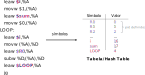

# Assembler

!!! info "EDSAC"
    O EDSAC (Electronic Delay Storage Automatic Calculator) é creditado como um dos primeiros computadores a utilizar um Assembler.
    
    
    
    > https://people.cs.clemson.edu/~mark/edsac.html

!!! info "Grace Hopper"
    Foi uma das primeiras pessoas a programar os computadores Mark I, Mark II, Mark III, UNIVAC I e UNIVAC II o que tornou ela uma das grandes pioneiras da computação e seus trabalhos influenciaram futuras gerações. Ela desenvolveu compiladores como o A-O e B-O que levaram ao desenvolvimento do COBOL, que foi usada durante muito tempo em diversos sistemas computacionais e ainda hoje, possui uso em sistemas críticos de [governos](https://www.nextgov.com/ideas/2020/05/learning-new-jersey-why-government-organizations-should-cut-ties-cobol/165356/) e [instituições financeiras](https://www.quora.com/Who-still-uses-COBOL) ao redor do mundo.
    
    
    Também um fato curioso, é que o primeiro bug de computadores se atribui a ela, no caso ela encontrou uma mariposa preso a um relay do Mark II que interrompeu uma execução de um programa dela.
    
    

    > https://en.wikipedia.org/wiki/Grace_Hopper
    
Linguagens Assembly são as representações simbólicas dos comandos binários do computador (linguagem de máquina), facilitando o desenvolvimento de programas. Essa é uma linguagem que chamamos de baixo nível, ou seja, ela não é tão sofisticada como uma linguagem Java onde os comandos abstraem o hardware, e não possuem uma relação direta com o hardware. Em geral instruções Assembly são convertidas diretamente para uma instrução de linguagem de máquina. 

Podemos dizer que é um mapeamento um para um, assim cada instrução Assembly vira uma instrução de máquina.

## O que um assembler faz?


!!! info "Assembler"
    Em português é conhecido como **montador**.

 As CPUs tem suas linguagens máquinas, que são descritas pelas sequências de bits, ou seja, seus `0`s e `1`s. O assembly é um formalismo que permite a criação dos programas em uma linguagem mais humanamente tratável, porém os computadores não conseguem executar diretamente esse tipo de instrução, uma série de tratamentos e conversões são necessárias e o que o Assembler faz é justamente traduzir essa linguagem de mnemônicos para os códigos binários da arquitetura em questão, ou seja, os `0`s e `1`s que o computador consegue diretamente executar.

!!! tip
    Os Assemblers presentes nos sistemas operacionais disponíveis são normalmente o NASM para a sintaxe intel e o GAS para a sintaxe AT&T, mas podem haver variações.
    
    http://www.ibm.com/developerworks/library/l-gas-nasm/

## Etapas de montagem

O montador proposto nesse curso tem as seguintes etapas:

1. Abrir arquivo
1. Análise sintática
1. Parsing (Tabela de Símbolos)
1. Geração de código (code)

### Análise Sintática

O assemble faz a análise sintática (parsing) dos arquivos, identificando cada sequencia de caracteres, e posteriormente gerando os códigos binários para uma determinada arquitetura.

Fazer o Parsing significa detectar cada símbolo para determinar a estrutura sintática de uma expressão, que é escrita de acordo com as regras de uma determinada gramática. Para analisar essa expressão, você tem que dividi-la no que chamamos de tokens:


### Símbolos

Uma das dificuldades em se programar em Assembly está relacionada ao gerenciamento de memória, ou seja, como saber em que endereço de memória devemos armazenar um valor ou para qual endereço realizar um salto, ou seja, um JUMP, ou Branching.

Para isso podemos usar referências simbólicas nos programas para endereçar memórias físicas no computador. Usamos uma variável como em linguagens de alto nível e esses símbolos são posteriormente convertidos em números pelo Assembler. 

``` nasm
leaw $END, %A
```

Para as variáveis de valores podemos escolher endereços seguindo alguma regra, que posteriormente podem ser recuperados e armazenados em uma tabela que relaciona o nome ao valor. 

```nasm
leaw $var1, %A
movw %D, (%A)
```

Já para os saltos, como a tradução do Assembly é direta, ou seja, as instruções em Assembly se mapeiam em instruções em linguagem de máquina como uma função bijetora, A tabela de símbolos pode ser usada para localizar onde estão marcados os marcadores que vamos chamar aqui de ==Labels== e também armazenar na memória.

Finalmente vale ressaltar que a tabela de símbolos muitas vezes vem com uma série de símbolos pré definidos, que podem acessar posições de memória padronizadas para algo específico da arquitetura.

``` nasm
leaw $R0, %A
leaw $LED, %A
```

O programa assembler varre o código em busca desses símbolos e cria uma tabela relacionando o seu nome a um valor que pode ser convertido em binário:



Sempre que o assembler encontrar um símbolo, ele consulta essa tabela em busca do valor associado a ele.

### Geração de código

O assembler necessita ler os opcodes e transformar em linguagem de máquina. É essa etapa que irá realmente criar uma saída binária. A geração de código deve identificar o tipo do comando que está sendo executado, os seus parâmetros e símbolos e então gerar a saída binária com base no instruction set de referência.


## Ferramental do curso

Desenvolvemos no projeto E-Assembly uma série de programas escritos em nasm, mas você já parou para pensar como esses programas são montados? Quando vocês executam o script `./testeAssembly.py` algumas coisas acontecem:

1. O script abre o arquivo de configurações de teste: `config.txt` e busca quais módulos nasm deve compilar
1. Para cada arquivo `.nasm` encontrado é chamado um programa em java que é o assembler, exemplo:

``` bash
$ java -jar ~/Z01-Tools/jar/Z01-Assembler.jar -i ./src/add.nasm -o /bin/add.hack
```

!!! tip
    Experimente você rodar esse comando e ver o que ele gera de output.

O programa em Java está dentro da pasta `Z01-Tools/jar` na raiz do usuário de vocês no linux. Esse programa em Java implementa o Assembler, e gera para cada nasm passado um executável.

O script de teste não para por aí, ele precisa agora pegar esse executável, junto com os testes e jogar no Hardware, executar e pegar o resultado.
