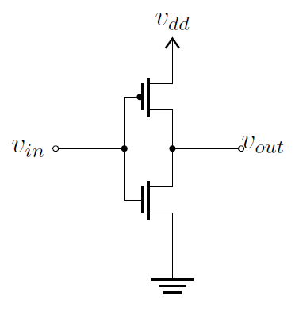
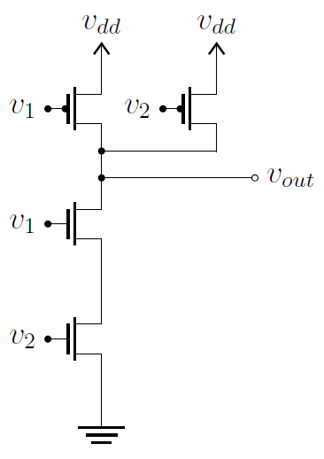
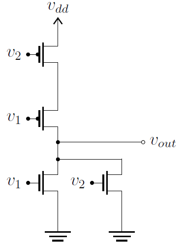

# Lógica CMOS (Complementary Metal–Oxide–Semiconductor)

- Conteúdo: CMOS

| Estudando    |                     |
| ---------    | --                  |
| Bibliografia |                     |
|              | [Cap7. FLOYD, 2005] |
|              | [Cap8. TOCCI, 2011] |

!!! tip
    Mais informações em: https://en.wikipedia.org/wiki/CMOS

## Transistores MOS

Os transistores MOSFET (Metal-Oxide-Semiconductor Field-Effect-Transistor) são os mais utilizados nos circuitos integrados analógicos e digitais, sendo que seu princípio básico foi proposto por Julius Edgar Lilienfeld em 1926. Mas, foi só em 1960 que esse transistor foi produzido. Seu princípio de funcionamento de baseia na presença de um capacitor MOS (Metal-Oxide-Semiconductor) que controla a quantidade de cargas na região semicondutora, chamada de canal. Os transistores MOS podem ser classificados de acordo com o portador de cargas: transistor nMOS onde a corrente é conduzida por elétrons e transistor pMOS onde a corrente é conduzida por lacunas. Para que esses dispositivos operem como chave, é necessária a aplicação de uma tensão de forma a atrair os portadores de corrente. Assim, no nMOS uma tensão positiva entre porta e fonte atrai elétrons para o canal, enquanto que no pMOS uma tensão negativa entre porta e fonte deve ser aplicada para atrair cargas positivas para a região do canal.

## Tecnologia CMOS

A tecnologia CMOS (Complementary MOS) é um tipo de processo de fabricação criado na década de 60, que utiliza pares simétricos e complementares de nMOS e pMOS para realizar funções lógicas. Para a análise dos circuitos lógicos CMOS, pode-se considerar que quando a tensão na porta de um nMOS foi positiva, ele se comporta como uma chave fechada e, quando a tensão for nula, se comporta como uma chave aberta. Para o pMOS, o comportamento é oposto: se comporta como chave fechada para a tensão nula e aberta para a tensão positiva.

### Lógica NOT

{width=300}

Quando ambos os transistores estão ligados em série como apresentado na figura, ao se aplicar uma tensão de entrada positiva, o nMOS (transistor inferior) se comporta como chave fechada enquanto o pMOS (transistor superior) se comporta como chave aberta. Assim, a tensão na saída será nula. Ao se aplicar uma tensão de entrada nula, o nMOS passa a se comportar como chave aberta enquanto o pMOS se comporta como chave fechada. Assim, a tensão na saída será positiva. Pode-se observar que o circuito opera como um inversor.

### Lógica NAND

{width=300}

Para formar a porta lógica NAND, dois transistores nMOS são ligados em série enquanto que dois pMOS são ligados em paralelo. A análise pode ser feita de mesma forma que para o circuito inversor.

### Lógica NOR

{width=300}

Para formar a porta lógica NOR, dois transistores pMOS são ligados em série enquanto que dois nMOS são ligados em paralelo. A análise pode ser feita de mesma forma que para o circuito inversor.

As demais porta lógicas podem ser criadas a partir dessas fundamentais.
