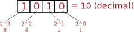

# Dados Digitais 

| Estudando      |                                                                                                                                                                                                            |
| ---------      | --                                                                                                                                                                                                         |
| Bibliografia   |                                                                                                                                                                                                            |
|                | [Cap 3,5. NISAN, 2005]                                                                                                                                                                                     |
|                | [Cap 8,11,12. FLOYD, 2011]                                                                                                                                                                                 |
|                | [Cap 7 TOCCI]                                                                                                                                                                                              |
| Leitura extra: |                                                                                                                                                                                                            |
|                | [Introduction to Digital Systems - Cap. 1](https://www.sciencedirect.com/science/article/pii/B978075064583650001X)                                                                                         |
|                | [Introduction to Digital Systems - Cap. 2](https://www.sciencedirect.com/science/article/pii/B9780750645836500021)                                                                                         |
| Vídeos (extra) |                                                                                                                                                                                                            |
| :+1:           | <iframe width="200" height="200" src="https://www.youtube.com/embed/dVixMB1uSYA" frameborder="0" allow="accelerometer; autoplay; encrypted-media; gyroscope; picture-in-picture" allowfullscreen></iframe> |
|                | [KhanAcademy](https://pt.khanacademy.org/math/algebra-home/alg-intro-to-algebra)                                                                                                                           |
|                | [Why Do Computers Use 1s and 0s? Binary and Transistors Explained.](https://www.youtube.com/watch?v=Xpk67YzOn5w)                                                                                                                                                                                                         |

!!! info "Primeiras Máquinas de Calcular"
    Wilhelm Schickard (1592–1635) construiu em 1623 uma calculadora para seu amigo astrônomo Johannes Kepler. Esta é a mais antiga calculadora mecânica conhecida de quatro funções, que foi descoberta por esboços da sua criação.
    
    {width=200}
    
    > Fonte: http://people.idsia.ch/~juergen/schickard.html

!!! info "História"
    Blaise Pascal (1623-1662) inventou e produziu em 1642 a Pascaline. Ela só podia fazer adição e subtração, manipulando os números inscritos em seus mostradores. Ele construiu 50 deles ao longo de 10 anos, embora só tenha vendido 15.
   
    {width=200}
   
    > Fonte: http://www.computerhistory.org/revolution/calculators/1/47
    
!!! info "Primeiras Máquinas de Calcular"
    Gottfried Wilhelm von Leibniz (1646-1716) é creditado como um dos inventores do cálculo diferencial e integral. Porém, foi o primeiro a documentar e estudar profundamente o sistema binário de numeração (base 2). Em 1672 Leibniz começou a inventar uma máquina capaz de fazer as 4 operações aritméticas, o Staffelwalze.
      
      {width=300}
    
    > Fonte: https://en.wikipedia.org/wiki/Gottfried_Wilhelm_Leibniz
    
Sistemas numéricos é a maneira como os seres humanos representam números, ao decorrer da história as civilizações assumiam maneiras diferentes de representar números, muitas vezes possuindo diferentes maneiras de codificar oralmente/escrito. 

O sistema decimal é o mais utilizado pelas civilizações modernas, nele utilizamos 10 símbolos: `0`, `1` ... `9` para representar qualquer número, essa notação remonta do fato de possuirmos 10 dedos em nossas mãos. Nesse sistema, cada digito possui um peso da ordem $10^n$:

{width=400}

!!! info "Algarismos indo-arábicos"
    O sistema de numeração hindu como a conhecemos hoje, pode ser atribuído a dois homens: o astrônomo Ariabata (आर्यभट) e seu pupilo Bhāskara I, durante 499-522 ac. Eles inventaram um sistema que se baseia na utilização da combinação de sílabas para formar os números, em um sistema incluindo a notação do zero. 
    
    
    
    > Fonte: https://kids.britannica.com/kids/assembly/view/89478

## Base 2

<iframe width="948" height="534" src="https://www.youtube.com/embed/7_t6IUJkJ1E" frameborder="0" allow="accelerometer; autoplay; encrypted-media; gyroscope; picture-in-picture" allowfullscreen></iframe>

No sistema de base 2 possuímos apenas duas opções de símbolo: `0` e `1`. Nessa base, cada posição possui um peso da ordem $2^n$:

{width=500}

Dessa maneira podemos construir o valor que desejarmos de decimal ($m$) em binário, para isso será necessário ocupar $ceil(log2(m))$ bits para armazenar o valor. A tabela a seguir ilustra algumas situações:

> `ceil`: arredondar para cima

| Valor decimal |      Bits necessário |
| ------------- |     ---------------- |
| $0 .. 1$      |                    1 |
| $0 .. 3$      | `ceil(log2(4))` =  2 |
| $0 .. 4$      |                    2 |
| $0 .. 6$      |                    3 |
| $0 .. 7$      |                    3 |
| $0 .. 15$     |                    4 |
| $0 .. 31$     |                    5 |
| $0 .. 63$     |                    6 |
| $0 .. 127$    |                    7 |

Supondo que possuímos um binário de três dígitos, um contador de `0` a `7` em decimal seria em binário: `000` -> `001` -> `010` -> `011` -> `100` -> `101` -> `110` -> `111` ... . O número `45` em binário é `0b101101`:


|   5 |   4 |   3 |   2 |   1 |   0 | posição        |
|-----|-----|-----|-----|-----|-----|----------------|
| 2^5 | 2^4 | 2^3 | 2^2 | 2^1 | 2^0 | peso           |
|  32 |  16 |   8 |   4 |   2 |   1 | valor          |
| `1` | `0` | `1` | `1` | `0` | `1` | número binário |

!!! tip
    Não tem muito segredo, para interpretar números binários facilmente é necessária prática! 

!!! tip
    Para saber qual o valor máximo de decimal que é possível armazenar com $n$ bits: 
    
    $0  ..  2^n-1$

!!! note "Nomenclatura"
    Iremos utilizar os prefixos:
    
    - ` `: Para indicar um número em decimal   
    - `0b`: Para indicar um número em binário
    - `0x`: Para indicar um número em hexadecimal

    Exemplo:
    ```
    hex      bin      dec
    0x100 != 0b100 != 100
      ```
   
<div id="quiz-result" class="card">
  Você acertou <span id="quiz-percent"></span>% - <span id="quiz-score"></span>/<span id="quiz-max-score"></span><br/>
</div>
    
!!! question "Quiz 1 - base 2"
     <div id="quiz-1">
            <!-- Question 1 -->
            <div class="card quizlib-question">
                <div class="quizlib-question-title">1. Quanto que é 0b00110 em decimal?</div>
                <div class="quizlib-question-answers">
                    <input type="text" name="">
                </div>
            </div>
            <!-- Question 2 -->
            <div class="card quizlib-question">
                <div class="quizlib-question-title">2. Converta 15 de decimal para binário</div>
                <div class="quizlib-question-answers">
                    <ul>
                        <li><label><input type="radio" name="q2" value="a"> 0015</label></li>
                        <li><label><input type="radio" name="q2" value="b"> 1111</label></li>
                        <li><label><input type="radio" name="q2" value="c"> 1110</label></li>
                        <li><label><input type="radio" name="q2" value="d"> 1101</label></li>
                    </ul>
                </div>
            </div>
            <button type="button-quiz" onclick="showResults(this.parentNode.id);">Verificar resposta</button>
      </div> 
    
### Definições

Em muitas linguagens de programação é necessário definirmos o tamanho da variável que iremos armazenar um dado, para facilitar o entendimento damos nome a quantidade de bits que ela irá ocupar: 

1. 4 bits: **nibble**
1. 8 bits: **byte**
1. 16 bits: **halfword**
1. 32 bits: **word**

### Conversão Decimal <-> Binário

Existem diversas técnicas de conversão binário :arrows_counterclockwise: decimal, a seguir detalhes de como realizar essas conversões, o segredo é entender os pesos de cada casa de um `bit` no sistema binário e então fazer a conta inversa.

<iframe width="948" height="534" src="https://www.youtube.com/embed/_68Cn5VuDxQ" frameborder="0" allow="accelerometer; autoplay; encrypted-media; gyroscope; picture-in-picture" allowfullscreen></iframe>

<iframe width="948" height="534" src="https://www.youtube.com/embed/gOXO5H4i18Y" frameborder="0" allow="accelerometer; autoplay; encrypted-media; gyroscope; picture-in-picture" allowfullscreen></iframe>

## Base 16

<iframe width="864" height="486" src="https://www.youtube.com/embed/uuUzkqSxCz4" frameborder="0" allow="accelerometer; autoplay; encrypted-media; gyroscope; picture-in-picture" allowfullscreen></iframe>

A base 16, ou hexadecimal, é outra maneira de representarmos números utilizando não só `2` ou `10` símbolos como acabamos de ver, mas 16 símbolos! É como se conseguimos representar o valor `10` com um único carácter, no caso iremos utilizar o `A`.

Nessa base, cada unidade possui um peso na forma $2^{16}$:

{width=500}

Um contador no formato hexadecimal possui a seguinte forma:

| Decimal |   Binário | Hexadecimal |
| ------- |   ------- | ----------- |
|       0 |      0000 |           0 |
|       1 |      0001 |           1 |
|       2 |      0010 |           2 |
|       3 |      0011 |           3 |
|       4 |      0100 |           4 |
|       5 |      0101 |           5 |
|       6 |      0110 |           6 |
|       7 |      0111 |           7 |
|       8 |      1000 |           8 |
|       9 |      1001 |           9 |
|      10 |      1010 |           A |
|      11 |      1011 |           B |
|      12 |      1100 |           C |
|      13 |      1101 |           D |
|      14 |      1110 |           E |
|      15 |      1111 |           F |
|      16 | 0001 0000 |          10 |

### Base 16 <--> Base 2

<iframe width="864" height="486" src="https://www.youtube.com/embed/SU0HpCAkIxY" frameborder="0" allow="accelerometer; autoplay; encrypted-media; gyroscope; picture-in-picture" allowfullscreen></iframe>

A conversão de número na base 16 para a base 2 e vice-versa acontece de forma trivial. Da base 2 para a base 16 basta separar os bits da palavra em unidades de 4 casas e então realizar a conversão de cada grupo de 4 bits para o seu equivalente em Hexa. Para a conversão de hexa para binário, basta converter cada símbolo de hexa para o seu equivalente em binário (4 dígitos), seguindo a tabela anterior.

Exemplos:

a) 0xA01 para binário:
  
```
      A   0    1  
      |    \    \ 
      |     \    \  
     1010   0000  0001 
     
     -> 0b1010_0000_0001 
```

b) `0b1111_0101_1000` para hexa:
  
```     
     1111 0101 1000
      |    |    |
      |    |    |
      F    5    8
      
      -> 0xF58
```

### Base 16 <--> Base 10

<iframe width="864" height="486" src="https://www.youtube.com/embed/0yAst89n0rM" frameborder="0" allow="accelerometer; autoplay; encrypted-media; gyroscope; picture-in-picture" allowfullscreen></iframe>

Para converter de Hexa para Decimal basta aplicar os pesos em cada um das unidades, como demonstrado a seguir:

a) 0xA01 para decimal:

```
    A       0       1
    |       |       |
    |       |       |
  A.16^2  0.16^1   1.16^0
    
   -> 10.256 + 0.16 + 1.1 = 2561
```

Para alterar a base de Decimal para Hexa, uma das soluções mais triviais é a de converter primeiro para binário e então agrupar os bits de 4 em 4 e converter para hexa:

```
   Decimal -> Binário -> Hexa
```

b) 42 -> 0x ???

```
    32 +  8 +  2 = 42
      \   |   /     ---------------
       \  |  /      |             |
        \ | /       |             v
42 -> 0b101010 -> 0010 1010 -> 0x2A
                         |        ^
                         |        |
                         ----------
                  ----|----
                      |      
                Blocos de 4 bits
```

## Base 8

Similar as outras bases de número, o sistema octal é composto por 8 símbolos: `0` .. `7`, e nele cada posição possui valor na forma de: $8^n$. Veja o exemplo a seguir:

a) 137 em octal para decimal: $1.8^2 + 3.8^1 + 7.8^0=95$


|    2 |   1 |   0 | posição                    |
|------|-----|-----|----------------------------|
|  8^2 | 8^1 | 8^0 | peso                       |
|   64 |   8 |   1 | peso                       |
|  `1` | `3` | `7` | valor octal                |
| 1*64 | 3*8 | 7*1 | :arrow_right: $64+24+7=95$ |

Para representarmos um valor octal em binário, é necessário reservarmos 3 bits para cada símbolo do número octal, a conversão é feita como no sistema hexadecimal, porém aqui separando blocos de 3 bits:

b) 137 para binário:

```
 001 011 111
```


O sistema octal é utilizado no Linux para permissões de arquivos onde são necessários 3 bits para controlar se um usuário possui: acesso de leitura, escrita e/ou execução de um determinado arquivo:
    
| Permission              | rwx | Binary | octal |
|-------------------------|-----|--------|-------|
| read, write and execute | rwx |    111 |     7 |
| read and write          | rw- |    110 |     6 |
| read and execute        | r-x |    101 |     5 |
| read only               | r-- |    100 |     4 |
| write and execute       | -wx |    011 |     3 |
| write only              | -w- |    010 |     2 |
| execute only            | --x |    001 |     1 |
| none                    | --- |    000 |     0 |

Para modificar a permissão de um arquivo no linux é necessário fornecer a informação para três grupos diferentes: `usuário`, grupos na qual o usuário faz parte e qualquer outro user. Para isso basta escrever no terminal: 

```
            / others
           /
$ chmod 754 FILE
        | \
        |  \ group
        user 
```
    
Isso da permissão de: 

- user: read/write/execute
- group: read/execute
- others: read


!!! tip "Povos"
    Alguns povos da América do Norte, México e Europa utilizam o sistema octal, pois consideram a quantidade dos vãos dos dedos e não os dedos propriamente.
    
    > Fonte: https://en.wikipedia.org/wiki/Octal#By_Native_Americans

!!! tip "Início da computação"
    Para que serve o sistema octal? No começo da computação a IBM possuía memórias com: 6-bit, 12-bit, 24-bit e 36-bit. Sendo todas as unidades divisíveis por 3, o que facilita a interpretação em um sistema octal.
    
## Outros sistemas

Existem inúmeras maneiras de codificação de números e/ou caracteres diversos, as mais utilizadas são:

- BCD
- ASCII
- UTF-8

### BCD

No sistema [Binary-coded decimal (BCD)](https://pt.wikipedia.org/wiki/Codifica%C3%A7%C3%A3o_bin%C3%A1ria_decimal) cada unidade de um sistema decimal é convertido para `4 bits`, muito parecido com a conversão para Hexadecimal. Ele é muito utilizado em relógios e quando há a necessidade de exibição do valor em decimal em binário (Display de 7 segmentos).

- Exemplo, `356` em BCD: 

```
  3   5    6    : Decimal
0011 0101 0110  : BCD
```

<iframe width="900" height="506" src="https://www.youtube.com/embed/AM0tr8Kyvzg" frameborder="0" allow="accelerometer; autoplay; encrypted-media; gyroscope; picture-in-picture" allowfullscreen></iframe>

### ASCII

[ASCII](https://pt.wikipedia.org/wiki/ASCII) (do inglês American Standard Code for Information Interchange; "Código Padrão Americano para o Intercâmbio de Informação") é uma maneira de codificar em binário (8 bits) 95 sinais gráficos (letras, símbolos e números) e alguns sinais de controle. É muito utilizada pelos programas para armazenarem 'caracteres' e 'strings'. 

[](http://www.asciitable.com)

> Fonte: www.asciitable.com

Por exemplo, a palavra Insper convertido para ASCII fica da seguinte maneira (em decimal):

{width=500}

<iframe width="900" height="506" src="https://www.youtube.com/embed/zB85kTs-sEw" frameborder="0" allow="accelerometer; autoplay; encrypted-media; gyroscope; picture-in-picture" allowfullscreen></iframe>
    
