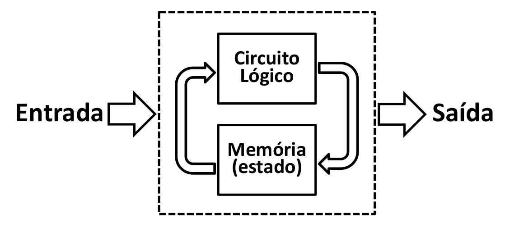

# Lógica Sequencial

!!! success "2020-2"
    Material atualizado.

<iframe width="692" height="519" src="https://www.youtube.com/embed/lNW2d26S-gI" frameborder="0" allow="accelerometer; autoplay; encrypted-media; gyroscope; picture-in-picture" allowfullscreen></iframe>

!!! info "Colossus"
    O Colossus foi um computador Britânico de 1700 válvulas, feito
    em 1943 para decifrar códigos nazistas durante a segunda
    guerra mundial. O computador e planos foram destruídos para
    manter o projeto em segredo.
    
    Uma característa importante desse computador é que ele podia 
    ser programado e reprogramado para decifrar as mensagens nazistas.
    Essa flexibilidade de programação foi revolucionária. O computador
    usava um mecanismo de memória chamado de flip-flops, que foi 
    desenvolvido muitos anos antes pelos professores 

    - http://www.britannica.com/technology/computer/images-videos/The-Colossus-computer-at-Bletchley-Park-Buckinghamshire-England-1943/19626
    - http://www.computerhistory.org/revolution/digital-logic/12/269
    - https://en.wikipedia.org/wiki/Flip-flop_(electronics)

Até este momento do curso só usamos circuitos criados com lógica combinacional, porém nem todos os tipos de lógica digital podem ser enquadrados nessa categoria. Nessa lógica uma tabela verdade define bem a saída de um circuito. Nesses casos, podemos dizer que ao colocar os sinais nas entradas de uma unidade lógica aritmética temos quase que instantaneamente uma saída válida independente dos sinais que estavam anteriormente no circuito. 

{width=400}

Já na lógica sequencial o estado anterior das entradas influencia na saída, ou seja, essa lógica possui uma memória. E é justamente essa característica de memória de estados anteriores que nos interessa. Podemos por exemplo armazenar valores para uso futuro, ou tomar uma decisão com base no estado anterior/atual.

{width=600}

http://www.inf.pucrs.br/~emoreno/undergraduate/SI/orgarq/class_files/Aula06.pdf
http://www.ee.surrey.ac.uk/Projects/CAL/seq-switching/General_seq_circ.htm

Sistemas sequências são em sua grande maioria combinados com sistema síncrono, onde todos o circuito digital opera em um determinado ritmo, esse sinal é conhecido como `clock` do sistema. 

## Circuitos biestáveis

Um dos circuitos sequenciais mais simples existentes são os circuitos biestáveis, que são chamados assim pois permanecem em um dos dois estados binários (`0` ou `1`) enquanto estiver energizado. Eles são usados para armazenar e recuperar os estados dos bits dos computadores.

- http://hyperphysics.phy-astr.gsu.edu/hbase/electronic/nandlatch.html#c1

O [latch SR](https://pt.wikipedia.org/wiki/Circuito_sequencial) é um circuito biestável composto de duas portas NOR que armazenam um valor simples. 

{width=200}

> Fonte: [WikiBook](https://en.wikibooks.org/wiki/Digital_Circuits/Latches)

Neste circuito normalmente as entradas `S` e `R`, conhecidas como Set e Reset, ficam em nível baixo. Enquanto estiverem assim o valor das saídas `Q` e $\bar{Q}$, que é sempre o inverso do `Q`, se mantem inalterados. Se o nível do `S` subir (`1`) a saída `Q` fica em nível alto, ou podemos dizer `1`, já se o nível do `R`, `Q` fica em nível lógico baixo, ou seja `0`. A tabela a seguir ilustra o texto:

| $S$ | $R$ | $Q$         | $\bar{Q}$   |
|-----|-----|-------------|-------------|
| `0` | `0` | Armazenado  | !Armazenado |
| `1` | `0` | `1`         | `0`         |
| `0` | `1` | `0`         | `1`         |
| `1` | `1` | metaestável | metaestável |

!!! note "Metaestável"
    Oxford Languages: capaz de perder a estabilidade através de pequenas perturbações (diz-se de sistema físico).
    
    No circuito anterior mestaestável indica que a saída pode ser `0` ou `1`, e que não podemos prever qual será.
    
Um outro circuito biestável é o latch tipo D, nesse caso o circuito mantem o valor da entrada de Dados D enquanto a entrada de Enable `E` estiver em nível alto, se o sinal `E` for para nível baixo o circuito não muda de estado. 

{width=300}

Esse componente possui a tabela verdade a seguir:

| $E$ | $D$ | $Q$                    | $\bar{Q}$                     |
|-----|-----|------------------------|-------------------------------|
| `0` | `0` | Armazenado             | !Armazenado                   |
| `0` | `1` | Armazenado             | !Armazenado                   |
| `1` | `0` | Copia Entrada `D`: `0` | Copia Entrad `D` negada: `1` |
| `0` | `1` | Copia Entrada `D`: `1` | Copia Entrada `D` negada: `0` |

<iframe width="900" height="506" src="https://www.youtube.com/embed/KGVeOCovTEQ" frameborder="0" allow="accelerometer; autoplay; encrypted-media; gyroscope; picture-in-picture" allowfullscreen></iframe>

## Clock

Em sistemas digitais, precisamos considerar que cada porta lógica possui um tempo de propagação do resultado, a resposta de uma porta AND não é imediata, leva alguns `ns` para que o resultado da operação `a and b` estabilize na saída. Cada porta possui tempos de propagação distintos (até uma mesma porta AND possui diferença de tempo entre elas). 

Imagine um sistema com centenas de milhares de portas lógicas onde um sinal pode percorrer por diversos caminhos diferentes, mas precisa chegar na saída ao mesmo tempo. Em hardware isso é muito difícil de prever/ controlar. A solução utilizada nesses casos é a de sincronizar os sinais com diferentes tempos de propagação.

> Podemos fazer analogia com uma banda que possui um saxofonista muito virtuoso chamado de Nand-Parker e um pianista mais calmo chamado de Or-Brubeck, o que aconteceria se cada um tocasse em seu tempo? O resultado com certeza não serial bom! Para isso cada música possui um ritmo/ batida, na qual os músicos por mais 'velozes/lentos' que sejam, precisam seguir. Em um sistema digital, esse é um dos papeis do clock! fazer com que todos executem ao mesmo tempo.

O clock é um sinal elétrico periódico utilizado para sincronizar sistemas digitais, utilizado em todo circuito síncrono, serve como o 'baterista' da banda, dando o ritmo de execução para a eletrônica. A cada novo clock (instante que ocorre uma mudança no sinal `0` -> `1`), o sistema começa uma nova operação. O sinal do clock é geralmente periódico e de modulação 50% (50% em alto e 50% em baixo):

{width=500}

!!! note "Frequência"
    F=1/L

!!! note "Clock de 3Ghz"
    São 3 bilhões `3_000_000_000` de bordas (`0` -> `1`) em um segundo!! Imagine que a cada borda, uma operação é realizada no computador, são 3 bilhões de operações em um único segundo....

!!! note "Overclock?"
    Muitos de vocês já ouviram falar overclock? Nessa técnica, aumentasse o clock para uma frequência na qual o sistema não foi projetado
    para operar, consequências disso são:
    
    - Possíveis erros de processamento (dado que parte do circuito pode ser mais lento que o 1/f)
    - Superaquecimento do chip, já que a tecnologia atual utilizada para fabricação de componentes eletrônicos (MOSFET) 'gasta' energia a cada clock. Com um aumento no clock, mais energia é gasta por segundo.
    
!!! note "Borda"    
    Nem todo sistema digital trabalha com borda de subida (`rising_edge`) (`0` -> `1`), outras opções são:
    
    - borda de descida (`falling_edge`): `1` -> `0`.
    - double data rate (DDR): Uma nova mudança a cada borda, subida e descida. (**Dai que vem o nome da memória DDR4 do seu computador!**)
    
<iframe width="640" height="360" src="https://www.youtube.com/embed/CDjQlw8bRU8" frameborder="0" allow="accelerometer; autoplay; encrypted-media; gyroscope; picture-in-picture" allowfullscreen></iframe>
    
- http://slideplayer.com.br/slide/370185/
-  http://www.plantation-productions.com/Webster/www.artofasm.com/Linux/HTML/SystemOrganizationa4.html
- http://www.gitam.edu/eresource/comp/gvr/6.1.htm

## Flip-Flop

Flip-Flop (FF) é um circuito similar ao LATCH porém síncrono, ou seja, a mudança na saída (`Q`) só ocorre na borda do clock. 

!!! tip
    FF são usados por diversas razões, nesse curso vamos explorar o uso do FF para a criação de uma unidade de armazenamento de bits.
    
!!! note
    Sabe o CI 555? Aquele usado em acionamentos para gerar o PWM? Internamente ele possui um FF do tipo D:
    
    
    
    > Fonte: https://www.electronics-tutorials.ws/waveforms/555_timer.html
    
Existem diversos tipos de FF, mas vamos explorar apenas o FF do tipo D.

### FF tipo D

O FF tipo D possui as seguintes portas:

- $D$ entrada do de `Dado`
- $Q$ saída do dado copiado
- $\bar{Q}$ saída do dado copiado
- $CLK$ entrada do clock

{width=300}

Toda vez que o ocorre uma borda de subina no `clock`, o sinal que está na entrada `D` é copiado para a saída `Q`, conforme diagrama a seguir:

{width=500}

A tabela verdade desse componente é representada da seguinte maneira:

| $D$ (in)  | $clk$ (in) | $Q$ (out)   |
|-----------|------------|-------------|
| `0`       | `0`        | `Q*`        |
| `1`       | `1`        | `Q*`        |
| `0`       | `^`        | `0`         |
| `1`       | `^`        | `1`         |

- `^`: borda de subida
- `Q*`: Q armazenado anteriormente 

### Clear e Preset

FF do tipo D podem possuir mais dois sinais de controle: `clear` e `preset`. O sinal `clear` faz com que a saída `Q` vá para `0` independe da entada `D` e do `clock`. O sinal `preset` faz com que a saída `Q` vá para `1` independente da entrada `D` e do `clock`.

A tabela verdade com esses sinais a mais fica:

| $D$ (in) | $clr$ | $set$ | $clk$ (in) | $Q$ (out) |
|----------|-------|-------|------------|-----------|
| `x`      | `0`   | `0`   | `x`        | `Q*`      |
| `x`      | `1`   | `0`   | `x`        | `0`       |
| `x`      | `0`   | `1`   | `x`        | `1`       |
| `0`      | `0`   | `0`   | `^`        | `0`       |
| `1`      | `0`   | `0`   | `^`        | `1`       |

<iframe width="900" height="506" src="https://www.youtube.com/embed/60ne-hmsd8g" frameborder="0" allow="accelerometer; autoplay; encrypted-media; gyroscope; picture-in-picture" allowfullscreen></iframe>
