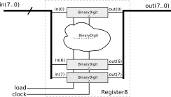

# Componentes Síncronos 

!!! info "Leitura necessária"
    - [The Elements of Computing Systems (Livro texto do curso), cap 3](https://b1391bd6-da3d-477d-8c01-38cdf774495a.filesusr.com/ugd/44046b_862828b3a3464a809cda6f44d9ad2ec9.pdf) 
    
<div style="text-align: center;" class="no-print"><embed src="https://b1391bd6-da3d-477d-8c01-38cdf774495a.filesusr.com/ugd/44046b_862828b3a3464a809cda6f44d9ad2ec9.pdf"  width="650" height="500"></div>

    
## Binary digit - `bits`

{width=300}

Criado com um FlipFlop tipo D, esse componente (que vamos chamar de `bit`) é capaz de armazenar um bit e será usado na construção das unidades de memória utilizadas na CPU.

{width=500}

> DFF = FlipFlop do tipo D

Esse componente funciona da seguinte maneira:

1. `load = '0'` FF é realimentando e mantém o valor que foi armazenado.
1. `load = '1'`, na subida do clock o componente 'captura' o valor da entrada in.

Pseudo código que descreve o funcionamento do bit é:

``` python
if load = '1' then:
  q = d
d = d
```

## Registrador

{width=400}

O registrador é um componente formado por vários `bits` e é capaz de armazenar um vetore de bits: 8 bits; 16 bits; 32 bits; ... . 

Pseudo código que descreve o funcionamento do register e 

``` python
if load = '1' then:
  q[7:0] = d[7:0]
d[7:0] = d[7:0]
```

Internamente o `register` é formado por diversos `bits`, um para cada index do vetor de bits de entrada:

{width=500}

Ele é utilizado geralmente dentro da CPU, como uma memória do tipo 'rápida'.

!!! note
    Podemos utilizar registradores de largura `w` para construir registradores de largura m*`w`:
    
    ```
      --------------------------------
      | ------------- -------------  |
      | | reg_8     | | reg_8     |  |
      | ------------- -------------  |
      -------------------------------- reg_16
    ```

!!! tip "uso"
    {width=400}
    
    Na nossa CPU do lab 10, o registrador é o HW que armazena a saída da ULA, nesse
    caso ele possui 16 bits de largura!


## Memória RAM

Uma memória é um array de registradores, ela funciona como uma tabela, onde conseguimos armazenar um vetor de bits em algum endereço (linha), a RAM possui as seguintes portas:

- `in` clk: entrada de clock
- `in` d: entrada do dado a ser armazenado (vetor de bits)
- `in` address: endereço onde o `word` será armazenado
- `in` load
    - `load = '0'`: não armazena word
    - `load = '1'`: armazena nova word
- `out` q: saída do valor armazenado no endereço `address`

O sinal `load` funciona como um controle se a operação a ser realizada na memória é a de gravar (`load = 1`) ou apenas ler o que já foi salvo (`load = 0`).

Pseudo código que descreve o funcionamento da memória RAM

``` python
if load = '1' then:
   ram[address] = d
else:
   q = ram[address]
```

{width=500}
