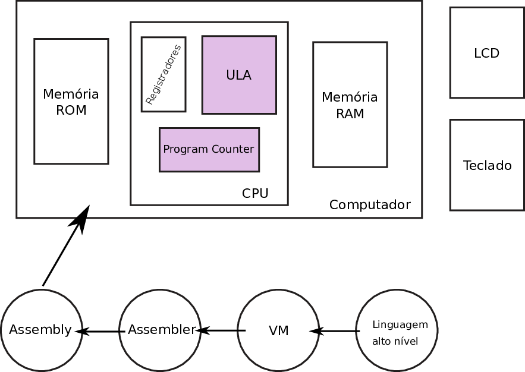

# ULA

!!! success "2020-2"
    Material atualizado.

Unidade Lógica Aritmética (ULA) é a parte da Unidade de Processamento (CPU) responsável por realizar operações binárias. Nesse hardware 

!!! info "Leitura necessária"
    - [The Elements of Computing Systems (Livro texto do curso), cap 2.](https://b1391bd6-da3d-477d-8c01-38cdf774495a.filesusr.com/ugd/44046b_f0eaab042ba042dcb58f3e08b46bb4d7.pdf) 
    
    
<embed src="https://b1391bd6-da3d-477d-8c01-38cdf774495a.filesusr.com/ugd/44046b_f0eaab042ba042dcb58f3e08b46bb4d7.pdf" width="600" height="500">

!!! warning
    Estudar pelo livro, o restante dessa teoria é apenas um resumo e algumas notas.

<iframe width="955" height="716" src="https://www.youtube.com/embed/zRX3sOtjS10?start=403" frameborder="0" allow="accelerometer; autoplay; encrypted-media; gyroscope; picture-in-picture" allowfullscreen></iframe>

!!! tip
    No coursera temos os autores do livro dando uma aula sobre esse tópico.
    
    - https://www.coursera.org/lecture/build-a-computer/unit-2-4-arithmetic-logic-unit-6ZS46

## Arquitetura

A ULA utilizada no curso tem a seguinte arquitetura interna:

## Operações

| zx | nx | zy | ny | f | no | out |
|----|----|----|----|---|----|--------|
|  1 |  0 |  1 |  0 | 1 |  0 | 0      |
|  1 |  1 |  1 |  1 | 1 |  1 | 1      |
|  1 |  1 |  1 |  0 | 1 |  0 | -1     |
|  0 |  0 |  1 |  1 | 0 |  0 | x      |
|  1 |  1 |  0 |  0 | 0 |  0 | y      |
|  0 |  0 |  1 |  1 | 0 |  1 | !x     |
|  1 |  1 |  0 |  0 | 0 |  1 | !y     |
|  0 |  0 |  1 |  1 | 1 |  1 | -x     |
|  1 |  1 |  0 |  0 | 1 |  1 | -y     |
|  0 |  1 |  1 |  1 | 1 |  1 | x+1    |
|  1 |  1 |  0 |  1 | 1 |  1 | y+1    |
|  0 |  0 |  1 |  1 | 1 |  0 | x-1    |
|  1 |  1 |  0 |  0 | 1 |  0 | y-1    |
|  0 |  0 |  0 |  0 | 1 |  0 | x+y    |
|  0 |  1 |  0 |  0 | 1 |  1 | x-y    |
|  0 |  0 |  0 |  1 | 1 |  1 | y-x    |
|  0 |  0 |  0 |  0 | 0 |  0 | x&y    |
|  0 |  1 |  0 |  1 | 0 |  1 | x or y |

### Operação não trivial

A maioria das operações da nossa ULA são imediatas, a menos imediata de entender é a operação `y-x`, nesse caso, se olharmos a operação que é realizada na ULA para executar isso notamos que:

1. $y-x=\overline{x+\bar{y}}$
    - esse `+` é de operação de soma, não OR!
1. Precisamos fazer um truque, note que: $\bar{y}=-y-1$
1. Substituindo: $\overline{x+ (-y -1)}$
1. Podemos chamar: $x+ (-y -1) = z$
1. $\overline{z}$, aplicando a mesma substituição que 2.
1. $\overline{z}=-z-1$, recuperando `z`
1. $-y-x=-(x -y -1)-1$
1. $y-x=-x+y$
