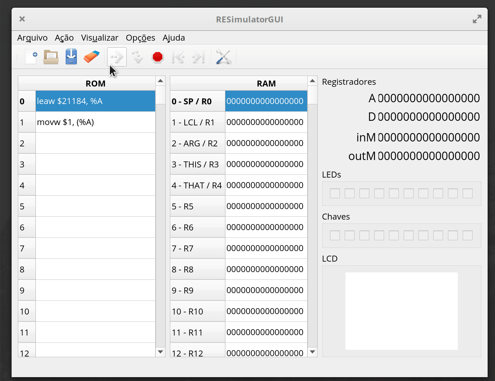

# ASM - Mapa de memória

!!! success "2020-2"
    Material atualizado.

A forma na qual a maioria das CPUs acessam periféricos (teclado/ mouse/ USB/ tela/ ...) é a do periférico mapeado em memória. Essa técnica utiliza da capacidade do computador de escrever e ler da memória RAM, **fazendo com que regiões de endereços da memória não sejam uma 'memória' física, mas sim um periférico do computador.**

{width=500}

Vamos trabalhar com o exemplo do nosso Z01, a memória é composta de:

- RAM 
- LCD
- Chaves
- LEDs

Nesse nosso hardware a memória que é visível pela CPU é organizada da seguinte maneira:

| Endereço            | Periférico           | Leitura (`r`) / Escrita (`w`) |
| ------------------- | -------------------- |                           |
| 0    -     16383    | RAM                  | r/w                       |
| 16384 - 21183       | LCD                  | w                         |
| 21184               | LED                  | w                         |
| 21185               | SW                   | r                         |


## RAM

| Endereço            | Periférico           | Leitura (`r`) / Escrita (`w`) |
| ------------------- | -------------------- |                           |
| 0    -     16383    | RAM                  | r/w                       |

A memória RAM é um componente do computador que permite guardar dados voláteis (que vão se perder após o reset do computador). É nela que guardamos as variáveis do programa. 

!!! note
    Nossa memória RAM possui 16 bits de largura.

A princípio podemos utilizar qualquer endereço da memória RAM para armazenar dados temporários, isso não será verdade mais para frente do curso, onde iremos organizar nossa memória RAM em secções.

!!! tip
    Iremos dar alguns nomes para os endereços específicos da memória RAM:

    | endereço | label / nome |
    |----------|--------------|
    | 0        | SP           |
    | 1        | LCL          |
    | 2        | ARG          |
    | 3        | THIS         |
    | 4        | THAT         |

!!! example
    Vamos fazer um exemplo que lê um dado na RAM[3] o incrementa e salva novamente no mesmo endereço de memória:

    === "código"

        ``` nasm
        leaw $3, %A    ; faz %A = 3 (%A aponta para RAM[3])
        movw (%A), %D  ; move o valor de RAM[%A] para %D
        incw %D        ; incrementa o valor de D (D = D + 1, D = RAM[3] + 1)
        movw %D, (%A)  ; move o valor incrementado de volta para a RAM[3]
        ```

        - Podemos também usar o label `ARG` para referencia o endereço `3` da memória RAM:

        ``` nasm
        leaw $ARG, %A  ; faz %A = 3 (%A aponta para RAM[ARG])
        ```

    === "simulador"
        {width=600}

    === "hardware"
        


!!! tip
    Execute você esse código no simulador! E analise o resultado.

!!! warning
    É necessário notar que a memória RAM não é um registrador e possui uma **grande limitação**, ==não podemos realizar uma ação de ESCRITA E LEITURA no mesmo ciclo!== O que impossibilita de fazermos o seguinte:

    ```nasm
    leaw $3, %A  
    incw (%A)              ; Não funciona no nosso hardware!!
    addw (%A), %D, (%A)    ; Nao funciona no nosso hardware!!
    ```
    
    - O assembly permite que vocês escrevam essas operações, porém quando
    forem executar no hardware o resultado não vai ser o esperado.

## LEDs

| Endereço            | Periférico           | Leitura (`r`) / Escrita (`w`) |
| ------------------- | -------------------- | -----------                   |
| 21184               | LED                  | w                             |


{width=500}

Os LEDs da FPGA são mapeados no endereço de memória `21184` onde cada bit (9..0) representa um LED, se o bit específico estiver valor `1`o LED está aceso e `0` apagado.

!!! example
    Como isso é traduzido para código? Imagine que desejamos acender um LED que nosso computador controla, para isso devemos fazer com que o registrador `%A` aponte para o endereço de memória na qual o LED está associado e então escreva nele:

    === "código"

        ```nasm
        leaw $21184, %A   ; endereço do LED
        movw $1, (%A)     ; move valor 1 para ele
        ```

    === "simulador"
        {width=600}

!!! tip
    Execute você esse código no simulador!

!!! tip
    Note que usamos `movw $1, (%A)`, nossa ULA é capaz de gerar os valores `1`, `-1` e `0`, mas outros valores não!

## SW

| Endereço            | Periférico           | Leitura (`r`) / Escrita (`w`) |
| ------------------- | -------------------- | --------                      |
| 21185               | SW                   | r                             |

{width=500}

Os chaves (SW) da FPGA são mapeados no endereço de memória `21185` onde cada bit (9..0) representa uma chave, se o bit específico estiver valor `1` indica que a chave está ligada (on) e `0` desligada.

!!! example

    O exemplo a seguir copia o valor das chaves para os LEDs:

    === "código"
        ```nasm
        leaw $21185, %A   ; endereço da chave
        movw (%A), %D     ; copia valor das chaves para %D
        leaw $21184, %A   ; endereço do LED
        movw %D, (%A)     ; move valor das chaves para %D
        ```

    === "simulador"
        {width=600}

!!! tip
    Execute você esse código no simulador!

## LCD

| Endereço            | Periférico           | Leitura (`r`) / Escrita (`w`) |
| ------------------- | -------------------- | --------                      |
| 16384 - 21183       | LCD                  | w                         |


{width=500}

O nosso LCD é um dispositivo de `320x240` pixels. Cada linha do endereço de memória do LCD representa `16` pixels do dispositivo, conforme figura anterior. Para acender um pixel, basta colocar `1` ou `0` para apagar.-

!!! tip "endereços do LCD"
    Como nosso LCD possui 320px na horizontal, e como cada endereço de memória acessa 16px por vez,
    uma linha é acessível por: `320/16 = 20` endereços. Ou seja, para acessar os primeiros px de cada linha devemos escrever endereço de memória:

    - Primeira linha: `16384 + 0 vezes 20`: 16384
    - Segunda  linha: `16384 + 1 vezes 20`: 16404
    - Terceira linha: `16384 + 2 vezes 20`: 16424
    - ...
    - Última linha:  `16384 + 239 vezes 20`: 21164


!!! example "LCD"
    Vamos desenhar px no meio do LCD que, para isso precisamos carregar o valor  0x`0001` no endereço `18242`

    ```nasm
    leaw $18242, %A
    movw $1, (%A)
    ```

!!! tip
    Execute você esse código no simulador!
