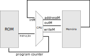
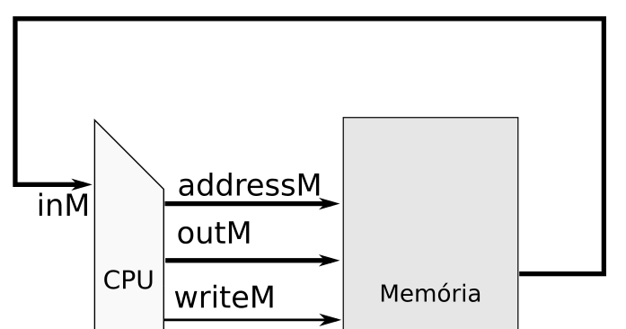
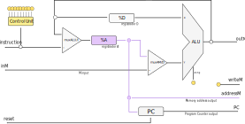

# Z01 

!!! success "2020-2"
    Material atualizado.

Nosso computador ao final das entregas de hardware (mais uma única entrega!) possuirá a estrutura a seguir:

{width=500}

No centro, a unidade central de processamento - **CPU** (*Central processing unit) que é responsável por realizar todas as operações do computador (processamento, mover dados, decisões, ...). A memória **ROM** é onde o programa a ser executado pela CPU está armazenado. A memória RAM é onde a CPU pode armazenar dados e também é na **RAM** que temos os periférico do computador mapeado em memória.

Notem que a CPU é responsável por gerar os sinais de controle tanto da ROM quanto da memória RAM. Um dos sinais que a CPU gera é chamado de **Program Counter - PC**, esse sinal é conectado ao *address* da memória ROM:

{width=300}

O PC indica qual **instrução** a CPU irá buscar (*fetch*) na memória para poder executar, o PC é normalmente sequência se o código não possui nenhuma condição, a condição faz com que o PC mude o valor atual dele para um novo valor, mas no próximo clock continua a contagem a partir desse valor.

{width=300}

A CPU acessa a memória RAM com 4 sinais:

- `addressM`: Indica qual endereço da memória RAM a CPU está acessando
- `outM`:  A informação que a CPU deseja 'escrever' na RAM
- `writeM`: Se a CPU quer escrever (`writeM=1`) ou ler (`writeM=0`) da RAM
- `inM`: Caso a CPU leia da memória RAM, a informação é transmitida por esse sinal!

## CPU

A nossa CPU (proposta originalmente no livro texto), possui internamente dois registradores `%A` e `%D` de *16*bits cada, uma ULA, um `Program Counter` e um `Control Unit`:

