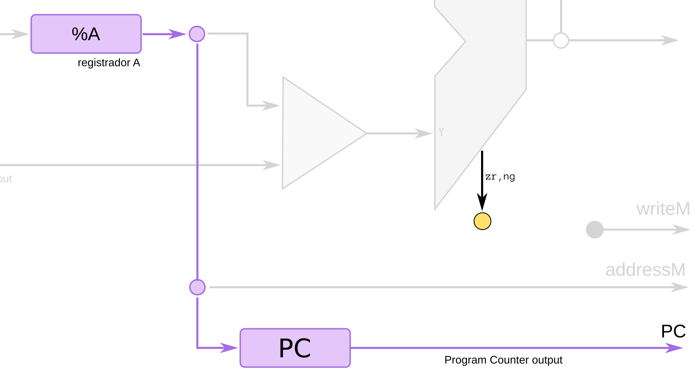
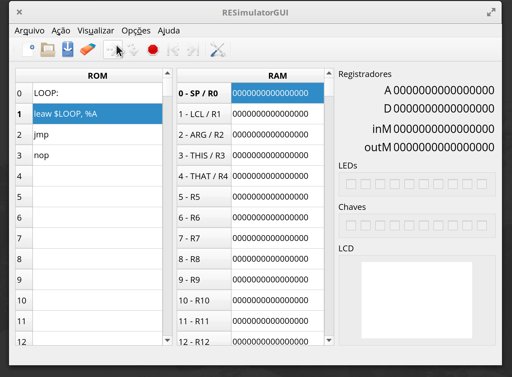

# ASM - jump

Saltos (jumps) são instruções em assembly que permitem a execução não sequêncial de um programa. As instruções de jumpo quando executadas alteram o program counter.

Nossa CPU é capaz de realizar códigos com condição, tal como:

``` python
if a > 0:
    b = 2
else:
    b = 3
```

ou:

``` python
while True:
    b = b+1
```

A maneira de realizarmos esse tipo de condição é com instruções de salto (`jump`), uma instrução de salto verifica uma determinada condição e realiza ou não o salto com base nessa condição, alterando o PC.


A sequência de execução do código é ditada pelo Program Counter (PC), um salto acontece quando o PC sofre uma mudança da sua sequência natural:

```
              | salto
              v
PC: 0 1 2 3 4   8 9 10 11
--------------------------------> tempo
```

Essa mudança pode ser tanto para 'frente' quanto para trás:

```
              | salto
              v
PC: 0 1 2 3 4   0 1 2 3 4 x 
--------------------------------> tempo
```

!!! tip "Salto"
    O salto é uma interrupção no fluxo contínuo e sequencial de um programa. O salto pode ser condicional (if, ...) ou incondicional (salta sem condição).

## PC

Para executarmos um salto é necessário alterarmos o valor do PC, no Z01 isso é feito utilizando o valor que está salvo no registrador `%A`. No nosso caso, antes de realizarmos um salto é necessário carregarmos em `%A` o endereço da qual desejamos ir caso o salto se realize (condição). 



O exemplo a seguir realiza um loop infinito (e não faz nada), ele trava nesse loop:

=== "código"
    ```nasm
    0: leaw $0, %A   ; carrega 0 em %A (linha 0)
    1: jmp           ; faz o salto incondicional
    2: nop           ; nop
    ``` 

=== "simulador"
    

O PC desse código fica:

``` 
  |     |     |     |
  v     v     v     v 
0 1 2 0 1 2 0 1 2 0 1 2
```

Note que o PC é incrementado para o valor **2** mesmo após a realização do salto (`jmp`), isso ocorre por um atraso no processamento do salto, é por esse motivo que um salto (de qualquer tipo) **deve ser sempre acompanhado de uma instrução do tipo `nop`**, o `nop` é uma instrução que não realizada nada na CPU, ela é usada para 'dar' tempo a CPU executar o salto.


!!! tip ""
    `jmp` é o comando em assembly de salto incondicional.

!!! note
    Repare que realizamos o comando `leaw $0, %A` antes de realizarmos o salto, isso é necessário pois o valor carregado em `PC` é o valor de `%A`.


## nop

No exemplo anterior logo após o salto `jmp` aparece a instrução `nop`. O **No Operation** (`nop`) é uma instrução que não faz nada na CPU, não modifica registradores e não modifica memória.

Ela serve para 'dar' tempo a CPU para realizar o salto. Como o salto é algo que quebra o fluxo contínuo de execução do código (chamamos isso de pipeline), é necessário colocarmos essa instrução para que a CPU se organize internamente para realizar a nova sequência de instruções.

> Imaginem que um modelo de carros específico está sendo fabricado em uma linha de produção, toda a linha (pipeline) está preparada para montar esse tipo de carro (ferramentas, desenhos técnicos, ...) e a fabrica decide por fabricar um carro de modelo diferente (quebra no pipeline). Duas são as alternativas: desligar toda a linha de produção para o pessoal se adequar ou deixar a linha em andamento, mas não colocar nenhum carro nela e dar tempo das pessoas se adequarem. 
>
> A opção de desligar a linha é uma analogia a 'desligarmos' o clock de parte da CPU, que é algo mais complexo. A segunda opção é a de colocar operações que não fazem nada na `CPU` dando assim tempo de ajuste interno (`nop`).

## Salto incondicional 

O salto mais simples que podemos realizar é o salto sem condições. Ou seja, chegou nessa instrução, salta. Isso é muito utilizado para realizarmos `while(True)`, possuimos apenas uma instrução que realiza o salto incodicional:

- `jmp`

!!! warning
    Antes de realizarmos qualquer salto é necessário carregarmos em `%A` o destino para onde desejamos ir.
    
## label

Para facilitar o uso de saltos, podemos criar `labels` no nosso código assembly, o `label` é um nome que damos para a linha que desejamos saltar. Label e uma string seguida de `:`:

- `LABEL:`

O código anterior ficaria o seguinte com uso de label:

=== "código"
    ```nasm
    LOOP:             ; label LOOP
    leaw $LOOP, %A    ; Aqui, $LOOP seria substituido por 0 pelo montador
    jmp
    nop
    ```

=== "simulador"
    

!!! note
    O label não é uma instrução, é um nome para a linha em questão e portanto não é convertido para nenhuma operação de hardware. 

!!! tip
    Teste o código anterior no `Z01-Simulator`.
    
## Salto condicional

O salto condicional é aquele que é utilizado para realizarmos `if ... else`, nele um salto só é executado caso uma condição específica seja satisfeita. Nossa CPU é capaz de realizar a seguintes condições:

- `je  %D`: Salta se valor de `%D`é igual a `0`
- `jne %D`: Salta se valor de `%D` for diferente de `0`
- `jg  %D`: Salta se valor de `%D` for maior que `0`
- `jl  %D`: Salta se valor de `%D` for menor que `0`
- `jge %D`: Salta se valor de `%D` for maior ou igual a `0`
- `jle %D`: Salta se valor  de `%D` for  menor ou igual a `0`

!!! note ""
    `%D` indica o valor salvo no registrador D.
    
!!! example
    considere o pseudo código a seguir:
    
    ```python
    if RAM[1] > 0:
        RAM[2] = 1
    else:
        RAM[2] = 2
    ```
    
    === "nasm" 
    
        Em assembly do Z01:

        ```nasm
        leaw $1, %A    ; faz %A apontar para RAM[1]
        movw (%A), %D  ; carrega o valor de RAM[1] em %D
        leaw $ELSE, %A ; precisamos carregar em %A o valor do salto
        jle %D         ; salta se valor em %D for menor ou igual a zero
        nop            ; 
                       ; if
        leaw $2, %A    ; 
        movw $1, (%A)  ; 
                       ;
        leaw $END, %A  ; agora não podemos executar o trecho 
        jmp            ; do else, vamos pular para o fim 
        nop            ; do código
                       ;
        ELSE:          ; else
                       ;
        leaw $2, %A    ; 
        movw %A, (%A)  ; 
                       ;
        END:           ;
        ```
    
    === "simulador"
        > RAM[1] = 0
 
        
        

!!! warning
    As labels precisam estar escritas da mesma maneira, altere ea linha 9 para **leaw $end, $A** **ou** a linha 15 para **END:**
 
!!! tip
    Teste o código anterior no `Z01-Simulator`.
    
### Hardware

O salto condicional utiliza o comparador que está dentro da nossa ULA para verificar a condição e realizar o salto, as etapas são:

1. O `Control Unit` faz com que o valor do registrador `%D` passe pela ULA 
1. Quando `%D` sai pela ULA o `Comparador` gera os sinais
    - `ng`: menor que zero
    - `zr`: igual a zero
1. Esses sinais vão até o `Control Unit`
1. O `control Unit` verifica a condição do salto e os valores de `ng` e `zr`, se forem condizentes, faz `load_PC <= '1'` caso contrário, não salta `load_pc <= '0'` .


