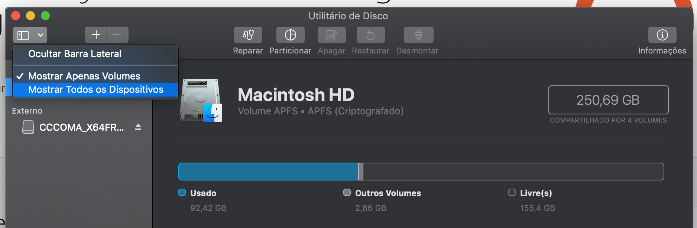
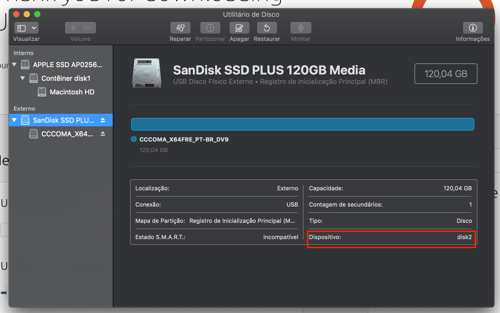

Através deste guia, você conseguirá criar uma máquina virtual no VirtualBox que realiza o boot de um HD Externo, este roteiro foi feito e testado no Mac OS Mojave (mas com o devido cuidado funciona no Windows e Linux também).

1. Antes, verifique se não há nenhum pendrive ou instalador montado (mostrando como unidade), se sim, ejete eles no Finder.

2. Conecte o HD Externo de tipo A (MBR) no Mac OS, neste momento deverá aparecer uma mensagem dizendo que o Mac OS não é capaz de ler o disco, atenção, você deve clicar no botão 'Ignorar'

3. Agora, abra o `Disk Utility` (Utilitário de Disco), ele pode ser encontrado pelo Spotlight ou pelo Launchpad, conforme imagem.

4. Clique no botão `Visualizar` e selecione `Mostrar todos os dispositivos`. Agora no menu lateral, você deve ser capaz de ver o HD Externo conectado, caso contrário, verifique a conexão USB e certifique-se que clicou no botão Ignorar ao conecta-lo.

5. Selecione o HD Externo no `Disk Utility` e nas informações exibidas procure por `Dispositivo: diskN`, sendo que haverá um número no lugar do N, no caso da foto é `disk2`. Verifique qual o número em seu Mac OS.

6. Agora, abra um Terminal. E execute o seguinte comando, substituindo o diskN pelo disco corresponde visto anteriormente (deve-se manter o `/dev/` inicial). Ele irá solicitar a sua senha do Mac OS, por favor digite.
`sudo VBoxManage internalcommands createrawvmdk -filename Elementos.vmdk  -rawdisk /dev/diskN`

7. Se tudo ocorrer bem, deve aparecer a mensagem `RAW host disk access VMDK file Elementos.vmdk created successfully.` Caso sim, continue, caso contrário, verifique o comando digitado.

8. No passo 6, criamos um disco virtual, que na realidade não armazena dados e sim diz ao VirtualBox procurar pelo HD Externo. No entanto, este acesso ao HD Externo em nível de partições de boot, necessita de acesso de administrador ao computador. Portanto, vamos ter que abrir o VirtualBox como administrador no Mac OS. Primeiro, certifique-se que o VirtualBox está fechado completamente.  Em seguida, no terminal novamente, digite o comando ` sudo /Applications/VirtualBox.app/Contents/MacOS/VirtualBox`

9. Com êxito, a janela do VirtualBox deve aparecer. Clique para criar uma nova máquina virtual, clique em seguida no modo `Expert`, de um nome apropriado a máquina virtual, na pasta da máquina virtual, sugiro que mude o caminho para `/Users/SEU_USUARIO/VirtualBox VMs` (crie caso não exista). Ele irá utilizar esta pasta apenas para arquivos de configuração. Troque o Tipo para Linux e Versão para Ubuntu (64-bits). É recomendável que aloque pelo menos 4GB (4096 MB) para o sistema. Na opção de Disco Rígido, escolha a opção Utilizar um disco virtual existente, e selecione o arquivo Elementos.vmdk criado no passo 6. Clique em Criar.

10. Clique para executar a máquina virtual criada, se tudo ocorrer bem, você deve ver o boot do Ubuntu iniciando, não esqueça depois de ligar, de verificar a resolução da tela e se a aceleração de vídeo está habilitada.