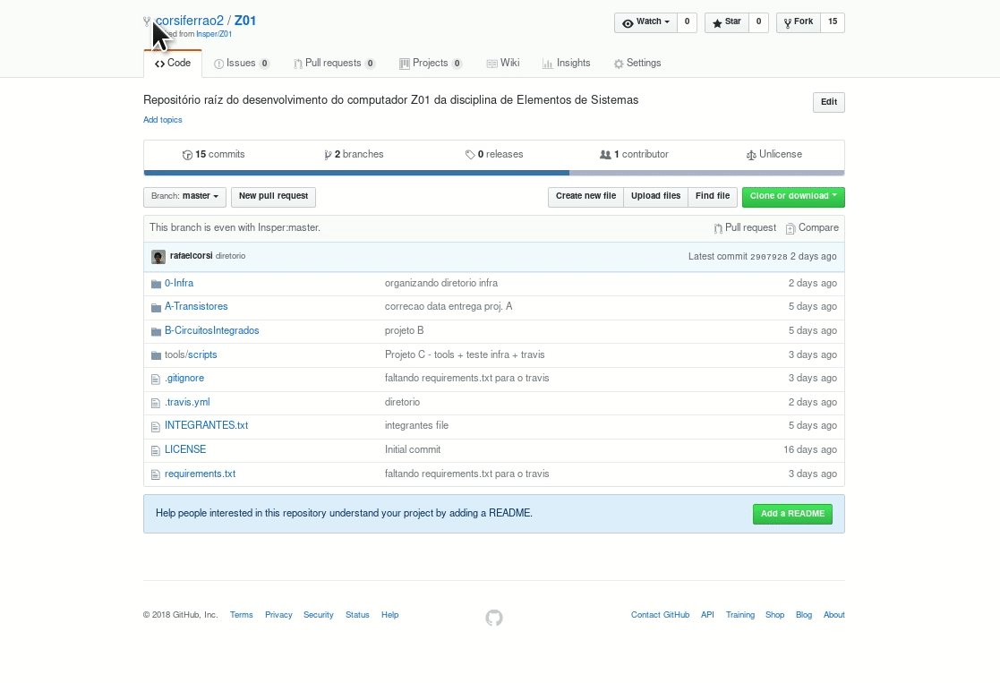

# Vixi! Sou scrum master

!!! tip "Passos"
    Você é o mediador (Scrum Master) do projeto e não sabe por onde começar? A seguir os passos que devem ser realizados!

    1. [Sincronizar repositório com upstream](https://insper.github.io/Z01.1/Util-Dicas-GIT/#configurando-upstream-z011-professor)

    2. Editar `SCRUM_MASTER.json` com suas informações

    3. Ler documentação do projeto

    4. [Configurar Actions para executar teste do projeto](https://insper.github.io/Z01.1/Util-Dicas-Travis/)

    5. Criar Project e issues no github (detalhes ao final dessa página)
        - Discuta com os seus colegas

    7. Acompanhe o grupo ajudando o pessoal trabalhar, **seu papel é entregar!! no prazo!!!** 

    8. Na entrega do projeto, todos os issues devem ter sido resolvidos (e arquivados). Todos as tarefas devem ser movidas para `done` no projects.

    **Com o projeto finalizado:**

    9. Criar uma tag no git para marcar o commit que tudo funciona, exemplo: `git tag Projeto-C` + `git push --tag`

    10. Preencher formulário de relato (irá receber por e-mail)

## Criar project no github

- Criando um project no github

- Adicionando issues

!!! tip
    Os issues devem ser todos os módulos a serem implementados do projeto.

- Você deve manter o quadro atualizado.

