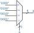

# Combinacional

Em sistemas digitais, lógica combinacional é aquela que não depende do estado anterior (não possui memória), podemos classificar portas lógicas (and, or, nand ...), mux, demux, comparadores, full address e outros componentes como sendo do tipo combinacional.

!!! note
    Logic is combinational if outputs at a specified time are a function only of the inputs at that time. Examples of combinational logic functions are decoders, multiplexers, and adders.
    ...
    
    > Trecho extraído do site da [intel](https://www.intel.com/content/www/us/en/programmable/quartushelp/13.0/mergedProjects/hdl/vhdl/vhdl_pro_combinatorial.htm)

## VHDL

Existem duas formas de descrevermos um circuito combinacional em VHDL, uma delas é utilizando o `process`, não iremos tratar dessa alternativa nesse documento.

!!! note
    O uso de `process` pode confundir vocês nesse primeiro momento, por parecer um função de um programa sequêncial.

Para transcrevermos uma lógica combinacional em VHDL basta escrever a implementação 

### Equações

Podemos escrever equações em VHDL utilizando os seguintes operadores: `not`, `and`, `or`, `nor`, `xor`, `xnor`. Como no exemplo a seguir:

$X = (\bar{A} . B) + C)$

Transcrevemos para:

```vhdl
X <= ((not A) and B) or C;
```

!!! tip 
    Abuse dos parenteses `()` para explicitar a lógica desejada, por exemplo:
    
    ```
    not A and B ---> not (A and B) 
                \
                 \-> (not A) and B
    ```

!!! tip
    Quando desenvolvemos projetos para FPGA não tem a necessidade de simplificarmos a equação lógica, a ferramenta (`Quartus`) faz isso para a gente.

### Concatenate

Em VHDL podemos concatenar bit para formar vetores, isso é feito da seguinte forma:

```vhdl
signal bit0, bit1 : std_logic;
signal vec        : std_logic_vector(1 downto 0);

begin

   vec <= bit1 & bit0;

end;
```

No exemplo anterior, temos um vetor de 2 bits (`vec`) que é formado por: `[bit1, bit0]`.

### with select

!!! note ""
    https://insights.sigasi.com/tech/signal-assignments-vhdl-withselect-whenelse-and-case/

O `with select` em VHDL é utilizado quando desejamos que um sinal (ou saída) receba diferentes valores com base em um sinal de seleção. No exemplo a seguir, o sinal `b` recebe o valor `1000` quando o sinal de seleção `a` for `00`, `0100` quando `a` for `01`, ..., note que no último caso usamos o `others`, ele entrou no lugar do `11`.

```vhdl
signal a : std_logic_vector(1 downto 0); 
signal b : std_logic_Vector(3 downto 0);

begin

with a select 
    b <= "1000" when "00",
         "0100" when "01",
         "0010" when "10",
   	     "0001" when others;
```

O hardware gerado pela descrição anterior seria:



!!! warning 
    Utilizar `others` na última opção!

!!! tip
    Precisamos lembrar que no final tudo vai virar um hardware, o `with` é normalmente utilizado para implementar um **multiplexiador**!
    
!!! note "Multiplexador"
    <iframe width="450" height="350" src="https://www.youtube.com/embed/FKvnmxte98A?list=PLbjtMHXGxHYisNnX3pErFxnR9kcu7Nh7q" frameborder="0" allow="accelerometer; autoplay; encrypted-media; gyroscope; picture-in-picture" allowfullscreen></iframe>
    

### when else

O construtor `when else` é um pouco mais geral, para cada opção você pode fornecer uma condição diferente. O mesmo exemplo do `with` ficaria escrito da seguinte maneira:

```vhdl
b <= "1000" when a = "00" else 
	 "0100" when a = "01" else 
	 "0010" when a = "10" else 
	 "0001";
```

!!! warning 
    A última opção não deve possuir nenhuma condição!

Porém com o `when else` temos a flexibilidade de realizar algo como:

```vhdl
b <= "1000" when (a = "00" AND en = '1') else 
	 "0100" when (a = "01" AND en = '1') else 
	 "0010" when (a = "10" AND en = '1') else 
	 "0010" when (a = "00" AND en = '1') else 
	 "0000";                                    -- enable desativado
```

Nesse exemplo, temos duas condições para cada opção: `a` e `en` devem satisfazer a condição, isso não é possível com o `with select`.

    
!!! note
    `others` e `else`: Precisamos entender que um sinal do tipo `std_logic` em VHDL não pode assumir apenas os valores `0` e `1`, mas sim: `0`, `1`, `X`, `Z`, `W`, `L`, `H`, `-`, para cobrir todas as opções (com dois 'bits') deveríamos possuir 64 linhas para cada `with` ou `when` que fossemos construir.

    
