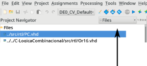
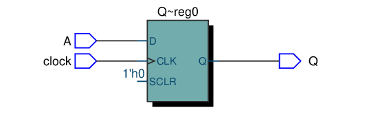

# RTL Viewer

> [RTL](https://en.wikipedia.org/wiki/Register-transfer_level) é uma forma de visualização de um circuito digital.
>
> Ela nos ajudará a entender o circuito que foi escrito em HDL. Muitas vezes a própria ferramenta não compreende o hardware que desejamos descrever (lembre que HDL é uma linguagem de descrição de hardware, não de programação). Com o RTL conseguimos ter uma noção de qual foi a 'interpretação' do nosso hardware que a ferramenta (no caso o Quartus) entendeu.

O `RTL Viewer` é uma ferramenta do Quartus utilizada para visualizar o RTL (interpretação do hardware descrito em HDL).

Para criarmos esse `RTL` de um módulo específico devemos no Quartus selecionar o componente em questão como **TopLevel**, para isso faça o seguinte:

!!! example 
    Exemplo para o projeto D, mas se aplica a qualquer outro!

1. Abra o projeto no `Quartus` localizado em `D-LogicaSequencial/Quartus/`
2. No **Project Navigator** escolha por **Files**:

3. Encontre o arquivo que deseja configurar como **TopLevel**:

Clique com o botão direito no arquivo e selecione a opção: **Set as Top Level Entity**

Agora o `Quartus` irá enterpretar esse módulo como sendo o "top" do projeto (podemos pensar como sendo o `main`).

4. Compile o Projeto (`Processing` -> `Start`)
5. Abra o RTL Viewer (`Tools` -> `NetList Viewers` -> `RTL Viewer`)

Esse código em VHDL irá ser interpretada pelo compilador como um FlipFlop tipo D.

