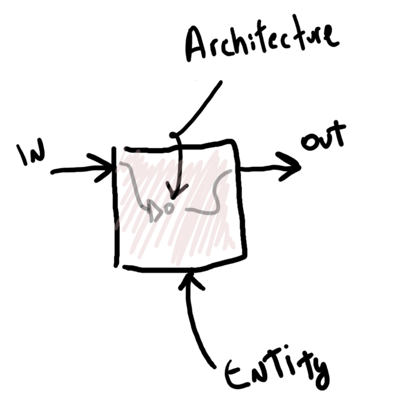
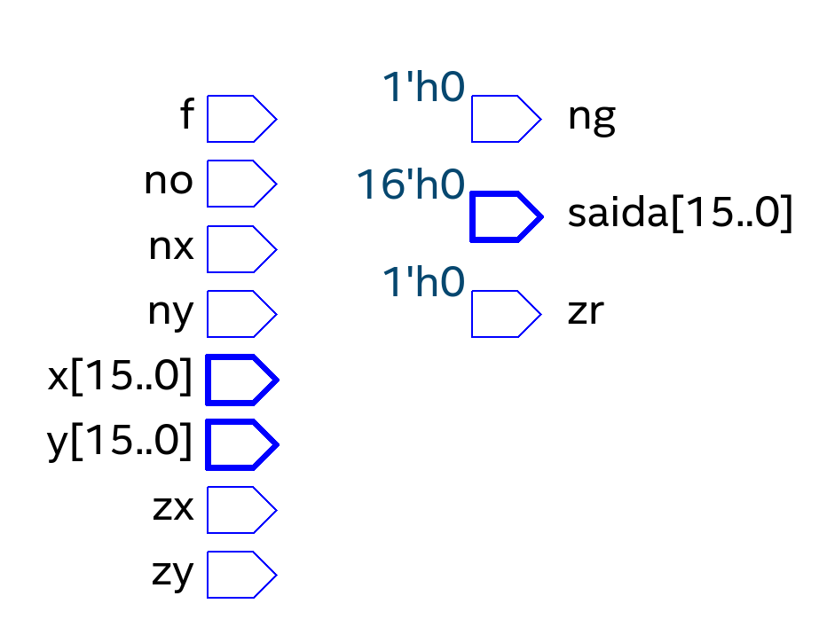
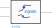

# Introdução

!!! success "2020-2"
    Material atualizado.

| Estudando        |                                                                                                                                                                                                            |
| ---------        | --                                                                                                                                                                                                         |
| Leituras (extra) |                                                                                                                                                                                                            |
|                  | [Free Range VHDL BOOK](http://freerangefactory.org/pdf/df344hdh4h8kjfh3500ft2/free_range_vhdl.pdf)                                                                                                         |
| :+1:             | [VHDL CookBook](https://www.ics.uci.edu/~alexv/154/VHDL-Cookbook.pdf)                                                                                                                                      |
|                  | [VHDL Básico: Parte 1 - Entidade](https://www.embarcados.com.br/vhdl-basico-parte-1-entidade/)                                                                                                             |
|                  | [VHDL Básico: Parte 2 - Arquitetura](https://www.embarcados.com.br/vhdl-basico-parte-2-arquitetura/)                                                                                                       |
| Vídeos (extra)   |                                                                                                                                                                                                            |
| :+1:             | <iframe width="200" height="200" src="https://www.youtube.com/embed/zm-RA6BsYmc" frameborder="0" allow="accelerometer; autoplay; encrypted-media; gyroscope; picture-in-picture" allowfullscreen></iframe> |


O [VHDL](https://en.wikipedia.org/wiki/VHDL) é uma linguagem de descrição de hardware ([Hardware Description Language - HDL](https://en.wikipedia.org/wiki/Hardware_description_language)), não sendo uma linguagem de programação. Foi criada durante a Guerra Fria no Departamento de Defesa Americano (DoD-DARPA) para a documentação de hardwares complexos (complementava/substituía os esquemáticos). Com a evolução da tecnologia agora é possível utilizar a linguagem para implementar sistemas digitais em hardwares programáveis (FPGA/CPL/...).

Por não ter sido criada para o fim que a utilizamos, o VHDL é no primeiro momento bastante intricado. Mas com o usar, vocês irão se acostumar com a linguagem e serão capazes de realizar hardwares cada vez mais complexos.

!!! note
    Algumas vezes iremos utilizar a palavra 'código' para descrever um projeto em VHDL, 
    tenha em mente que não estamos falando de um programa e sim de uma
    descrição de hardware.

Um programa em `Python`/`Java`/`C` é como uma receita de bolo que será executada em uma cozinha que já está montada, essa cozinha é o sua CPU (processador), e não dá para mudar com código (software), o que você muda de um programa para outro é a receita. Uma cozinha é capaz de realizar diversas receitas diferentes ....

No caso do VHDL não temos essa 'cozinha' pronta, na verdade, podemos criar qualquer cozinha que quisermos. Com o VHDL você será o arquiteto de cozinhas, capaz de criar praticamente qualquer hardware! E então realizar suas receitas na cozinha que criou.

## Regras de Ouro do VHDL

-   VHDL é uma descrição, ou projeto, do hardware e não uma programação dele.
    -  As linhas de código não são executadas sequencialmente com exceção de algumas construções da linguagem.
    -  As linhas de código serão executadas simultaneamente.
-   Deve-se possuir uma visão de como o circuito digital final será.
    - Se ele for muito complexo, use uma divisão em blocos menores até chegar às unidades construtivas básicas.

## Básico

Um código em VHDL possui basicamente três partes:

1. Declaração de bibliotecas utilizadas
    ```vhdl
    library ieee;
    use ieee.std_logic_1164.all;
    use ieee.numeric_std.all;
    use work.all;
    ```
2. Declaração das entradas e saídas desse bloco (entidade)
    ```vhdl
    entity TopLevel is
      port(
            a : in  std_logic;
            b : out std_logic
      );
    end entity;
    ```
3. Implementação da lógica que relaciona as entradas e saídas do módulo (arquitetura)
    ```vhdl
    architecture rtl of TopLevel is

    begin
    
      a <= not b; -- a saída A recebe a entrada B
      
    end rtl;
    ```

{width=400}

!!! tip "Comentários em VHDL"
    Comentários em VHDL são iniciados com dois traços: `--`. Exemplo:
    
    ``` vhdl
    -- Comenário em VHDL 
    -- a <= not b;          Trecho de código comentado
    a <= `1`; -- comentário
    ```

### Bibliotecas

As [bibliotecas do VHDL](https://www.csee.umbc.edu/portal/help/VHDL/stdpkg.html) são onde as definições dos tipos e das operações são realizadas, não será necessário mexer com isso ao longo do semestre, essa parte já vai estar pronta nos projetos que vocês forem mexer. 

### Entidade (entity)

Podemos pensar na entidade como o trecho de código que define o módulo como uma caixa preta, ela explicita quem são as entradas e quais são as saídas desse módulo. Assim como um CHIP, que possui pinos de entradas e pinos de saída.

No exemplo anterior, o módulo é chamado de `TopLevel` e possui uma entrada `a` e uma saída `b`. Tanto a entrada quanto a saída são do tipo `std_logic`. Cada porta tem a descrição de sua direção (`in`, `out`), como detalhado a seguir:

{width=800}

Uma entidade pode ter nenhuma ou 'infinitas' portas, para adicionarmos uma porta nova a uma entidade, basta adicionarmos uma nova linha com as três propriedades:

```
   NOME : DIREÇÃO TIPO;
```

!!! tip 
    Note a necessidade do `;` no final da linha, isso indica para o VHDL
    que essa descrição 'acabou'. A quebra de linha `Enter` não tem uso para o 
    VHDL, só serve para facilitar nossa leitura.
    
!!! warning
    O `;` não deve aparecer na última porta! No exemplo anterior a porta `b : out STD_LOGIC` não possui `;`.

!!! example
    Adicionando uma entrada `x` ao módulo anterior:
    
    ```vhdl
    entity TopLevel is
      port(
           a : in  std_logic;
           b : out std_logic;
           x : in  std_logic
      );
    end entity;
    ```
#### Nome

No VHDL você **não** pode usar um nome de porta que:

- Comece com um número:  (`0`, `1`, ... ), ex: `0bus : out std_logic;`
- É uma das muitas [palavras reservadas](https://www.csee.umbc.edu/portal/help/VHDL/reserved.html): `in`, `out`, `not`, ex: `bus : out std_logic;`
- Possua espaço: `entrada 1: in std_logic;`

Para mais detalhes, dê uma olhada na [documentação completa](https://www.ics.uci.edu/~jmoorkan/vhdlref/names.html)

#### Direção

A direção `in`, `out` define se a informação irá **entrar** no módulo ou **sair** do módulo. Por exemplo, se quisermos 'ler' um botão, devemos declarar essa
porta como sendo uma 'entrada' (`in`) do módulo, mas se quisermos acionar um LED, devemos declarar essa porta como 'saída' (`out`), pois ela será controlada por nossa lógica.

#### Tipo

O tipo define se a porta será composta por um único bit `std_logic` ou por
um vetor de bits `std_logic_vector(2 downto 0)` (vetor de 3 bits). 

O tipo `STD_LOGIC` é muito mais complexo que só um bit, mas vamos deixar isso de lado 
por ora.

#### Exemplos

- Módulo com duas entradas binárias: `a`, `x` e uma saída `b`

```vhdl
    entity Comp1 is
      port(
            a   : in  std_logic;
            x   : in  std_logic;
            b   : out std_logic
      );
    end entity;
```


- Módulo chamado MUX que possui 4 entradas na forma de um vetor (`I : in std_logic_vector(3 downto 0)`), um seletor de dois bits na forma de um vetor (`S`) e uma saída `q` na forma de um bit.

```vhdl
    entity mux is
      port(
            I   : in  std_logic_vector(3 downto 0);
            S   : in  std_logic_vector(1 downto 0);
            q   : out std_logic
      );
    end entity;
```


!!! tip 
    Note que a entrada `I` foi declarada como sendo um vetor que começa em `3` e termina em `0`, possuindo no total 4 bits: `3`, `2`, `1`, `0`
    
    Em diagrama elétrico é utilizado a seguinte notação para indicar um vetor de bits:
    
    - Uso de uma `/` no fio com a indicação da quantidade de bits
    - Uso de uma linha mais grossa, para indicar um vetor
    
    {width=300}
    
- Entidade de uma ULA

```vhdl
entity ALU is
	port (
			x,y:   in STD_LOGIC_VECTOR(15 downto 0); -- entradas de dados da ALU
			zx:    in STD_LOGIC;                     -- zera a entrada x
			nx:    in STD_LOGIC;                     -- inverte a entrada x
			zy:    in STD_LOGIC;                     -- zera a entrada y
			ny:    in STD_LOGIC;                     -- inverte a entrada y
			f:     in STD_LOGIC;                     -- se 0 calcula x & y, senão x + y
			no:    in STD_LOGIC;                     -- inverte o valor da saída
			zr:    out STD_LOGIC;                    -- setado se saída igual a zero
			ng:    out STD_LOGIC;                    -- setado se saída é negativa
			saida: out STD_LOGIC_VECTOR(15 downto 0) -- saída de dados da ALU
	);
end entity;

```

{width=400}

!!! note "nota"
    Note que a primeira linha declara duas portas com nome `x` e `y` com a mesma direção `in` e do tipo `std_logic_vector(15 downto 0)`. Isso é um atalho no VHDL e deve ser evitado. O ideal é reescrever essa linha como a seguir:
    
    ```vhdl
    port (
      x: in STD_LOGIC_VECTOR(15 downto 0); -- entrada X de dados da ALU
      y: in STD_LOGIC_VECTOR(15 downto 0); -- entrada Y de dados da ALU
    ```

### Arquitetura (architecture)

A arquitetura (`architecture`) define a relação das entradas com as saídas da entidade. Nessa parte é onde será construída a lógica digital desse módulo. Pense que é na arquitetura onde transcrevemos uma equação lógica, ou onde descrevemos uma memória.

```vhdl
architecture rtl of TopLevel is

-- Aqui é declaro os possíveis:
--   a) sinais internos de uma entidade
--   b) outras entidades que essa entidade pode utilizar

begin
   
    -- Aqui é onde a coisa acontece de verdade
    -- onde é feita a descrição da lógica digital
    a <= not b;

end rtl;
```

#### Operações básicas

!!! note ""
    Suponha o uso da entidade a seguir para os exemplos que serão apresentados
    
    ```vhdl
    entity Foo is
        port(
            x   : in  std_logic;
            y   : in  std_logic;
            q   : out std_logic;
            p   : out std_logic
        );
    end entity;
    ```

No VHDL usamos `<=` para representar que alguma coisa (a esquerda da seta) recebe algum outro valor (a direita da seta). Exemplos:

1. `q <= x;` 
    - `q` recebe o valor de `x`
    - Na prática estamos conectando um fio de `x` que liga em `q`
1. `q <= '0';` 
    - `q` recebe o valor `0`
    - Na prática estamos conectando um fio que sai de `q` e liga no terra
1. `q <= '1';` 
    - `q` recebe o valor `1`
    - Na prática estamos conectando um fio que sai de `q` e liga no vcc
    
!!! note 
    Note que aqui estamos usando aspas simples: `'0' e '1'` para indicar um número binário (`std_logic`). Aspas dupla `"0101"` em VHDL significa que estamos trabalhando com um vetor de números binários (`std_logic_vector`).
    
Podemos utilizar portas lógicas nas operações, alguns operadores implementados pela linguagem, são: `not`, `and`, `or`, `nand`, `nor`, `xor`, `xnor`. O uso dos operadores é feito da seguinte maneira:
    
1. `q <= not x;` 
    - `q` recebe o valor de `x` **negado**
1. `q <= x and y;` 
    - `q` recebe o valor de `x` **E** `y`
1. `p <= x xor y;` 
    - `q` recebe o valor de `x` **XOR** `y`

!!! warning 
    Em VHDL não é possível 'ler' uma saída, as seguintes operações **não pode** ser realizada:
    
    ```vhdl
    q <= not x; -- x é saída
    p <= q;     -- q é saída
    ```

#### Operação com vetores

!!! note ""
    Suponha o uso da entidade a seguir para os exemplos que serão apresentados
    
    ```vhdl
    entity Bar is
    port(
            a   : in  std_logic;
            b   : in  std_logic_vector(3 downto 0);
            q   : out std_logic;
            p   : out std_logic_vector(2 downto 0)
      );
    end entity;
    ```
Exemplos de operação com vetores:

1. `p <= "100"`
    - `p` recebe o valor em binário `100`
1. `p <= not "100"`
    - `p` recebe o valor em binário `011`
1. `p <= b(2 downto 0);`
    - `p` recebe os três primeiros bits de `b`
1. `p(0) <= a;` 
    - `p` `bit 0` recebe o valor da entrada `a`
1. `q <= not b(1);`
    - a saída binária `q` recebe o `bit 1` da entrada `b` negado.

!!! tip
    É comum confundir quando usar aspas simples `''` e aspas dupla `""`, fique atento aos 
    erros de compilação.

#### signal

Sinais são declarados entre a palavra reservada `architecture` e o `begin` e servem para
facilitar/ possibilitar o desenvolvimento de um sistema digital, eles só são visíveis
dentro de uma entidade e servem como 'fios' internos de um módulo. 

{width=400}

`Sinais` são diferente de portas não possuem direção, e são declarados da seguinte maneira:

``` vhdl
signal NAME : TYPE
```

- `TYPE` pode ser: `std_logic`/ `std_logic_vector`, entre outros.

Exemplo:

```vhdl
architecture rtl of TopLevel is

-- Declaração de sinais
signal aux1 : std_logic;                
signal aux2 : std_logic_vector(1 downto 0);

-- inicio da implementação
begin

    --------------------
    aux1 <= not a;
    q    <= aux1;
    p(0) <= aux1;
    
    --------------------
    aux2 <= b(3 downto 2);
    p(2 downto 1) <= aux2;
    
end rtl;
```

No exemplo anterior, criamos um sinal auxiliar chamado de `aux1` que recebe a entrada `a` negada, esse sinal é então atribuído a saída `q` e ao `bit 0` da saída `p`. Outro sinal `aux2`, vetor de 2 bits recebe os dois bits mais significativos da entrada `b` e então é atribuído a saída `p`, bits 2 e 1.

