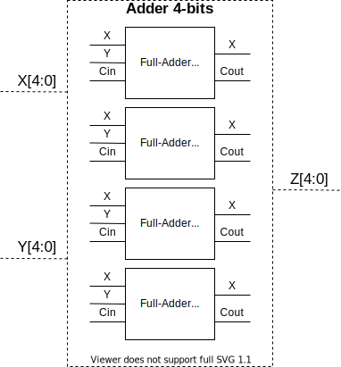

# port map

Esse texto explica como realizar o `port map` em VHDL, técnica que permite o reaproveitamento
de módulos e o desenvolvimento hierárquico.

## Desenvolvimento hierárquico

É uma técnica de organização de projeto onde são desenvolvidos pequenos módulos e esses módulos fazem parte de um sistema maior, que por sua vez, fazem parte de algo muito mais complexo. As vantagens de um desenvolvimento desse tipo são:

- Facilidade em realizar testes e validação
    - Cada módulo é testado independentemente
- Trabalho em equipe
    - A partir do momento que as interfaces são bem estabelecidas, cada um do time pode desenvolver um módulo
- Ferramentas gostam / se adaptam bem
    - As ferramentas de desenvolvimento conseguem otimizar o hardware melhor
- Reaproveitamento de módulos
    - Muito mais fácil para reaproveitar outros módulos.

!!! tip "Leitura extra"
    > https://www.intel.com/content/www/us/en/programmable/support/support-resources/design-examples/design-software/vhdl/v_hier.html


> Fonte: https://www.embedded.com/the-art-of-fpga-construction/

## `port map`

`port map` é a maneira em VHDL de reaproveitamos uma entidade definida em outro lugar no nosso arquivo. Pensar em `port map` como uma função não é de todo errado, mas devesse notar que quando usamos `port map` estamos **criando uma cópia do hardware** que é descrito pela entidade usada, isso é diferente de uma função em Python, que reaproveita o mesmo trecho de código para cada chamada de função.

É mais apropriado pensar que a descrição de um `hardware` é uma receita (que vemos na `architecture`), o `port map` seria como o bolo, você pode ter vários bolos com a mesma receita e cada bolo pode ser usado/ir para pessoa diferente (entrada e saídas).

Vamos ver como usar `port map` com um exemplo a seguir, nesse exemplo possuímos dois arquivos `modulo2.vhd` e `modulo1.vhd`, e desejamos utilizar o modulo1 dentro do componente 2 (modulo2):

```
       -------------------
  i1  |     --------      | o1
   -->|--->| modulo1|-----|-->
  i2  | -->|        |     |
   -->|/    --------      |
      |      modulo2      |
       -------------------
```

``` vhdl
-- `modulo1.vhd`
entity modulo1 is
  port (
     a,b : in  std_logic;
       x : out std_logic);
end entity;

architecture  rtl OF modulo1 IS
begin
    x <= a xor b;
end architecture;
```

``` vhdl
-- `modulo2.vhd`
entity modulo2 is
  port (
     i1,i2 : in  std_logic;
     o1    : out std_logic);
end entity;

architecture  rtl OF modulo2 IS

-- Aqui devemos fazer a declaração do componente
-- que queremos utilizar, a declaração
-- tem que ser igual a entidade do componente 
-- original, mas trocando a palavra `entity`
-- pelo keyword `component`

component modulo1 is
  port (
     a,b : in  std_logic;
       x : out std_logic);
end component;

begin

-- Agora com o componente 'criado'
-- podemos utilizar no nosso projeto
--
-- podemos dar um 'nome' a intancia do componente
--  |    
--  |    | nome do componente a ser usado
--  v    v
   u1: modulo1 port map(
      a => i1,  -- o sinal a do componente é conectado no sinal i1
      b => i2,  -- o sinal a do componente é conectado no sinal i1
      x => o1   -- o sinal a do componente é conectado no sinal i1
   );

end architecture;
```

!!! tip 
    - O nome da instância não pode repetir (`u1`, ...)
    - Podemos instanciar a quantidade de componente que desejarmos 
        - (vai depender do tamanho da FPGA)
    - Nenhuma porta de entrada pode ficar vazia! Você não precisa ligar todas saídas.
    - Para deixar uma saída desconectada utilize o keyword `OPEN`:
        ``` vhdl
      u1: modulo1 port map(
        a => OPEN,  
        ```
    - Não podemos aplicar operações no `port map`:
        ``` vhdl
      u1: modulo1 port map(
        a => i1 and i2,  
        ```
    - Evitar a notação de `port map` que não indica qual porta vai para onde:
        ``` vhdl
            u1: modulo1 port map (i1, i2, o1);
        ```
    - As vezes é necessário criarmos sinais (`signals`) para atribuirmos aos componentes

## Video-Exemplo: Construindo um Adder de 4-bits usando FullAdder de 1-bit

<iframe width="560" height="315" src="https://www.youtube.com/embed/GfpuRfTqWwc" frameborder="0" allow="accelerometer; autoplay; encrypted-media; gyroscope; picture-in-picture" allowfullscreen></iframe>

## Versão Texto - Exemplo: Construindo um Adder de 4-bits usando FullAdder de 1-bit

Neste exemplo vamos ver a elaboração de um somador (`adder`) de 4-bits atráves do uso de vários somadores de 1-bit. 

Suponha que você já tenha um somador pronto porém o mesmo é apenas de 1-bit, criar um somador de 4-bits do zero, pode ser uma tarefa trabalhosa, elaborar uma tabela verdade de 2^4 = 16 linhas, econtrar 4 saídas distintas (cada bit de saída), enfim... será que não é possível usar o conceito que vimos de port-map anteriormente e multiplos somadores para obter o desejado?

Sim, é possível, desde que nosso somador de 1-bit seja um Full-Adder, lembre-se que a principal diferença de um Full-Adder e um Half-Adder, é a presença de uma entrada de Carry In, que permite que a ligação em cascata de vários somadores.

Portanto, o nosso somador de 4-bits, nada mais será que uma `caixa preta` que dentro terá 4 somadores de 1-bit realizando o trabalho, para o usuário final, que irá utilizar o componente isto ficará transparente e o mesmo não saberá deste detalhe. 



Vamos criar nosso componente Somador de 4-bits, `Adder.vhdl` e definir suas entradas e saídas (4-bits).
``` vhdl
entity Adder is
	port
	(
		X	: in  std_logic_vector(3 downto 0);
		Y	: in  std_logic_vector(3 downto 0);
		Z	: out std_logic_vector(3 downto 0)
	);
end Adder;

architecture archAdder of Adder is
begin
end archAdder;
```

Agora suponha que temos o arquivo de nosso `FullAdder` de 1-bit, `FullAdder1.vhdl` e que tenha a definição (entidade da seguinte forma):
``` vhdl
entity FullAdder1 is
	port
	(
		X	: in  std_logic;
		Y	: in  std_logic;
		Cin : in  std_logic;
		Z	: out std_logic;
		Cout: out std_logic
	);
end FullAdder1;
```

Observe que nós preocupamos apenas em ver a entidade (onde existem as entradas e saídas). Quer dizer que agora podemos usar a entidade `FullAdder1` diretamente no `Adder`? Não ainda! O componente ` Adder` não conhece nenhum `FullAdder1` ! para poder usar.

Por isto devemos declarar na arquitetura do Adder que existe um componente com este nome e com tais entradas e saídas disponíveis para uso! Para isso usamos a declaração `component` do VHDL, permitindo especificar os nomes e entradas.

``` vhdl
architecture archAdder of Adder is
component FullAdder1
	port
	(
		-- Input ports
		X	: in  std_logic;
		Y	: in  std_logic;
		Cin: in std_logic;

		-- Output ports
		Z	: out std_logic;
		Cout: out std_logic
	);
end component;
begin
end archAdder;
```

Pronto! Agora podemos usar o componente `FullAdder1`, na verdade, podemos usar vários! Isso mesmo, podemos criar várias instâncias deste `FullAdder1`, vamos precisar de 4. A forma de fazer isto em VHDL, é usar definir um nome de instancia, nome do componente e suas ligações (port-map).

Sintaxe:
``` vhdl
<instance_name> : <component_name> 
	port map 
	(
		<formal_input> => <signal>,
		<formal_output> => <signal>
	);
```
Exemplo para os nosso 4 FAs (por enquanto vamos ligar apenas as entradas X, Y e saídas Z sem se preocupar com os Cin/Cout).

``` vhdl
    A0 : FullAdder1
	port map 
	(
		X => X(0),
		Y => Y(0),
		Z => Z(0)
	);
	
	A1 : FullAdder1
	port map 
	(
		X => X(1),
		Y => Y(1),
		Z => Z(1)
	);
	
	A2 : FullAdder1
	port map 
	(
		X => X(2),
		Y => Y(2),
		Z => Z(2)
	);
	
	A3 : FullAdder1
	port map 
	(
		X => X(3),
		Y => Y(3),
		Z => Z(3)
	);
```

Observe que conseguimos facilmente instanciar 4 somadores de 1-bit! Outro detalhe importante no port-map é que sempre o sinal a esquerda pertence ao componente e este é conectado ao sinal da direita (pertence ao arquivo atual). Por isto podemos ligar X a X(0), sem dar erro de nome duplicado, pois o VHDL é espertinho e sabe que o primeiro X se refere ao X do componente e o segundo, ao do nosso Adder de 4-bits.

Agora precisamos ligar os Carrys para que nosso somador some corretamente, lembre, o primeiro somador (bit 0), terá carry de entrada (Cin) zero (0), e os demais somadores receberam o carry de saída (Cout) do somador anterior. 

No entanto no VHDL não é possível ligar diretamente entre componentes diferentes!! E agora?
Existem no VHDL, sinais virtuais, literalmente chamados `signals`, podemos pensar nestes sinais como um `fio`, cuidado, eles não são variavéis (o VHDL possui elas, porém tem algumas pecularidades diferentes que não iremos abordar aqui)

Os sinais devem serem declarados dentro de um arquitetura com a seguinte sintaxe
``` vhdl
signal <name> : <type>;
```
Como teremos 4 carrys de saída, podemos usar então
``` vhdl
signal carry : std_logic_vector(3 downto 0);
```

Agora basta ligar o carry dos somadores intermediarios e o final, no anterior (não esquece de ligar o carry de entrada e saída). Exemplo dos dois primeiros somadores.


``` vhdl
	A0 : FullAdder1
	port map 
	(
		X => X(0),
		Y => Y(0),
		Cin => '0',
		Z => Z(0),
		Cout => carry(0)
	);
	
	A1 : FullAdder1
	port map 
	(
		X => X(1),
		Y => Y(1),
		Cin => carry(0),
		Z => Z(1),
		Cout => carry(1)
	);
	...
```

Feito isto, seu somador está completo, basta utiliza-lo em um TopLevel ou outro VHDL que desejar para ver os resultados!
