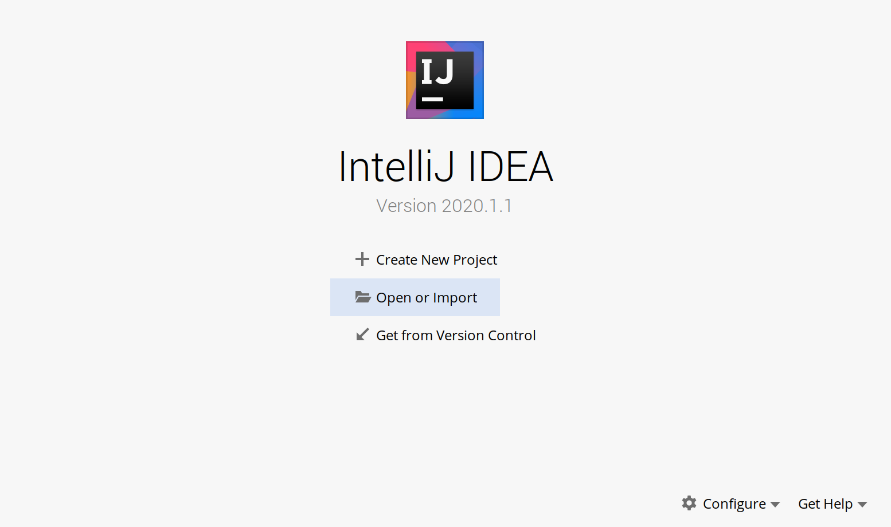
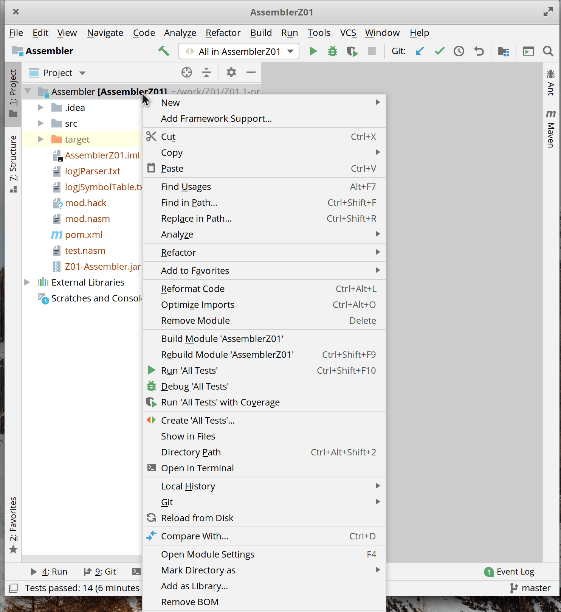

# parte 2

!!! warning
    Todos devem realizar de forma individual!

Iremos realizar o desenvolvimento do Assembler na IDE do Intellij, para isso precisamos importar um projeto do tipo maven.

### Import Project:

{width=500}

Importe o arquivo `.mvn` que está dentro da pasta `G-Assebler/Assembler`:

{width=500}

{width=300}

### final

Você deve obter um projeto importado no intellij:

{width=500}

### Verificando sdk

Verifique se o intellij associou um SDK ao projeto:

### Próximos passos

Agora vamos começar a trabalhar no código java. Siga para a próxima parte.
