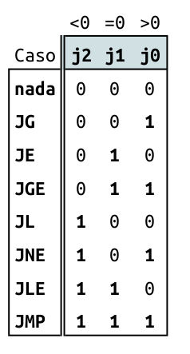
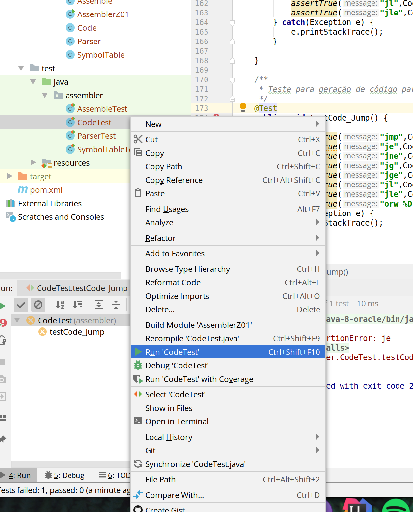
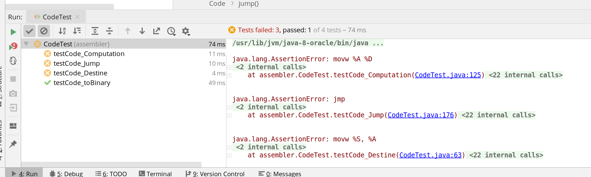

# parte 3

!!! warning ""
    Deve ser realizado individual (porém discutindo no grupo)
    
Iremos agora implementar um dos métodos da classe **Code**, a parte responsável por gerar os três bits referentes ao `jump`:



No Intellij abra o código `code.java` e procure pelo método `jump`:

``` java
/**
 * Retorna o código binário do mnemônico para realizar uma operação de jump (salto).
 * @param  mnemnonic vetor de mnemônicos "instrução" a ser analisada.
 * @return Opcode (String de 3 bits) com código em linguagem de máquina para a instrução.
 */
public static String jump(String[] mnemnonic) {


 return  "";
}
```

Note que o input dessa função é um array de strings, chamado `mnemnonic` e seu retorno é uma string. No mnemnonic será passado a instrução a ser executada da seguinte forma:

- `{"jmp"}`
- `{"jge", "S"}`
- `{"jg", "%D"}`
- ...

E deve retornar o binário correspondente aos bits j2, j1 e j0 do comando de jump :

- `111`, `011`, `010`, ....


> Note que aesa classe não precisa se preocupar com a origem do jump (%S, %D, ...) apenas com o seu tipo `jmp`, `jge`, ...

### Implementando

Vamos implementar algo bem simples que está incompleto, mas vai servir para entendermos o fluxo. Modifique o código com o exemplo a seguir :

```java
    public static String jump(String[] mnemnonic) {
        switch (mnemnonic[0]){
            case "jmp"  : return "111";

            default    : return "000";
        }
    }
```

Com a classe implementada, podemos executar o teste unitário dela. No Intellij:


Com o botão direito no `test/java/assembler/CodeTest`



Note que o teste falhou, já que a nossa implementação está incompleta.



### terminando

1. Retorne a classe `jump` e termine sua implementação.
1. Execute novamente o teste até passar.


!!! warning "Antes de continuar"
    Termine de implementar essa classe


## Continuando

Siga para a próxima parte.
