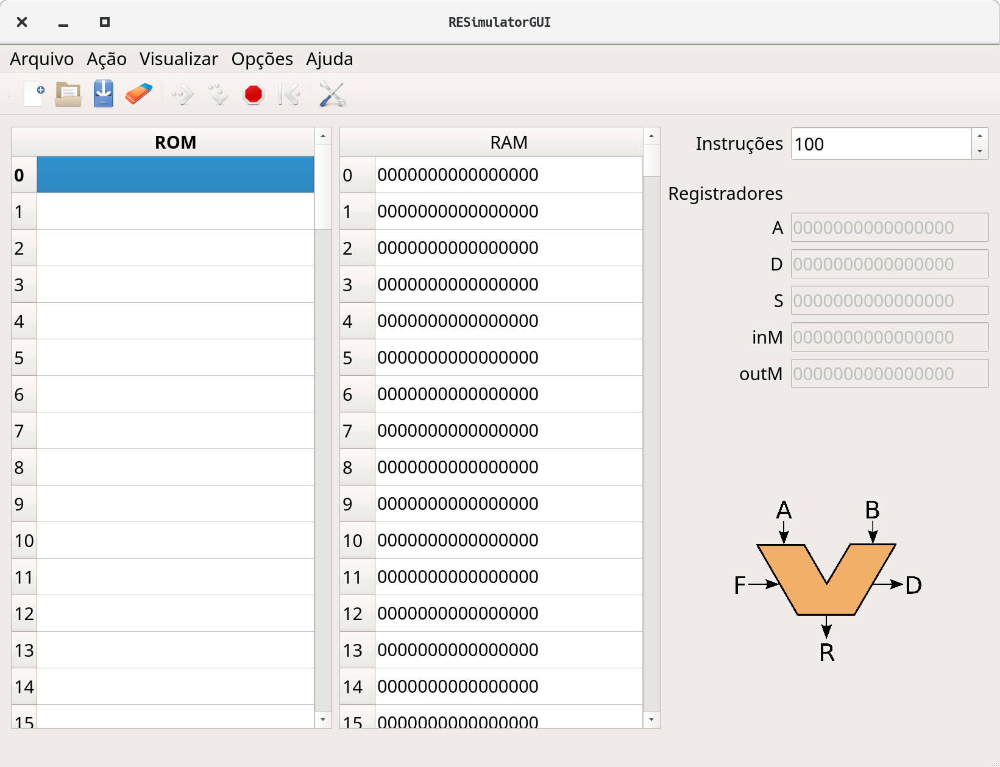
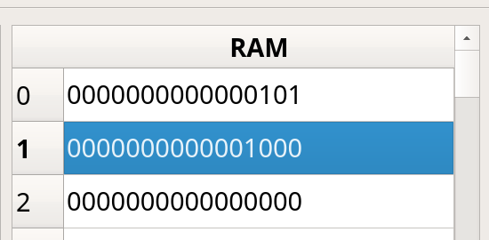

# Lab 11: Assembly 

Ao final desse lab você deve ser capaz de:

1. Usar o simulador gráfico 
1. Fazer pequenas modificações em um código assembly
1. Executar script de teste do projeto E - Assembly

!!! warning "Antes de começar"
    Toda vez que um novo projeto começar será necessário realizar algumas configurações no repositório do grupo, vocês devem seguir para o documento: [`Util/Começando novo Projeto`](https://insper.github.io/Z01.1/Util-Comecando-novo-projeto/) e depois voltar para esse lab.

    - Não seguir sem realizar a etapa anterior.

!!! tip
    - Atualizem o Z01-Tools! submodule antes de começar.

## Simulador

Nosso código assembly pode ser executado em hardware de verdade (FPGA) porém nesse primeiro momento iremos trabalhar em um ambiente simulado que nos dará maior facilidade de programação e depuração.

Um pouco de contexto: O livro texto (The Elements Of Computer System) disponibiliza um simulador da CPU original todo escrito em java, esse código é fechado e não permite nenhuma customização. Em 2017 o Prof. Luciano Pereiro iniciou a criação de um simulador Z0 (versão anterior) também em Java, onde teríamos controle total do software.

Percebemos alguns pontos negativos de utilizar um simulador em Java sendo o principal: Qualquer alteração no Hardware iria demandar uma alteração no simulador, sendo necessário mantermos dois projetos independentes e sincronizados.

Nesta versão do curso iremos utilizar um simulador que utiliza o nosso próprio código VHDL como descrição da CPU (e de tudo envolvido), uma alteração no hardware (VHDL) irá automaticamente alterar o simulador e o comportamento do computador. Para isso, fazemos uso do ModelSim, um software da Mentor Graphics que executa simulaçòes em VHDL (o mesmo utilizado nos projetos anterios), desenvolvemos uma série de APIs e configurações desse simulador para funcionar para a disciplina.

> As APIS de interface do simulador foram desenvolvidas por mim (vhdl/ tcl/ python) e a interface gráfica pelo Prof. Eduardo Marossi (python/ qt5). 
>
> De uma olhada na pasta Z01-Tools na sua home, está tudo lá!

O simulador possui a estrutura ilustrada a seguir:


O simulador possui como entradas (para cada simulação): a arquitetura do computador (hardware); o conteúdo da memória RAM o conteúdo da memória ROM e um tempo de execução.

Após o término da simulação é exportado diversos sinais internos da CPU, o estado final da memória RAM e ROM. Esses sinais são então lidos pela interface gráfica e exibida de uma forma amigável, ou usados nos testes.

## Arquivos

O simulador está localizado nas pastas `Z01-tools/` :

- `Z01-Simulator-GUI`: Parte gráfica do simulador
- `Z01-Simulator-RTL`: Hardware a ser executado no modelsim para executar o programa.

Para inicializar o simulador basta executar o script localizado na pasta do projeto E:

``` bash
$ python3 Projetos/E-Assembly/Z01simulador.py
```

##Interface do Simulador 

O simulador possui a interface a seguir, onde a coluna da esquerda é referente a memória ROM (programa), a coluna da direita referente a memória RAM (dados). 



Toda vez que houver uma alteração em algum dos parâmetros do simulador (RAM/ROM/Instruções,...) o programa será novamente executado no simulador para obtermos um resultado atualizado. Isso pode dar a sensação de "lerdeza" mas lembre da complexidade do sistema: estamos executando um programa em um hardware inteiramente simulado no computador de vocês.


### Programando 

Abra o simulador e insira o seguinte código `nasm` (na parte referente a ROM), uma instrução por linha:

``` nasm
 leaw $1,%A         ; carrega a constant 1 em %A
 movw (%A),%D       ; move o valor da RAM[%A] para %D 
 leaw $0,%A         ; carrega a constant 0 em %A
 addw (%A), %D, %D  ; faz RAM[%A] + %D e salva em %D
 leaw $2, %A        ; carrega a constant 2 em %A
 movw %D, (%A)      ; copia o valor de %D para RAM[%A]
```

Esse código soma o valor que está salvo na memória RAM endereço 0 com o valor da memória RAM endereço 1 e salva no endereço RAM[2]:

```
RAM[2] = RAM[0] + RAM[1]
```

!!! tip "mov"
    A operação de `movw` não 'move' o dado de um lugar para outro, ela copia. O valor no destino não é apagado, por exemplo:
    
    ```nasm
    leaw $10, %A
    movw %A, %D
    ```
    
    Ao final dessas operações os registradores `%A` e `%D` possui o valor 10.

!!! tip "labels"
    **R0, R1, .., R15**, ... são nomes pré definidos de endereços de memória. O **R0** indica o endereço de memória 0, **R1** o endereço de memória 1 e assim por diante até o **R15**. O mesmo código pode ser escrito como:

    ``` nasm
      leaw $R1,%A            
      movw (%A),%D
      leaw $R0,%A
      addw (%A), %D, %D
      leaw $R2, %A
      movw %D, (%A)
    ```


Para testarmos esse código será necessário colocarmos valores iniciais na memória RAM para validarmos o nosso código, para isso altere a memória RAM como demonstrado a seguir:

- Endereço 0 = 5
- Endereço 1 = 8




!!! example "Executando"
    1. Com a memória alterada você pode agora executar a simulação
    1. Verifique se o valor da memória 2 é a soma dos endereços 0 e 1.
    1. Brinque com esses valores...

    

## Treinando

Vamos praticar um pouco agora programar em assembly, no começo parece bem difícil, mas com a prática as coisas vão ficando mais fáceis.

Use o resumo das instruções: [AssemblyZ1](https://insper.github.io/Z01.1/Util-Resumo-Assembly) para saber as instruções disponíveis.

!!! example ""
    Altere o código para armazenar o resultado no endereço RAM[5]
    
??? tip "Solução"
    ```nasm
    leaw $1,%A
    movw (%A),%D
    leaw $0,%A
    addw (%A), %D, %D
    leaw $5, %A        ; <- alterado essa linha para 5!
    movw %D, (%A)
    ```

!!! example ""
    Altere o código para armazenar o negativo da operação entre RAM[0] + RAM[1] no endereço RAM[5] (dica: tem uma operação de `NEG`).
    
??? tip "solução"
    ```nasm
    leaw $1,%A
    movw (%A),%D
    leaw $0,%A
    addw (%A), %D, %D
    negw %D              ; aqui eu faço %D = - %D
    leaw $5, %A        
    movw %D, (%A)
    ```
    
## Script automático de testes

Além da interface gráfica do simulador, possuímos um script de teste automatizado (similar ao do VHDL), esse script: `E-Assembly/testeAssembly.py` compila os códigos que estão na pasta `E-Assembly/src/` para a pasta `E-Assembly/bin/hack` e executa os testes localizados em `E-Assembly/tests/`. Somente os arquivos configurados no `config_testes.txt` serão testados.

### `config_testes.txt`

O arquivo de configuração dos testes é um pouco diferente, possui além do nome do módulo que será testado um segundo parâmetro que indica quantos testes serão executados para esse módulo e quantos microsegundos ele ficará na simulação (microsegundos suposto de um sistema real).

Exemplo do `config_testes.txt`
```
# nome | quantidade de testes | us de execucao
#add 1 1000
```

!!! example "Tarefa"
    - Abra o arquivo `config_testes.txt` e remova o comentário do módulo add

### Implementando o add.nasm

Os arquivos a serem implementando estão na pasta `E-Assembly/src/` lá você vai encontrar todos os códigos fontes que deverão ser feitos nesse projeto. 

!!! example "Tarefa"
    Edite o arquivo `add.nasm` realizando a implementação que ele pede no comentário do arquivo (já foi feito nesse lab)
    
!!! linux "vscode"
    Abra o arquivo `add.nasm` no VsCode.

Agora com o módulo implementando podemos testar seu funcionamento. Para isso execute o script `testeAssembly.py`. Esse script irá compilar o nasm e gerar os arquivos `.hack` e `.mif` (salvos no `/bin/hack/`) que serão carregados no simulador junto com uma configuração inicial da memória RAM (como no gui do simulador), ao término da simulação um arquivo com o estado final da RAM é salvo na pasta `/tests/add/add0_end.mif`.

Executamos um script que compara o estado final da RAM com o um esperado (`add0_tst.mif`), em caso de algum erro, o scripr irá reportar falha.

Se tudo ocorrer bem você deverá ter a seguinte saída :

```diff
 - Testando .... 
 -------------------------
 Starting  add0 ....
 pass    add0
 ==== Summary ===================================
+ pass    add teste: 0
```
 
### Implementando outros módulos

Vamos implementar outros módulos: `sub.nasm` e `mov.nasm`. Para cada módulo descomente o teste no `config_tests.txt` e leia o que deve ser feito nos comentários de cada arquivo.

!!! example "Tarefa"
    1. Implementar o `sub.nasm` e testar
    1. Implementar o `mov.nasm` e testar
