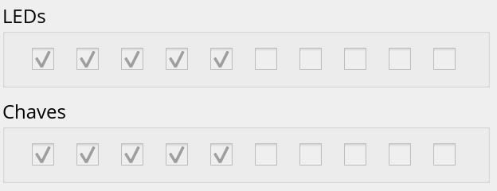

# Lab 11: Periféricos

Ao final desse lab você deve ser capaz de:

1. Escrever nos LEDs do nosso Z01
1. Ler das chaves (SW) do nosso Z01
1. Escrever no LCD do nosso Z01

!!! tip
    Para fazer esse lab, você deve ter lido a teoria sobre [mapa de memória](https://insper.github.io/Z01.1/Teoria-Z01-mapadeMemoria/)

!!! note
    Dúvidas sobre assembly? [Z01->Resumo Assembly](https://insper.github.io/Z01.1/Util-Resumo-Assembly/)

Esse lab deve ser feito no Z01Simulador, para abrir o programa basta ==executar o script `Z01simulador.py`== dentro da pasta do projeto `E-Assembly`

Todos os arquivos possuem teste, após programar no `Simulador` execute o teste

## LEDs

Problemas relacionados ao LED do nosso Z01

!!! question "Lembrando..."
    === "Pergunta"
        Qual endereço de memória para acessar os leds do Z01?

    === "Resposta"
        - `21184`

!!! example "led1.nasm"
    - `Projetos/E-Assembly/src/labs/led1.nasm`
    
    Faça o LED0 acender
    
    === "resultado esperado"
        {width=350}
        
    === "resposta"
        ``` nasm
        leaw $1, %A
        movw %A, %D
        leaw $21184, %A
        movw %D, (%A)
        ```
        
!!! example "led2.nasm"
    - `Projetos/E-Assembly/src/labs/led2.nasm`
    
    Faça os LEDs: 9,7,5,3,1 acenderem
    
    === "resultado esperado"
        {width=350}
        
    === "dica"
        1. Você precisa escrever a palavra 0b`1010101010` nos LEDs, converta para decimal e carrega na CPU com `leaw`
        1. Use uma calculadora/google para isso
            - no google: `bin 1010101010 to dec`
        
## SW

Problemas relacionado a chave do nosso Z01

!!! question "Lembrando..."
    === "Pergunta"
        Qual endereço de memória para acessar as chaves SW do Z01?

    === "Resposta"
        - `21185`

!!! example "sw1.nasm"
    - `Projetos/E-Assembly/src/labs/sw1.nasm`
    
    Faça os LEDs serem o valor das chaves: LED = SW
    
    === "configurando"
        Antes de iniciar a simulação, você deve configurar as chaves:
        
        {width=350}
        
    === "resultado esperado"
        {width=350}
        
    === "resposta"
        ```nasm
        leaw $21185, %A
        movw (%A), %D
        leaw $21184, %A
        movw %D, (%A)
        ```

!!! example "sw2.nasm"
    - `Projetos/E-Assembly/src/labs/sw2.nasm`
    
    Faça os LEDs serem o contrário do valor das chaves: LED = !SW
    
    === "configurando"
        Antes de iniciar a simulação, você deve configurar as chaves:
        
        {width=350}
        
    === "resultado esperado"
        {width=350}
        
    === "dica"
        Utilize a instrução `notw %D` para inverter o valor  salvo no registrador `%D`

## LCD

Trabalhando com o LCD.

!!! example "LCD" 
    - Linhas 6-7 do arquivo `Projetos/E-Assembly/src/labs/lcd2.nasm` -->
    
    Acione os 16 primeiros pxs do LCD.
    
    === "resultado esperado"
        {width=350}
        
    === "dica"
        ```nasm
        leaw $16384, %A
        movw $-1, (%A)
        ```
        
        > `movw $-1, (%A)`: Gera o vetor `1111111111111` e grava no endereço que %A aponta (primeiros pxs do LCD)

!!! example "lcd2.nasm" 
    - `Projetos/E-Assembly/src/labs/lcd2.nasm`
    
    Acione todos os pxs da primeira posição de memória do LCD, do meio do LCD e da última posição de memória do LCD.
    
    === "resultado esperado"
        {width=350}
        
    === "dica"
        O endereço central do LCD vocês podem calcular por:
        
        ```
        LCD = 320x240
        
        1. enderecos_porLinha    = 320/16 
                                 = 20

        2. offset_linhaCentral   = 20*240/2
                                 = 2400
                                 
        3. endereco_linhaCentral = 16384 + 2400
                                 = 18784
                                 
        4. px_central            = 18784 + 10 
                                 = 18794
        ```
