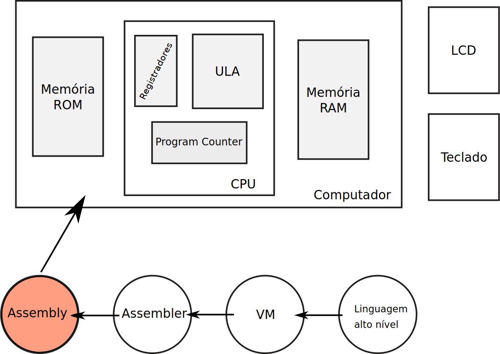

# E - Assembly

| Entrega      |
|--------------|
| 04/11 - Sexta |



Nesse projeto cada grupo terá que implementar diversos códigos em assembly a fim de entendermos a linguagem e as limitações do hardware propostos.

## Instruções 

Seguir as instruções a seguir para desenvolvimento do projeto.

## Entendendo a Organização do Projeto

A pasta do projeto E, no repositório Z01, possui a seguinte estrutura:

```
E-Assembly/
  testeAssembly.py
  Z01simulator.py
  /Quartus
  /src
      /nasm
          *.nasm
  /tests
      /tst
          /abs
          /add
          ....
```

1. `Quartus`: Projeto Quartus para gravar o computador na FPGA
1. `*.py`: Scripts em python que automatizam a execução dos testes;
1. `src/nasm/*.nasm`: Arquivos ASSEMBLY que serão implementados pelo grupo;
1. `tests/tst/*`: Arquivos que realizam o teste nos arquivos códigos do rtl.

### Executando o Script de Teste 

Abra o terminal na pasta `E-Assembly/` e execute o script python localizado nessa pasta:

```bash
$ ./testeAssembly.py
```

O mesmo irá compilar os arquivos `src/rtl/*.nasm` e executar os testes unitários em cada um deles. Nesse momento do teste, como os módulos não estão implementados, o resultado deverá ser falho.

Esse comando executa um teste unitário em cada um dos módulos, verificando se sua implementação está correta. O resultado é exibido na tela como  **pass** ou **fail**.


!!! tip
    O arquivo `config_testes_nasm.txt` define quais testes serão executados.

## Projeto

Deve-se implementar diversos programas na linguagem de máquina do Z01 que irão manipular a memória RAM a fim de implementar o que é pedido. **A descrição a seguir está classificada em ordem de dificuldade, começando pelos mais simples.**


### Módulos 

- Esses arquivos estão localizados em `E-Assembly/src/`

**A descrição de cada módulo está localizada no cabeçalho do arquivo.**
 
- add
    - **Arquivo**   : `add.nasm` (==lab 10==)
- sub
    - **Arquivo**   : `sub.nasm` (==lab 10==)
- mov
    - **Arquivo**   : `mov.nasm` (==lab 10==)           
- abs
    - **Arquivo**   : `abs.nasm` (==lab 12==)
- max
    - **Arquivo**   : `max.nasm` (==lab 12==)
- mult
    - **Arquivo**   : `mult.nasm` (==lab 12==)
- mod
    - **Arquivo**   : `mod.nasm`
- div
    - **Arquivo**   : `div.nasm` 
- pow
    - **Arquivo**   : `pow.nasm`
- É par 
    - **Arquivo** : `isEven.nasm`
- String length 
    - **Arquivo** : `stringLength.nasm`


#### Conceito B
- Palindromo 
    - **Arquivo** : `palindromo.nasm`
- fatorial
    - **Arquivo**   : `fatorial.nasm`    
- Mean
    - **Arquivo** : `vectorMean.nasm`
- Chaves e Leds 
    - **Arquivo** : `SWeLED.nasm`

#### Conceito A
- Linha
    - **Arquivo**   : `LCDlinha.nasm`
    - Edite o arquivo para desenhar uma linha completa
- Quadrado
    - **Arquivo**   : `quadrado.nasm`
- Letra Grupo
    - **Arquivo**   : `LCDletraGrupo.nasm`

**O funcionamento dos arquivos que envolvem SWs, LEDs e LCD deve ser demonstrado na FPGA.**
    
#### Extra

- SWeLED2 
    - **Arquivo** : `SWeLED2.nasm`    
- Nome grupo
    - **Arquivo** : `LCDnomeGrupo.nasm`
- excelToLCD.py
    - **Arquivo** : `excelToLCD.py`
    - Criar um programa em python que converte um tabela do excel (onde cada célula equivale a um px pintado) em um código nasm que executa no Z01 e gera a imagem da tabela


### Formulários
 
 - [Scrum Master](https://forms.gle/Yjoi2Mtwmp7MbSfS8)
 - [Desenvolvedores](https://forms.gle/NnHDz7UVb63zwpm86)
