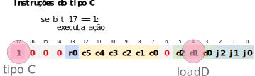
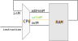
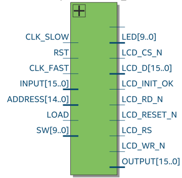

# Lab 15: Control Unit

!!! warning "Antes de começar"
    <!-- Aqui começa o projeto **F-CPU**. ==Vocês devem escolher um novo Mediador== -->
    
    Toda vez que um novo projeto começar será necessário realizar algumas configurações no repositório do grupo, vocês devem seguir para o documento: [`Util/Começando novo Projeto`](https://insper.github.io/Z01.1/Util-Comecando-novo-projeto/) e depois voltar para esse lab.

    - Não seguir sem realizar a etapa anterior.

A unidade de controle é o periférico da CPU responsável por decodificar uma instrução (linguagem de máquina) e realizar as modificações necessárias no HW (mux, load, ULA, registradores, PC) a fim de executar tal operação.

{width=60%}

O `control unit` controla todos os componentes internos da nossa CPU, é ele que por exemplo seleciona como vai estar os sinais do seletor dos mux (`muxALUI/I`/`muxAM/D`, qual operação a ULA irá executar (`zr.nx.zy.ny.f.no`), onde o dado será salvo (`loadD`, `loadA`, `writeM`, `loadPC`) e se é para executar uma operação de salto (`loadPC`). 

A figura a baixo ilustra tudo que o ==control unit controla==.


!!! note
    Note que os sinais do comparador da ULA: `zr` e `ng` também vão para a unidade de controle. É a partir do valor deles que o hardware decide se vai ou não ocorrer uma operação de salto.

## ControlUnit

Vamos implementar partes da unidade de controle. 

### `loadD` (exemplo)

!!! example ""
    Exemplo!

!!! tip
    Utilize o documento [`Z01/Instruction Set`](https://insper.github.io/Z01.1/Util-InstructionSet/) para resolver esse lab.

O sinal `loadD` indica quando o registrador `D` deve armazenar um novo sinal. Para isso, devemos verificar se a instrução em questão que está sendo decodificada pelo 'controlUnit' é do tipo **comando** (C), essa verificação é feita pelo bit mais significativo da instrução (`bit17`).

Uma vez que detectado uma instrução do tipo C, devemos verificar se o comando que ela representa carrega a operação de salvar em `%D`, verificamos isso pelo bit `d1`, que indica se irá ou não ocorrer um carregamento em `%D`.



Com esses dados conseguimos criar a tabela verdade a seguir e extrair a equação que rege esse sinal.

| `bit 17` | `bit 4` | `loadD` |
|----------|---------|---------|
| 0        | X       | 0       |
| 1        | 0       | 0       |
| ==1==    | ==1==   | ==1==   |

Podendo ser traduzido para o código em VHDL (via soma dos produtos):

``` vhdl
  loadD <= istruction(17) and instruction(4);
```

> Nesse lab iremos fazer parte do ControlUnit, ele não deve passar em todos os testes.


!!! example "Implementando e testando"
    1. Abra o arquivo `/Projetos/F-Computador/src/rtl/controlUnit.vhd`
    1. Insira a implementação anterior do `loadD` na arquitetura
    1. Teste com o comando `./testeHW.py lib.tb_controlunit.all`
       - Deve passar no ==TESTE 1== e ==TESTE 2==
       - Deve parar para no ==TESTE 3==
         
    O resultado deve ser como a seguir:
    
    {width=300}

### `loadM`

Vamos agora implementar o sinal `loadM`, esse sinal é o que controla se irá ocorrer uma operação de escrita na memória RAM.

{width=300}

!!! example "Implementando e testando"
    1. Entenda os bits envolvidos
    1. Escreva uma tabela verdade
    1. Encontre a equação e implemente no `controlUnit.vhd`
    1. Teste com o comando `./testeHW.py lib.tb_controlunit.all`
       - Deve passar no ==TESTE 3== e ==TESTE 4==
       - Deve parar para no ==TESTE 4==
         
### `loadA`

Agora implemente o `loadA`, esse sinal que controla o load do registrador A.

!!! example "Implementando e testando"
    1. Entenda os bits envolvidos
    1. Escreva uma tabela verdade
    1. Encontre a equação e implemente no `controlUnit.vhd`
    1. Teste com o comando `./testeHW.py lib.tb_controlunit.all`
       - Deve passar no ==TESTE 5== e ==TESTE 6==
       - Deve parar para no ==TESTE 7==
       
### `muxALUI_A`

Esse sinal (`muxALUI_A`) controla o mux que seleciona qual o sinal que entra no registrador `%A`, a entrada `0` do mux é o sinal que sai da ULA e o sinal `1` do mux são os bits [15..0] da instrução. 

{width=300}

!!! tip
    Com esse sinal implementando, nossa CPU já suporta a instrução `leaw $x, %A`

!!! example "Implementando e testando"
    1. Entenda os bits envolvidos
    1. Escreva uma tabela verdade
    1. Encontre a equação e implemente no `controlUnit.vhd`
    1. Teste com o comando `./testeHW.py lib.tb_controlunit.all`
       - Deve passar no ==TESTE 7== e ==TESTE 8==
       - Deve parar para no ==TESTE 9==
       
### `zx`

Agora faça o sinal `zx` que controla o zerador do sinal x da ULA.


!!! example "Implementando e testando"
    1. Entenda os bits envolvidos
    1. Escreva uma tabela verdade
    1. Encontre a equação e implemente no `controlUnit.vhd`
    1. Teste com o comando `./testeHW.py lib.tb_controlunit.all`
       - Deve passar no ==TESTE 9== e ==TESTE 10==
       - Deve parar para no ==TESTE 11==

## Memory IO 

O componente `memory IO` é a 'memória' do nosso computador. Interno nesse módulo possuímos além da memória RAM, outros componentes tais como: tela, chave, leds. Lembrando que para a CPU, não existe separação entre o que é memória e o que é periférico. 

Os periféricos internos do `memoryIO` são:

- Tela (`screen.vhd`)
    - responsável por controlar o LCD 
- RAM (`ram16k.vhd`)
    - memória RAM de 16k endereços
- SW
    - chaves da FPGA
- LED
    - LEDs da FPGA

`screen` e `ram16k` possuem a interface detalhada a seguir:


!!! note
    Os sinais do tipo `LCD_` da `screen` são conectados diretamente ao LCD, via `portmap`.

O componente `memoryIO` possui a seguinte entidade:

{width=200}

### Estudando!

!!! warning
    Discuta, pense e escreva a solução antes de ver a resposta.

1. Pense e discuta com seus colegas o `memoryIO`.

2. Dos sinais de entrada do `memoryIO` qual define qual periférico (RAM/LCD/SW/LED) será acessado pela CPU? Explique.

```

```

??? info "Resposta"
    O sinal em questão é o `address`, pois os periféricos são mapeados em endereços diferentes, e é esse sinal que define qual periférico a CPU está querendo acessar. Exemplo: se o sinal `address = 1024`, a CPU está realizando uma operação na memória RAM, mas se o sinal `address = 21184` isso indica que a CPU está querendo acessar o `LED`.

    - Para mais informações, leia [Teoria/Z01 - Mapa de Memória](https://insper.github.io/Z01.1/Teoria-Z01-mapadeMemoria/).

3. Qual sinal informa o `memoryIO` que a CPU está realizando uma escrita?

```

```

??? info "Resposta"
    É o `writeM`, se `1` indica que a CPU quer realizar uma escrita, caso contrário é uma leitura.
    
4. Quais são suas entradas e saídas do LCD que o memoryIO controla? (tudo tirando o que começa com **LCD_**)

```

```

??? info "Resposta"
    ``` vhdl
      DISPLAY: Screen  port map (
             RST          => RST,
             CLK_FAST     => CLK_FAST,
             CLK_SLOW     => CLK_SLOW,

             INPUT        => INPUT,
             LOAD         => LOAD_DISPLAY,
             ADDRESS      => ADDRESS(13 downto 0),
             LCD_INIT_OK  => LCD_INIT_OK,

             LCD_CS_N 	  => LCD_CS_N ,
             LCD_D 		    => LCD_D,
             LCD_RD_N 	  => LCD_RD_N,
             LCD_RESET_N  => LCD_RESET_N,
             LCD_RS 	    => LCD_RS,
             LCD_WR_N 	  => LCD_WR_N
    );
    ```
    
    - `input`: são os px a serem escritos
    - `load`: se é para atualizar os px
    - `adddress`: quais px serão escritos

    Note que esses sinais são os mesmos sinais de uma memória RAM, porém se a parte de leitura. O LCD como foi implementando, não suporta que realizemos a leitura de seus pxs.

4. Como funciona o LED?

```

```

??? info "Resposta"
    O LED é um endereço da memória, como ele 'armazena' o dado, deve ser implementando com um registrador.

5. Faça um esboço (diagrama) de como o `memoryIO` implementará a saída `LED` 

```
         |                                                          |
   LOAD  --->                                                       |
   ADDRESS ->                                                       |
   INPUT --->                                                       |
         |                                                          ---> LED
         |                                                          |
         |                                                          |
         |                                                          |
         |                                                          |
```

Pinos do `memoryIO`:

- LOAD: indica escrita
- ADDRESS(16 downto 0): endereço da escrita
- INPUT(16 downto 0): dado a ser escrito 
- LED(9 downto 0): Valor dos LEDs da FPGA

## CPU

Proponha uma modificação na `CPU` do nosso Z01.1 que:

 1. Adiciona mais um registrador (`%S`) (onde é melhor?)
 1. Você teria que modificar a linguagem de máquina do nosso HW. Proponha uma solução.
 1. Possibilita %D endereçar a memória 
     - `movw %A, (%D)`
 1. Possibilite fazer carregamento efetivo em %D
     - `leaw $5, %D`

Para cada modificação faça o desenho da nova CPU.

## Extras

### `nop`

Como o controlUnit controla a CPU para realizar a operação de NOP?

### `movw %D, %A e jg %D` ao mesmo tempo

Nossa CPU suportaria executar simultaneamente a instrução `movw %D, %A` e ao mesmo tempo a instrução `jg %D`? 

### `loadPC`

Quais sinais o influenciam?

