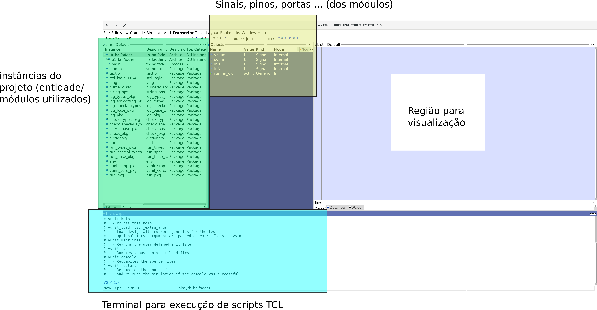
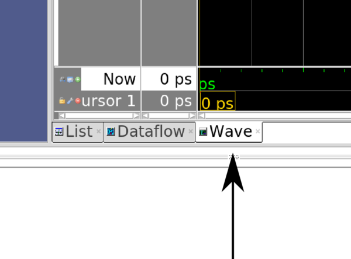
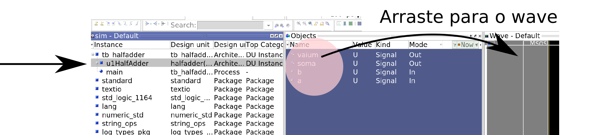
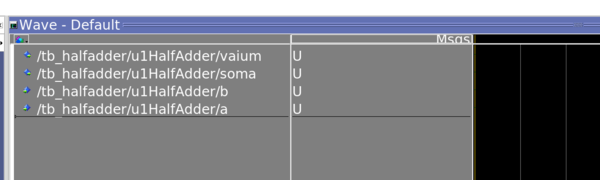
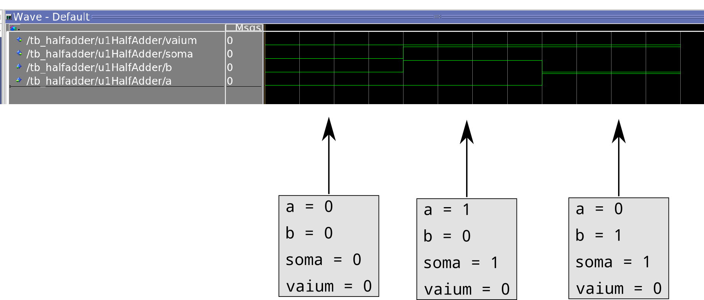

# Lab 7: Visualizando simulação

!!! success "2020-2"
    Material atualizado.

!!! note "Sugestão"
    1. Realizar o lab individualmente
    1. Ficar no canal do grupo e tirar dúvidas entre os colegas!

É muito difícil sabermos porque uma implementação em VHDL não funciona, atualmente o fluxo é: transcreve para VHDL o componente; testa; não funcionou volta para o VHDL; testa.... Será que não existe uma forma de conseguirmos visualizar o resultado do teste e com isso mudarmos a implementação em VDHL? Sim existe! Para isso será necessário invocarmos a parte gráfica do modelsim. 
Na hora de invocarmos o script de teste (`B-UnidadeLogicaAritmetica/testeULA.py`) passe o parâmetro `--gui` (ou `-g`), como a seguir:

```bash
$ python testeULA.py --gui
```

Esse comando irá executar a simulação e abrir no software `modelsim` (toda a simulação é realizada por esse software, mas estava sendo 'mascarada' pelos scripts de teste em py).

!!! note
    Antes de continuar, o módulo do `HalfAdder.vhd` já deve está implementando e testado (na forma tradicional).

## modelsim

O [modelsim](https://www.mentor.com/company/higher_ed/modelsim-student-edition) não possui uma interface moderna, porém é o software de simulação de hardware mais completo e mais utilizado pela industria. 


Siga os passos a seguir para conseguirmos visualizarmos a forma de onda:

Primeiramente devemos adicionar os sinais que desejamos visualizar, no caso do HalfAdder queremos ver suas entradas (a,b) e suas saídas (soma, vaium).

Para isso clique em **wave**:



!!! tip
    Caso não possua a janela wave aberta, clique em `File` -> `Wave` e a janela irá aparecer.

E depois selecione no menu das instâncias o módulo u1HalfAdder, com isso poderemos selecionar quais pinos/ sinais gostaríamos de visualizar desse bloco. Arraste todos os sinais para o wave form :



Resultando em:



Agora podemos executar a simulação, na região do script TCL execute o seguinte comando: **vunit_run**

```tcl
VSIM > vunit_run
```

Podemos agora visualizar a forma de onda:



## Aprimorando teste

Testbench (bancada de teste) é a forma utilizada para verificarmos se um projeto de HDL (VHDL, Verilog, ...) está certo, o testbench pode ser escrito em várias linguagens inclusive em VHDL.

Os TestBenchs estão localizados nas pastas dos projetos em: `/tests/tst/`.

No projeto C temos os seguintes testbenchs definidos (um para cada módulo a ser implementando):

```bash
/tests/tst/
          tb_Add16.vhd
          tb_ALU.vhd
          tb_comparador16.vhd
          tb_FullAdder.vhd
          tb_HalfAdder.vhd 
          tb_Inc16.vhd
          tb_inversor16.vhd
          tb_zerador16.vhd
```

### tb_HalfAdder.vhd

Note que na simulação do HalfAdder não testamos um dos casos de entrada: **1 + 1**, esse teste está incompleto. Vamos corrigir isso!

O arquivo `tb_HalfAdder` faz a inclusão do módulo HalfAdder (component e port map) instanciando esse módulo para uso. No arquivo é criado **estímulos** na entrada do componente e verifica-se se a saída está de acordo com o que deveria ser feito.

#### modificando o arquivo

Agora vamos modificar o arquivo para inserir o teste que está faltando: `1+1`, para isso inclua as linhas a seguir logo após o teste 3:

```diff
 -- Teste: 4
 -- 1 + 1
+inA <= '1'; inB<= '1';
+wait for 200 ps;
+assert(soma = '0' and vaium = '1')  report "Falha em teste: 4" severity error;
```

Como isso funciona? Primeiro colocamos os valores desejados na entrada do componente:

``` vhd
inA <= '1'; inB <= '1';
```

é necessário aguardar um instante de tempo para que as portas lógicas fiquem com a saída estável (e para possibilitar a visualização na simulação):

``` vhd
wait for 200 ps;
```

#### Testando novamente

Execute novamente a simulação com o modo `--gui` e verifique se o módulo está se comportando corretamente:` soma = 0` e `vaium = 1`.

!!! warning
    Salve e submeta as alterações para o `remote`, apenas uma pessoa do grupo deve realizar isso.
