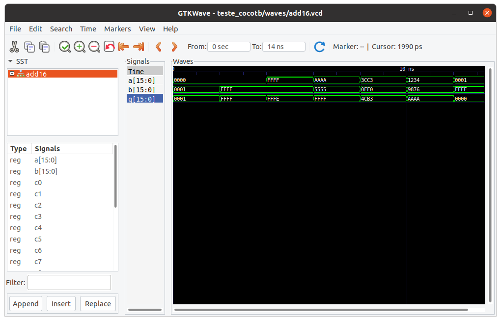

# Lab 7: Visualizando simulação

!!! success "2022-2"
    Material atualizado.


É muito difícil sabermos porque uma implementação em VHDL não funciona, atualmente o fluxo é: transcreve para VHDL o componente; testa; não funcionou volta para o VHDL; testa.... Será que não existe uma forma de conseguirmos visualizar o resultado do teste e com isso mudarmos a implementação em VDHL? Sim existe! 

Cada simulação realizada usando o software GHDL salva um arquivo `.vcd`que contém as formas de onda que resultam dos testes.

Assim, após executar o script de teste (`C-UnidadeLogicaAritmetica/testeULA.py`), pode-se utilizar o software `gtkwave` para visualizar o resultado. Por exemplo:

```bash
$ gtkwave teste_cocotb/waves/fulladder.vcd 
```

Esse comando irá abrir no software `gtkwave` o resultado do teste do `fulladder`.



Para visualizar as formas de onda, selecione o módulo na caixa à esquerda e, em seguida, arraste os sinais desejado para a caixa `Signals`.
