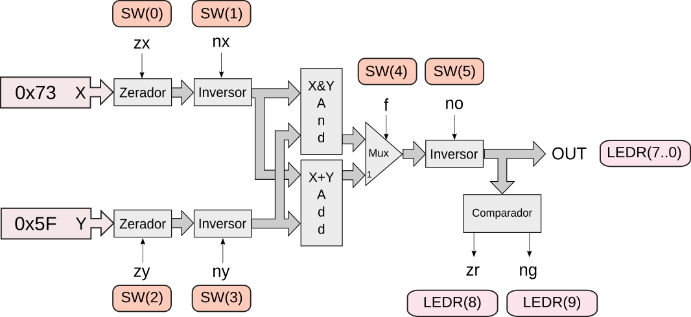

# Lab 8: ULA 

!!! note "Trabalhando em grupo"
    Realizar o lab em trio

!!! warning "Antes de começar"
    Toda vez que um novo projeto começar será necessário realizar algumas configurações no repositório do grupo, vocês devem seguir para o documento: [`Util/Começando novo Projeto`](https://insper.github.io/Z01.1/Util-Comecando-novo-projeto/) e depois voltar para esse lab.

    - Não seguir sem realizar a etapa anterior.


O objetivo desse laboratório é o de trabalharmos com o controle dos sinais da ULA para entendermos as operações da unidade de processamento do nosso computador.

1. Programando FPGA com ULA
1. Entendendo funções das chaves e LEDs
1. Controlando ULA para realizar operações específicas (exercícios)

## Programando FPGA

Com a FPGA plugada no PC e ligada, execute o script `programFPGA.py` da pasta do projeto `C`. Esse script irá realizar a programação da FPGA com o hardware da Unidade Lógica Aritmética - ULA que vocês terão que implementar. 

Nesse exemplo os controles da ULA estão mapeados para as chaves da FPGA, a saída da ULA foi mapeada para LEDs: como ilustrado as figuras a seguir:




Como isso é feito em VHDL? De uma olhada no `toplevel` do projeto (`C-UnidadeLogicaAritmetica/src/TopLevel.vhd`)

``` vhd
  ula0: ALU port map (
    x                  => x,
    Y                  => y,
    Zx                 => SW(0),
    Nx                 => SW(1),
    Zy                 => SW(2),
    Ny                 => SW(3),
    F                  => SW(4),
    No                 => SW(5),
    Zr                 => LEDR(8),
    Ng                 => LEDR(9),
    Saida(7 downto 0)  => LEDR(7 downto 0),
    Saida(15 downto 8) => Open
    );
```

Note que a ULA que iremos desenvolver no projeto C tem **16 bits** de largura, porém como temos um limite de LEDs e botões na FPGA, estamos ignorando os valores mais significativos, sem afetar o projeto.

## Controlando ULA

Com a FPGA programada podemos testar a ULA modificando seus sinais de controle. A seguir uma proposta de operações lógicas devem ser realizadas na FPGA, seus sinais de controle e resultado devem ser anotados nas tabelas.

!!! tip 
    O projeto **FIXA** as entradas da ULA com os valores:

    - X = 0x73  
    - Y = 0x5F

!!! example "Tarefa: `out = X`"
    - Configure os controles da ULA para fazer com que a saída da ULA seja a entrada **X**
    
    Para isso você deve mexer nas chaves da FPGA e verificar a saída nos leds.

!!! example "Tarefa: `out = Y`"
    - Configure os controles da ULA para fazer com que a saída da ULA seja a entrada Y

!!! example "Tarefa: `out = !Y`"
    - Configure os controles da ULA para fazer com que a saída da ULA seja a entrada a entrada Y negada

!!! example "Tarefa: `out = 0`"
    - Faça com que a saída da ULA seja 0

!!! example "Tarefa: `out = 1`"
    - Faça com que a saída da ULA seja 1

!!! example "Tarefa: `out = -1`"
    - Faça com que a saída da ULA seja -1 (em complemento de 2)

!!! example "Tarefa: `out = X+Y`"
    - Faça com que a saída da ULA seja a entrada X + a entrada Y

!!! example "Tarefa (difícil): `out = X or Y`"
    - Faça com que a saída da ULA seja X ou Y

!!! example "Tarefa (difícil): `out = X - Y`"
    - Faça com que a saída da ULA seja a entrada X menos a entrada Y
